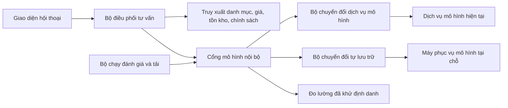

# Đường chuyển sang mô hình tự lưu trữ tại chỗ

**Ngày rà soát:** 18 tháng 7 năm 2026

**Phạm vi:** chuẩn bị từ bản mẫu 48 giờ để sau thử nghiệm 3 tháng có đủ bằng chứng quyết định có chuyển từ dịch vụ mô hình sang mô hình tự lưu trữ tại chỗ hay không

**Vấn đề nguồn:** [Vấn đề số 10](https://github.com/hoangvantuan/vaic_thancotong/issues/10)

## Kết luận điều hành

**Chưa đủ dữ kiện để chốt mô hình, cách lượng tử hóa, máy chủ phục vụ hoặc cấu hình phần cứng.** Ba biến quyết định còn thiếu là phần cứng, tải thực và ngân sách. Chốt trước khi có ba biến này sẽ biến một giả định thành quyết định mua sắm.

Việc cần làm ngay trong bản mẫu là:

1. Đặt một **cổng mô hình nội bộ** giữa ứng dụng và dịch vụ mô hình.
2. Giữ truy xuất danh mục, giá, tồn kho, khuyến mãi và luật nghiệp vụ ngoài trọng số mô hình.
3. Thu phép đo tải, chất lượng, độ trễ, lỗi và chi phí theo cùng một lược đồ cho mọi nhà cung cấp.
4. Tạo bộ đánh giá tiếng Việt khóa phiên bản, có nhãn từ chuyên gia ngành hàng.
5. Dùng cùng bộ kiểm thử hợp đồng, bộ đánh giá và tải phát lại để so dịch vụ hiện tại với từng tổ hợp mô hình, máy phục vụ, độ chính xác số và phần cứng.
6. Chỉ chuyển khi tổ hợp tự lưu trữ vượt qua toàn bộ cổng chất lượng, hiệu năng, bảo mật, vận hành và tổng chi phí sở hữu.

Hướng phục vụ nên đưa vào vòng đo là **vLLM**, **SGLang**, **TensorRT-LLM kết hợp Triton** khi có phần cứng NVIDIA phù hợp, và **llama.cpp** cho cấu hình ít tài nguyên hoặc tải thấp. **Ollama** phù hợp làm đường chuẩn phát triển cục bộ, không mặc nhiên là đường sản xuất. **Text Generation Inference (TGI)** không nên là đầu tư mới vì kho mã chính thức đã được lưu trữ chỉ đọc từ ngày 21 tháng 3 năm 2026 và nhóm duy trì khuyên chuyển sang vLLM, SGLang hoặc các máy cục bộ tương thích như llama.cpp ([kho mã TGI chính thức](https://github.com/huggingface/text-generation-inference)).

## Điều đã biết và điều còn thiếu

### Điều đã biết

| Hạng mục | Dữ kiện | Hệ quả đối với phép đo |
|---|---|---|
| Quy mô thử nghiệm | **1.000 đến 10.000 hội thoại trong 3 tháng** | Tổng lượng không cho biết tải đỉnh. Phải thu tốc độ đến, số yêu cầu đồng thời và phân bố theo giờ. |
| Phạm vi | Một kênh bán lẻ hoặc một nhóm ngành hàng | Bộ đánh giá phải khóa theo ngành hàng thật được chọn. |
| Mục tiêu độ trễ | Hỏi thêm dưới **3 giây**, so sánh ba sản phẩm dưới **5 giây** | Phải làm rõ đây là thời gian tới mã đầu tiên hay thời gian hoàn tất câu trả lời. Cần đo cả hai. |
| Chất lượng | Hiểu nhu cầu, hỏi thêm, so sánh, đề xuất ba sản phẩm, không bịa dữ liệu | Điểm chuẩn kiến thức chung không đủ. Cần bộ đánh giá nghiệp vụ và kiểm tra từng mệnh đề với nguồn. |
| Dữ liệu | Danh mục, chính sách, tình huống nhu cầu, giá, khuyến mãi, tồn kho | Dữ kiện động phải đến từ nguồn truy xuất, không được trông chờ vào trí nhớ của mô hình. |
| Bảo mật | Không lưu dữ liệu khách hàng thật nếu chưa được phép, nhật ký phải che dữ liệu nhạy cảm | Mặc định không ghi nội dung thô. Chỉ bật lấy mẫu đã khử định danh theo phê duyệt. |

Nguồn của các ràng buộc trên là [đề bài doanh nghiệp trong kho mã](../dien-may-xanh.md) và [vấn đề số 10](https://github.com/hoangvantuan/vaic_thancotong/issues/10).

### Thông tin bắt buộc phải chốt trong hai tuần đầu

| Khoảng trống | Tối thiểu cần biết | Quyết định bị khóa nếu thiếu |
|---|---|---|
| Phần cứng | Loại và số bộ xử lý đồ họa, bộ nhớ đồ họa, liên kết giữa bộ xử lý, bộ xử lý trung tâm, bộ nhớ chính, lưu trữ, điện, làm mát, trình điều khiển, nền tảng điều phối | Mô hình có nạp được không, mức song song, máy phục vụ nào hỗ trợ, chi phí đầu tư |
| Tải | Yêu cầu mỗi giây ở trung vị và đỉnh, số phiên đồng thời, phân bố mã đầu vào và đầu ra, độ dài ngữ cảnh, tỷ lệ gọi công cụ, mùa cao điểm | Dung lượng bộ nhớ đệm khóa và giá trị, thông lượng, số bản sao, tải đỉnh |
| Ngân sách | Trần đầu tư, trần vận hành tháng, giá điện và làm mát, giá nhân sự vận hành, thời hạn khấu hao, mức dự phòng | Tổng chi phí sở hữu và điểm hòa vốn |
| Mức dịch vụ | Phân vị độ trễ, tỷ lệ sẵn sàng, thời gian khôi phục, mức mất dữ liệu chấp nhận, có truyền dòng hay không | Kiến trúc một nút hay nhiều nút, dự phòng, đường quay lui |
| Dữ liệu và pháp lý | Phân loại dữ liệu, vị trí lưu, thời hạn giữ, quyền truy cập, yêu cầu giấy phép trọng số | Có được ghi phát lại, dùng trọng số và chạy mô hình trong môi trường đã chọn hay không |
| Năng lực đội ngũ | Người trực vận hành, kinh nghiệm bộ xử lý đồ họa, vùng chứa, điều phối, quan sát và ứng cứu | Mức phức tạp có thể chấp nhận và chi phí nhân sự thật |

Trong báo cáo này, **mã từ (token)** là đơn vị văn bản mô hình xử lý, **bộ tách mã (tokenizer)** là thành phần đổi văn bản thành mã từ, **thời gian tới mã đầu tiên (time to first token, TTFT)** là thời gian người dùng chờ phần đầu phản hồi, và **thời gian mỗi mã đầu ra (time per output token, TPOT)** phản ánh nhịp sinh tiếp theo. **Bộ nhớ đệm khóa và giá trị (key-value cache, KV cache)** là phần bộ nhớ tăng theo ngữ cảnh và mức đồng thời.

## Kiến trúc tách rời cần có từ bản mẫu



Giá, tồn kho và khuyến mãi thay đổi liên tục. Chúng phải được truy xuất ở thời điểm trả lời và đi kèm mã nguồn dữ liệu. Mô hình chỉ diễn giải dữ kiện đã lấy được. Kiến trúc sinh tăng cường bằng truy xuất (retrieval-augmented generation, RAG) kết hợp bộ nhớ tham số với nguồn ngoài, qua đó giải quyết nhu cầu cập nhật kiến thức và truy nguyên tốt hơn cách chỉ dựa vào tham số ([bài báo RAG gốc, NeurIPS 2020](https://papers.neurips.cc/paper/2020/file/6b493230205f780e1bc26945df7481e5-Paper.pdf)).

### Hợp đồng của cổng mô hình

Hợp đồng nội bộ nên nhỏ hơn hợp đồng của bất kỳ nhà cung cấp nào.

| Nhóm | Trường bắt buộc |
|---|---|
| Yêu cầu | Mã truy vết, bí danh năng lực, danh sách thông điệp có vai trò, phiên bản chỉ dẫn, công cụ được phép, lược đồ đầu ra, giới hạn mã đầu ra, chế độ truyền dòng, thời hạn |
| Kết quả | Văn bản, lệnh gọi công cụ có cấu trúc, lý do dừng, mã đầu vào và đầu ra theo bộ tách mã của máy đang dùng, định danh mô hình thực, phiên bản chỉ dẫn |
| Sự kiện | Nhận yêu cầu, bắt đầu xếp hàng, nhận mã đầu tiên, hoàn tất, hủy, hết hạn, lỗi |
| Năng lực | Độ dài ngữ cảnh, gọi công cụ, đầu ra theo lược đồ, truyền dòng, hỗ trợ ảnh nếu sau này cần |

Quy tắc tách rời:

- Ứng dụng chỉ gọi **bí danh năng lực**, không chứa tên mô hình hay địa chỉ máy phục vụ.
- Chỉ bộ chuyển đổi được biết trường riêng của nhà cung cấp.
- Chỉ dẫn hệ thống, mẫu hội thoại, luật truy xuất và luật kiểm tra nguồn có phiên bản độc lập với mô hình.
- Cổng chuẩn hóa lỗi, thời hạn, hủy yêu cầu, truyền dòng và thống kê sử dụng.
- Không so trực tiếp số mã giữa hai bộ tách mã khác nhau. Lưu thêm số ký tự, số lượt hội thoại và hóa đơn thực.
- Chỉ thử lại tự động trước khi có mã đầu tiên, trừ khi bộ chuyển đổi chứng minh yêu cầu có tính lặp an toàn.
- Cổng phải cho phép quay về dịch vụ hiện tại bằng cấu hình, không cần sửa luồng nghiệp vụ.

### Tương thích giao diện không đồng nghĩa tương thích hành vi

Một lớp tương thích giao diện OpenAI giúp giảm công viết bộ chuyển đổi, nhưng không đủ làm tiêu chí chọn máy phục vụ:

- vLLM hỗ trợ nhiều điểm cuối tương thích OpenAI, nhưng tài liệu nêu rõ có trường không được hỗ trợ hoặc bị bỏ qua, và hành vi gọi nhiều công cụ còn phụ thuộc mô hình ([tài liệu phục vụ trực tuyến của vLLM](https://docs.vllm.ai/en/stable/serving/online_serving/)).
- SGLang cung cấp giao diện tương thích OpenAI, nhưng mẫu hội thoại và bộ phân tích công cụ vẫn phải đúng với từng mô hình ([tài liệu giao diện SGLang](https://docs.sglang.io/docs/basic_usage/openai_api_completions)).
- llama.cpp nói rõ không đưa ra bảo đảm mạnh về mức tương thích, dù có các điểm cuối hội thoại, truyền dòng, công cụ và đầu ra theo lược đồ ([tài liệu máy chủ llama.cpp](https://github.com/ggml-org/llama.cpp/blob/master/tools/server/README.md)).
- Ollama chỉ tương thích với **một phần** giao diện OpenAI và bỏ qua khóa truy cập trong ví dụ cục bộ ([tài liệu tương thích của Ollama](https://docs.ollama.com/api/openai-compatibility)).

Do đó phải có bộ kiểm thử hợp đồng chạy giống nhau trên mọi bộ chuyển đổi: hội thoại nhiều lượt, tiếng Việt có dấu và không dấu, gọi công cụ, đối số sai, lược đồ đầu ra, truyền dòng, hủy, hết hạn, ngữ cảnh dài, lỗi quá tải và phản hồi khi thiếu dữ liệu.

## Phép đo phải thu từ ngày đầu

### Tải và hiệu năng

| Nhóm | Phép đo | Cách tổng hợp |
|---|---|---|
| Tải đến | Yêu cầu mỗi giây, phiên đồng thời, lượt mỗi hội thoại, giờ và ngày | Trung vị, phân vị 95, đỉnh theo cửa sổ một phút và năm phút |
| Kích thước | Ký tự, mã đầu vào, mã đầu ra, tổng độ dài ngữ cảnh, số tài liệu truy xuất, số công cụ | Phân vị 50, 95 và 99 theo loại tác vụ |
| Độ trễ người dùng | Thời gian đầu cuối, thời gian tới mã đầu tiên, thời gian mỗi mã đầu ra | Phân vị 50, 95 và 99, tách hỏi thêm và so sánh |
| Thành phần độ trễ | Xếp hàng, truy xuất, xếp hạng, gọi dữ liệu, nạp trước, giải mã | Phân vị 50, 95 và 99 |
| Thông lượng | Yêu cầu mỗi giây, mã đầu vào và đầu ra mỗi giây | Theo mức đồng thời và độ dài ngữ cảnh |
| Thông lượng hữu ích | Yêu cầu mỗi giây đồng thời đạt ngưỡng chất lượng và độ trễ | Chỉ số chính để định cỡ |
| Tài nguyên | Bộ nhớ đồ họa, mức dùng bộ nhớ đệm khóa và giá trị, công suất, bộ xử lý trung tâm, bộ nhớ, nhiệt độ | Trung bình, đỉnh và theo yêu cầu |
| Tin cậy | Lỗi, hết hạn, hủy, từ chối quá tải, thử lại, hết bộ nhớ, khởi động lại | Tỷ lệ trên tổng yêu cầu, theo phiên bản |

vLLM công bố trực tiếp các phép đo thời gian tới mã đầu tiên, độ trễ giữa mã, độ trễ đầu cuối, thời gian xếp hàng, mã đầu vào và đầu ra, yêu cầu đang chạy và mức dùng bộ nhớ đệm khóa và giá trị ([thiết kế phép đo vLLM](https://docs.vllm.ai/en/latest/design/metrics/)). SGLang cũng cung cấp công cụ tạo tải trực tuyến có điều khiển tốc độ và mức đồng thời, đo thời gian tới mã đầu tiên, thời gian mỗi mã đầu ra, độ trễ giữa mã và thông lượng ([hướng dẫn đo SGLang](https://docs.sglang.io/docs/developer_guide/benchmark_and_profiling)). Các tên phép đo này là điểm khởi đầu tốt, nhưng số dùng ra quyết định phải được đo từ phía cổng để bao gồm truy xuất và mạng.

Quy ước ngữ nghĩa trí tuệ nhân tạo tạo sinh của OpenTelemetry có trường nhà cung cấp, mô hình, thông điệp, truy xuất và công cụ. Tuy nhiên, chính đặc tả cảnh báo nội dung, truy vấn truy xuất, chỉ dẫn hệ thống, đối số và kết quả công cụ có thể chứa dữ liệu nhạy cảm ([đặc tả OpenTelemetry](https://opentelemetry.io/docs/specs/semconv/registry/attributes/gen-ai/)). Vì vậy chỉ dùng tên trường chuẩn, không bật ghi nội dung theo mặc định.

### Chất lượng nghiệp vụ

Mỗi lần đánh giá phải gắn với: mã bộ dữ liệu, mã cam kết bộ kiểm thử, phiên bản chỉ dẫn, mô hình và mã băm trọng số, mẫu hội thoại, độ chính xác số hoặc lượng tử hóa, máy phục vụ và phiên bản, tham số sinh, nguồn truy xuất và thời điểm chụp dữ liệu.

| Năng lực | Phép đo chính | Lỗi nghiêm trọng cần đếm riêng |
|---|---|---|
| Hiểu nhu cầu | Độ chính xác khớp tuyệt đối và điểm F1 vĩ mô cho ngân sách, mục đích, ràng buộc, ưu tiên | Bỏ sót ràng buộc làm sản phẩm không phù hợp |
| Hỏi thêm | Độ chính xác nhận biết khi cần hỏi, độ phủ câu hỏi bắt buộc, số câu thừa | Tư vấn khi còn thiếu thông tin quyết định |
| Truy xuất và gọi công cụ | Tỷ lệ chọn đúng công cụ, đối số hợp lệ, đầu ra đúng lược đồ | Gọi chức năng không được phép hoặc dùng dữ liệu của phiên khác |
| Đề xuất ba sản phẩm | Mức trùng với nhãn chuyên gia, điểm xếp hạng giảm dần tại ba vị trí, tỷ lệ có ít nhất một lựa chọn đạt chuẩn | Đề xuất sản phẩm vi phạm ngân sách hoặc điều kiện lắp đặt |
| Bám nguồn | Độ chính xác mệnh đề có bằng chứng, tỷ lệ trích đúng mã sản phẩm và trường nguồn | Bịa giá, tồn kho, khuyến mãi, chính sách hoặc thông số |
| Giải thích | Điểm chuyên gia về đúng, dễ hiểu, hữu ích và nêu đánh đổi | Che giấu bất lợi quan trọng hoặc dùng lời khẳng định không có nguồn |
| An toàn | Tỷ lệ kháng chèn chỉ dẫn, rò dữ liệu, vượt quyền công cụ | Lộ bí mật, dữ liệu phiên khác hoặc thực hiện hành động trái phép |

## Bộ đánh giá cần chuẩn bị

### Cấu trúc dữ liệu

Bộ đánh giá nội bộ là cổng chính. Nó cần phủ:

- Ngành hàng thật của thử nghiệm và các ràng buộc quyết định của ngành đó.
- Tiếng Việt có dấu, không dấu, lỗi chính tả, viết tắt, văn nói, từ địa phương và xen tiếng Việt với tiếng Anh.
- Yêu cầu rõ, yêu cầu thiếu dữ kiện, yêu cầu mâu thuẫn và yêu cầu ngoài phạm vi.
- Dữ liệu đầy đủ, thiếu trường, sai đơn vị, xung đột giữa nguồn, hết hàng và không có khuyến mãi.
- Hội thoại nhiều lượt, người dùng đổi ưu tiên và yêu cầu so lại.
- Chèn chỉ dẫn trực tiếp và gián tiếp qua mô tả hoặc đánh giá sản phẩm.
- Trường hợp không có sản phẩm phù hợp, trong đó câu trả lời đúng là nói không có.

Không ấn định một số lượng mẫu duy nhất trước khi chọn ngành hàng. Chủ bộ đánh giá phải lập ma trận phủ theo ngành hàng, ý định, biến thể ngôn ngữ, trạng thái dữ liệu và mức rủi ro. Mỗi ô rủi ro cao phải có đủ ví dụ để phát hiện hồi quy. Mẫu được chia thành:

1. Tập phát triển để sửa chỉ dẫn.
2. Tập hồi quy khóa, không dùng để chỉnh mô hình hay chỉ dẫn.
3. Tập phát lại thử nghiệm đã khử định danh, chỉ dùng sau khi có phê duyệt dữ liệu.

Các tiêu chí chủ quan cần hai người chấm độc lập và một người phân xử. Giá, tồn kho, khuyến mãi, mã sản phẩm và thông số phải chấm tự động theo ảnh chụp dữ liệu nguồn. Ngưỡng đạt và biên không thua kém dịch vụ hiện tại phải được phê duyệt **trước khi xem kết quả ứng viên**.

VMLU gồm các phép đánh giá tiếng Việt về kiến thức, đọc hiểu, suy luận và hội thoại ([bài báo VMLU gốc tại ACL 2025](https://aclanthology.org/2025.acl-long.563/)). Có thể dùng VMLU làm chỉ báo hồi quy tiếng Việt chung, nhưng không dùng thay bộ tình huống bán lẻ. Khung đánh giá mô hình ngôn ngữ của EleutherAI cho phép khóa cấu hình tác vụ cùng mã cam kết để tái lập phép đo ([hướng dẫn cấu hình tác vụ chính thức](https://github.com/EleutherAI/lm-evaluation-harness/blob/main/docs/task_guide.md)).

Mọi mức lượng tử hóa phải được coi là một ứng viên riêng và chạy lại toàn bộ cổng chất lượng. Ngay tài liệu Ollama cũng nêu tác động của lượng tử hóa bộ nhớ đệm phụ thuộc mô hình và tác vụ, cần thử nghiệm để tìm cân bằng bộ nhớ và chất lượng ([câu hỏi thường gặp của Ollama](https://docs.ollama.com/faq)).

## Phương pháp đo dung lượng và độ trễ

1. Chụp phân bố tải thật từ dịch vụ hiện tại, không tạo tải chỉ bằng chuỗi ngẫu nhiên.
2. Khử định danh và đóng băng một tập phát lại đại diện cho độ dài đầu vào, đầu ra, tỷ lệ công cụ và tốc độ đến.
3. Chạy cùng tập trên từng tổ hợp mô hình, độ chính xác số, máy phục vụ và phần cứng.
4. Đo cả trạng thái lạnh, trạng thái ấm, truy xuất trúng và trượt bộ nhớ đệm.
5. Tăng dần tốc độ và số phiên đồng thời tới khi vi phạm mục tiêu độ trễ hoặc tỷ lệ lỗi.
6. Chạy bền trong thời gian đủ lộ rò bộ nhớ, tích hàng đợi, quá nhiệt và suy giảm sau nhiều lượt.
7. Thử khởi động lại tiến trình, mất một bản sao, lỗi nguồn truy xuất và quay về dịch vụ hiện tại.

Không so thông lượng tối đa khi hai ứng viên trả lời với độ dài hoặc chất lượng khác nhau. Chỉ so **thông lượng hữu ích** tại cùng bộ dữ liệu, tham số sinh và ngưỡng chất lượng. MLPerf Inference tách kịch bản máy chủ, mục tiêu chất lượng và mục tiêu thời gian tới mã đầu tiên hoặc thời gian mỗi mã, đồng thời yêu cầu ghi rõ dữ liệu, tiền xử lý, mô hình và cách chạy ([quy tắc MLPerf Inference chính thức](https://github.com/mlcommons/inference_policies/blob/master/inference_rules.adoc)). Đây là nguyên tắc tái lập nên áp dụng, không phải lấy kết quả MLPerf thay phép đo tải của dự án.

Mỗi báo cáo hiệu năng phải ghi:

- Mã băm trọng số và bộ tách mã.
- Mẫu hội thoại, phiên bản chỉ dẫn và tham số sinh.
- Độ chính xác số, cách lượng tử hóa và độ dài ngữ cảnh.
- Máy phục vụ, ảnh vùng chứa và mã cam kết.
- Loại, số lượng, bộ nhớ và liên kết bộ xử lý đồ họa.
- Bộ xử lý trung tâm, bộ nhớ, lưu trữ, trình điều khiển và thư viện tăng tốc.
- Mức song song, lô liên tục, giới hạn yêu cầu chạy, cấu hình bộ nhớ đệm.
- Mã cam kết tập tải, tốc độ đến, mức đồng thời và số mẫu.

vLLM hướng dẫn tăng từ một bộ xử lý đồ họa tới song song tensor, song song đường ống và nhiều nút theo việc mô hình có vừa bộ nhớ hay không. Máy cũng báo sức chứa bộ nhớ đệm khóa và giá trị cùng mức đồng thời ước tính, nhưng tài liệu yêu cầu đo và bổ sung tài nguyên nếu chưa đạt tải ([hướng dẫn song song và mở rộng vLLM](https://docs.vllm.ai/en/stable/serving/parallelism_scaling/)). Đây là lý do không thể định cỡ khi chưa có phần cứng, độ dài ngữ cảnh và mức đồng thời.

## Tổng chi phí sở hữu

Không dùng riêng giá mua bộ xử lý đồ họa hoặc giá mỗi triệu mã để so sánh.

**Chi phí dịch vụ theo tháng** gồm:

```text
chi phí mã đầu vào
+ chi phí mã đầu ra
+ nhúng và xếp hạng
+ lưu trữ hoặc mạng
+ gói hỗ trợ
+ chi phí do thử lại và lỗi
```

**Chi phí tự lưu trữ theo tháng** gồm:

```text
khấu hao máy chủ và thiết bị mạng
+ điện, làm mát và chỗ đặt máy
+ giấy phép và hỗ trợ
+ lưu trữ, sao lưu và quan sát
+ nhân sự xây dựng, trực vận hành, vá lỗi và ứng cứu
+ năng lực dự phòng và thời gian nhàn rỗi
+ chi phí vốn và thời gian mua sắm
```

Chỉ số so sánh là:

```text
chi phí trên hội thoại thành công
= tổng chi phí trong kỳ
/ số hội thoại đồng thời đạt cổng chất lượng và mức dịch vụ
```

Điểm hòa vốn tải chỉ tồn tại khi chi phí biến đổi mỗi hội thoại của tự lưu trữ thấp hơn dịch vụ:

```text
tải hòa vốn
= chi phí cố định tự lưu trữ
/ (chi phí biến đổi dịch vụ mỗi hội thoại - chi phí biến đổi tự lưu trữ mỗi hội thoại)
```

Phải dùng hóa đơn thật, giờ vận hành thật, công suất đo tại máy và thời hạn khấu hao do tài chính phê duyệt. Báo cáo cần đưa ba kịch bản tải thấp, tải cơ sở và tải cao. Với tổng **1.000 đến 10.000 hội thoại trong 3 tháng**, khả năng phần cứng nhàn rỗi là rủi ro lớn, nhưng chưa thể định lượng khi chưa biết độ dài hội thoại, tải đỉnh và máy có được dùng chung cho công việc khác hay không.

## Bảo mật, dữ liệu và vận hành

Tự lưu trữ giảm việc gửi dữ liệu ra nhà cung cấp, nhưng không tự động làm hệ thống an toàn. Nó chuyển trách nhiệm vá lỗi, cách ly, kiểm soát truy cập, lưu nhật ký và ứng cứu về đội nội bộ. Hồ sơ trí tuệ nhân tạo tạo sinh của NIST yêu cầu quản trị rủi ro xuyên vòng đời, gồm riêng tư dữ liệu, an toàn thông tin và tích hợp chuỗi giá trị ([NIST AI 600-1](https://doi.org/10.6028/NIST.AI.600-1)).

Yêu cầu tối thiểu:

- Cổng mô hình chịu trách nhiệm xác thực, phân quyền, mã hóa đường truyền, hạn mức và giới hạn tốc độ.
- Máy phục vụ suy luận chỉ nằm trong mạng riêng, không mở trực tiếp ra Internet.
- Quyết định quyền truy cập và hành động luôn do mã xác định bên ngoài mô hình.
- Mọi lệnh gọi công cụ phải qua danh sách cho phép, kiểm tra lược đồ và kiểm tra quyền lần nữa.
- Chỉ ghi định danh giả, số đo và mã lỗi theo mặc định. Nội dung thô cần cơ sở sử dụng, che dữ liệu, quyền truy cập và thời hạn xóa.
- Chạy tiến trình không có quyền quản trị, trong vùng chứa hoặc máy ảo cách ly, hệ thống tệp chỉ đọc nếu có thể.
- Khóa phiên bản ảnh vùng chứa và trọng số, kiểm tra mã băm, quét lỗ hổng, lưu danh mục thành phần phần mềm.
- Tách dữ liệu và tài nguyên theo người thuê, đặt hạn mức bộ nhớ và hàng đợi để một phiên không gây từ chối dịch vụ cho phiên khác.
- Có bản hướng dẫn vá lỗi, quay lui, sao lưu cấu hình, ứng cứu sự cố và diễn tập khôi phục.
- Kiểm thử chèn chỉ dẫn, rò dữ liệu, vượt quyền công cụ, làm cạn tài nguyên và tệp trọng số không tin cậy trước khi nhận tải thật.

Tài liệu bảo mật llama.cpp yêu cầu cách ly mô hình và đầu vào không tin cậy, kiểm tra mã băm hiện vật, mã hóa dữ liệu trên mạng và cảnh báo không dùng máy chủ llama.cpp hoặc môi trường gọi thủ tục từ xa trên mạng không tin cậy ([chính sách bảo mật llama.cpp](https://github.com/ggml-org/llama.cpp/security)). Tài liệu nhiều nút của vLLM cũng nói lưu lượng nội bộ không mã hóa và có thể dẫn tới thực thi mã nếu đối thủ vào được mạng, nên phải dùng đoạn mạng riêng không cho bên không tin cậy truy cập ([hướng dẫn nhiều nút vLLM](https://docs.vllm.ai/en/stable/serving/parallelism_scaling/)).

## So sánh hướng phục vụ mô hình

Không có thứ hạng tuyệt đối. Mỗi hàng dưới đây là một giả thuyết phải đo trên cùng phần cứng và tải.

| Hướng | Điều kiện nên đưa vào vòng đo | Điểm phù hợp | Rủi ro và điều phải chứng minh |
|---|---|---|---|
| **vLLM** | Có phần cứng nằm trong ma trận hỗ trợ, cần hội thoại trực tuyến, truyền dòng, gọi công cụ và mở rộng từ một tới nhiều bộ xử lý | Hỗ trợ nhiều giao diện tương thích OpenAI, phép đo sản xuất, song song tensor và đường ống ([phục vụ trực tuyến](https://docs.vllm.ai/en/stable/serving/online_serving/), [mở rộng](https://docs.vllm.ai/en/stable/serving/parallelism_scaling/)) | Mức tương thích không tuyệt đối. Phải kiểm tra mẫu hội thoại, bộ phân tích công cụ, lượng tử hóa, mô hình và bộ tăng tốc cụ thể. Nhiều nút làm tăng yêu cầu mạng và bảo mật. |
| **SGLang** | Cần đo tải đồng thời cao, tái dùng tiền tố, đầu ra có cấu trúc hoặc phần cứng ngoài một hệ duy nhất | Có giao diện tương thích OpenAI, công cụ đo tải trực tuyến và tài liệu cho NVIDIA, AMD, bộ xử lý trung tâm, TPU và các nền tảng khác ([giao diện](https://docs.sglang.io/docs/basic_usage/openai_api_completions), [phần cứng](https://docs.sglang.io/docs/hardware-platforms/overview), [đo tải](https://docs.sglang.io/docs/developer_guide/benchmark_and_profiling)) | Hỗ trợ tính năng thay đổi theo mô hình, bộ phân tích, nhân tăng tốc và phần cứng. Phải khóa phiên bản và chạy kiểm thử hợp đồng, chất lượng, độ ổn định. |
| **TensorRT-LLM kết hợp Triton** | Đã chuẩn hóa NVIDIA, đội có năng lực tối ưu hệ này, tải và mức dịch vụ đủ lớn để biện minh công tích hợp | TensorRT-LLM có lô đang chạy, bộ nhớ đệm phân trang, song song nhiều bộ xử lý và nhiều nút, tích hợp Triton ([tổng quan TensorRT-LLM](https://nvidia.github.io/TensorRT-LLM/overview.html)) | Khóa chặt vào hệ NVIDIA hơn, nhiều cấu hình xây dựng và tối ưu hơn. Phải chứng minh lợi ích thông lượng hữu ích vượt chi phí tích hợp, nâng cấp và hỗ trợ mô hình. |
| **llama.cpp** | Bộ xử lý trung tâm, Apple Silicon hoặc phần cứng hỗn hợp, tải thấp, cần mô hình lượng tử hóa gọn hoặc đường chuẩn ngoại tuyến | Máy chủ nhẹ bằng C/C++, chạy mô hình đủ hoặc lượng tử hóa trên bộ xử lý trung tâm và đồ họa, có lô liên tục, nhiều người dùng và điểm cuối kiểu OpenAI ([tài liệu máy chủ](https://github.com/ggml-org/llama.cpp/blob/master/tools/server/README.md)) | Dự án không bảo đảm mạnh tương thích OpenAI. Chính sách bảo mật cảnh báo không mở máy chủ trên mạng không tin cậy. Chỉ dùng sau cổng, cách ly và kiểm thử tải, không suy từ thử một người dùng sang sản xuất. |
| **Ollama** | Cần đường chuẩn cài nhanh cho nhà phát triển, thử mô hình và kiểm thử hợp đồng cục bộ | Có giao diện cục bộ và tương thích một phần OpenAI ([tài liệu tương thích](https://docs.ollama.com/api/openai-compatibility)) | Ví dụ cục bộ bỏ qua khóa giao diện. Yêu cầu đồng thời có thể xếp hàng hoặc trả lỗi quá tải và bộ nhớ tăng theo độ dài ngữ cảnh nhân mức song song ([tài liệu đồng thời](https://docs.ollama.com/faq)). Không coi là đường sản xuất nếu chưa có cổng bảo mật và bằng chứng tải. |
| **TGI** | Chỉ xét khi tổ chức đã có hệ TGI cần duy trì trong thời gian chuyển | Từng có lô liên tục, truyền dòng, phép đo và giao diện hội thoại | **Không đầu tư mới.** Kho mã đã ở chế độ bảo trì, được lưu trữ chỉ đọc ngày 21 tháng 3 năm 2026 và chính nhóm duy trì khuyên dùng vLLM, SGLang hoặc máy cục bộ tương thích ([kho mã chính thức](https://github.com/huggingface/text-generation-inference)). |

Lớp điều phối là quyết định riêng với máy phục vụ. Một vùng chứa đơn sau cổng phù hợp cho phép đo ban đầu. Chỉ thêm Kubernetes, tự mở rộng và nhiều nút nếu tổ chức đã có nền tảng hoặc cổng mức dịch vụ chứng minh cần chúng. Không nên dùng độ phức tạp điều phối để bù cho việc chưa biết tải.

## Cổng quyết định sau 3 tháng

### Cổng 0: đủ đầu vào

Phải có bản ký duyệt về phần cứng, tải, ngân sách, mức dịch vụ, dữ liệu, giấy phép và năng lực vận hành. **Không mua phần cứng và không chốt mô hình nếu cổng này chưa đạt.**

### Cổng 1: hợp đồng thay thế

- Mọi bộ chuyển đổi vượt bộ kiểm thử hợp đồng.
- Ứng dụng không chứa tên hoặc trường riêng của nhà cung cấp.
- Quay về dịch vụ hiện tại bằng cấu hình đã được diễn tập.
- Nhật ký mặc định không chứa nội dung thô.

### Cổng 2: chất lượng tiếng Việt và nghiệp vụ

- Ứng viên tự lưu trữ đạt biên không thua kém đã phê duyệt so với dịch vụ hiện tại.
- **Không có lỗi nghiêm trọng bịa giá, tồn kho, khuyến mãi, chính sách hoặc thông số trong tập hồi quy khóa.**
- Đạt ngưỡng hiểu nhu cầu, hỏi thêm, gọi công cụ, đề xuất ba sản phẩm và giải thích do nghiệp vụ đặt trước.
- Vượt kiểm thử tiếng Việt có dấu, không dấu, lỗi chính tả, xen ngôn ngữ và hội thoại nhiều lượt.

Việc không thấy lỗi nghiêm trọng trong tập khóa chỉ là điều kiện qua cổng, không phải bằng chứng hệ thống không bao giờ lỗi. Vẫn cần giám sát, giới hạn và đường chuyển cho người thật.

### Cổng 3: mức dịch vụ và dung lượng

- Đạt mục tiêu dưới 3 giây và 5 giây theo định nghĩa đã thống nhất, ở phân vị và tải đỉnh đã phê duyệt.
- Đạt tỷ lệ lỗi, thông lượng hữu ích và phần dung lượng dự phòng đã phê duyệt.
- Vượt chạy bền, khởi động lạnh, lỗi truy xuất, mất bản sao và tải đột biến.

### Cổng 4: bảo mật, pháp lý và dữ liệu

- Giấy phép trọng số cho phép mục đích thương mại, cách triển khai và phân phối dự kiến.
- Mô hình đe dọa, phân vùng mạng, xác thực, phân quyền, quản lý bí mật và thời hạn lưu dữ liệu được phê duyệt.
- Không có lỗi nghiêm trọng mở trong kiểm thử chèn chỉ dẫn, vượt quyền công cụ, rò dữ liệu và làm cạn tài nguyên.
- Có quy trình kiểm tra nguồn gốc và mã băm trọng số, ảnh vùng chứa và thành phần phụ thuộc.

### Cổng 5: vận hành và khả năng quay lui

- Có người sở hữu, bảng theo dõi, cảnh báo, lịch vá, hướng dẫn xử lý và trực vận hành.
- Diễn tập khởi động lại, thay phiên bản, quay lui và chuyển sang dịch vụ dự phòng.
- Đạt mục tiêu thời gian khôi phục và mất dữ liệu đã phê duyệt.

### Cổng 6: kinh tế

- Tổng chi phí sở hữu được tài chính xác nhận.
- Chi phí trên hội thoại thành công đạt trần đã phê duyệt trong kịch bản tải cơ sở và tải thấp.
- Điểm hòa vốn nằm trong thời hạn đầu tư chấp nhận được.
- Lợi ích riêng tư hoặc chủ quyền dữ liệu, nếu là lý do chính, được ghi rõ thay vì che dưới giả định tiết kiệm chi phí.

**Chỉ chuyển khi tất cả cổng 0 đến 6 đạt.** Nếu chất lượng và hiệu năng đạt nhưng kinh tế không đạt, giữ dịch vụ hiện tại. Nếu bảo mật yêu cầu tại chỗ nhưng kinh tế chưa tối ưu, ghi đây là chi phí tuân thủ. Nếu một cổng chưa chắc chắn, tiếp tục chạy song song thay vì chuyển toàn bộ.

## Lộ trình 3 tháng

| Thời gian | Kết quả cần có |
|---|---|
| Bản mẫu 48 giờ | Cổng mô hình tối thiểu, một bộ chuyển đổi dịch vụ, mã truy vết, thời gian đầu cuối, số sử dụng, phiên bản chỉ dẫn, nhật ký đã che dữ liệu, đường quay lui |
| Tuần 1 đến 2 | Chốt ngành hàng, định nghĩa mức dịch vụ, phân loại dữ liệu, bản kiểm kê phần cứng và ngân sách, chụp tải dịch vụ hiện tại |
| Tuần 3 đến 4 | Bộ đánh giá phát triển và tập khóa đầu tiên, ngưỡng chất lượng, bộ kiểm thử hợp đồng, danh sách ngắn mô hình theo giấy phép và năng lực, không theo danh tiếng |
| Tuần 5 đến 7 | Đo ngoại tuyến các tổ hợp mô hình, lượng tử hóa và máy phục vụ trên phần cứng đại diện, loại ứng viên không đạt chất lượng trước khi tối ưu hiệu năng |
| Tuần 8 đến 9 | Tạo tải theo phân bố thật, chạy bền, đo điện và tài nguyên, lập tổng chi phí sở hữu, rà soát bảo mật |
| Tuần 10 | Chạy bóng tối với lưu lượng đã được phê duyệt, không dùng câu trả lời tự lưu trữ để tư vấn khách, so sai khác với dịch vụ hiện tại |
| Tuần 11 | Thử lỗi, quay lui, khôi phục, vá và kiểm thử lại tập khóa |
| Tuần 12 | Hồ sơ quyết định gồm bằng chứng từng cổng, rủi ro còn mở và một trong ba quyết định: chuyển có kiểm soát, kéo dài đo, hoặc giữ dịch vụ |

## Rủi ro còn mở

| Rủi ro | Tác động | Cách đóng rủi ro |
|---|---|---|
| Chưa có kiểm kê phần cứng | Không biết mô hình có nạp được, máy phục vụ nào hợp lệ, điện và làm mát có đủ | Đội hạ tầng ký bản kiểm kê và cung cấp máy đại diện trước tuần 4 |
| Chưa có phân bố tải | Dễ mua thừa hoặc đo sai tải đỉnh | Thu phép đo cổng từ ngày đầu, tách theo loại tác vụ và giờ |
| Chưa có ngân sách và thời hạn đầu tư | Không tính được điểm hòa vốn | Tài chính chốt trần và công thức khấu hao trước vòng đo chi phí |
| Mục tiêu 3 giây và 5 giây chưa rõ | Có thể tối ưu sai thời gian tới mã đầu tiên thay vì hoàn tất | Chủ sản phẩm định nghĩa từng mục tiêu và phân vị |
| Bộ đánh giá tiếng Việt chưa tồn tại | Điểm chuẩn chung có thể che lỗi bán lẻ | Chuyên gia ngành hàng xây nhãn, khóa tập hồi quy và phân xử bất đồng |
| Dữ liệu thử nghiệm có thể chứa thông tin cá nhân | Nhật ký phát lại tạo rủi ro mới | Khử định danh, lấy mẫu tối thiểu, kiểm soát quyền và xóa theo hạn |
| Giấy phép trọng số chưa được xét | Ứng viên kỹ thuật có thể không dùng thương mại được | Pháp lý duyệt giấy phép và điều khoản sử dụng trước khi đo sâu |
| Một nút tại chỗ là điểm lỗi đơn | Không đạt sẵn sàng dù mô hình nhanh | Chốt mục tiêu sẵn sàng, đo đường dự phòng và dịch vụ quay lui |
| Máy phục vụ và nhân tăng tốc thay đổi nhanh | Hồi quy tính năng, hiệu năng hoặc bảo mật | Khóa ảnh, mã cam kết, quét lỗ hổng và chạy lại hợp đồng cùng tập khóa mỗi lần nâng cấp |
| Thiếu người vận hành bộ xử lý đồ họa | Tổng chi phí và thời gian khôi phục bị đánh giá thấp | Ghi giờ công thật, phân công trực và diễn tập sự cố |
| Tải thử nghiệm có thể quá thấp cho đầu tư riêng | Phần cứng nhàn rỗi làm chi phí trên hội thoại cao | Tính kịch bản tải thấp và khả năng dùng chung đã được phê duyệt |

## Danh mục nguồn sơ cấp

- [Đề bài doanh nghiệp trong kho mã](../dien-may-xanh.md)
- [Vấn đề số 10 của dự án](https://github.com/hoangvantuan/vaic_thancotong/issues/10)
- [Bài báo RAG gốc, NeurIPS 2020](https://papers.neurips.cc/paper/2020/file/6b493230205f780e1bc26945df7481e5-Paper.pdf)
- [Tài liệu phục vụ trực tuyến của vLLM](https://docs.vllm.ai/en/stable/serving/online_serving/)
- [Thiết kế phép đo của vLLM](https://docs.vllm.ai/en/latest/design/metrics/)
- [Hướng dẫn song song và mở rộng của vLLM](https://docs.vllm.ai/en/stable/serving/parallelism_scaling/)
- [Tài liệu giao diện tương thích OpenAI của SGLang](https://docs.sglang.io/docs/basic_usage/openai_api_completions)
- [Tài liệu đo tải và phân tích SGLang](https://docs.sglang.io/docs/developer_guide/benchmark_and_profiling)
- [Tài liệu nền tảng phần cứng SGLang](https://docs.sglang.io/docs/hardware-platforms/overview)
- [Tổng quan TensorRT-LLM](https://nvidia.github.io/TensorRT-LLM/overview.html)
- [Tài liệu máy chủ llama.cpp](https://github.com/ggml-org/llama.cpp/blob/master/tools/server/README.md)
- [Chính sách bảo mật llama.cpp](https://github.com/ggml-org/llama.cpp/security)
- [Tài liệu tương thích OpenAI của Ollama](https://docs.ollama.com/api/openai-compatibility)
- [Tài liệu đồng thời và bộ nhớ Ollama](https://docs.ollama.com/faq)
- [Kho mã TGI chính thức, trạng thái lưu trữ và bảo trì](https://github.com/huggingface/text-generation-inference)
- [Bài báo VMLU gốc, ACL 2025](https://aclanthology.org/2025.acl-long.563/)
- [Hướng dẫn tác vụ của khung đánh giá EleutherAI](https://github.com/EleutherAI/lm-evaluation-harness/blob/main/docs/task_guide.md)
- [Quy tắc MLPerf Inference](https://github.com/mlcommons/inference_policies/blob/master/inference_rules.adoc)
- [Đặc tả đo lường trí tuệ nhân tạo tạo sinh của OpenTelemetry](https://opentelemetry.io/docs/specs/semconv/registry/attributes/gen-ai/)
- [Hồ sơ rủi ro trí tuệ nhân tạo tạo sinh NIST AI 600-1](https://doi.org/10.6028/NIST.AI.600-1)

## Câu trả lời ngắn cho vấn đề

Từ bản mẫu, hãy đặt cổng mô hình độc lập nhà cung cấp, giữ dữ liệu động ngoài mô hình, thu tải và độ trễ theo phân vị, khóa bộ đánh giá tiếng Việt nghiệp vụ, ghi đầy đủ chi phí và cấu hình, rồi so cùng một tải trên vLLM, SGLang, TensorRT-LLM hoặc llama.cpp tùy phần cứng. Không chọn mô hình khi chưa có phần cứng, phân bố tải và ngân sách. Sau 3 tháng, chỉ chuyển nếu ứng viên vượt đồng thời cổng hợp đồng, chất lượng, mức dịch vụ, bảo mật, vận hành và tổng chi phí sở hữu, đồng thời đã diễn tập quay về dịch vụ hiện tại.
