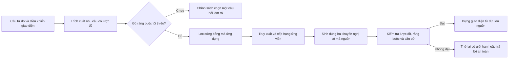

# Khảo sát kiến trúc tư vấn sản phẩm có căn cứ

Ngày khảo sát: **18/07/2026**

Phạm vi: bản mẫu **48 giờ**, một ngành hàng máy lạnh, hội thoại lai, trả đúng **3 sản phẩm** kèm lý do, điểm đánh đổi và nguồn.

Trạng thái: tài liệu cung cấp bằng chứng và cổng kiểm chứng, **không chốt kiến trúc thay người ra quyết định**.

## Tóm lược điều hành

Giả thuyết đáng kiểm chứng đầu tiên là một luồng cố định, lấy danh mục làm trung tâm:

1. Mô hình chỉ trích xuất nhu cầu thành dữ liệu có cấu trúc và diễn đạt câu trả lời.
2. Mã ứng dụng thực hiện lọc cứng, tính điểm, giới hạn tập ứng viên và kiểm tra kết quả.
3. Bộ xếp hạng lại chỉ sắp xếp các sản phẩm đã hợp lệ, không được hồi sinh sản phẩm bị loại.
4. Mọi nhận định về sản phẩm phải trỏ tới mã sản phẩm, trường dữ liệu và phiên bản nguồn.
5. Giao diện dựng giá, thông số và liên kết nguồn từ dữ liệu đã kiểm tra, không dùng chuỗi do mô hình tự viết.

Đây là **giả thuyết**, chưa phải quyết định. Nó cần được so với tìm kiếm lai và dịch vụ truy xuất được quản lý trên cùng bộ tình huống. Nếu luồng cố định không đạt chất lượng truy xuất với cách nói tự nhiên, tìm kiếm lai là phần mở rộng hợp lý. Nếu đội đã có sẵn tài khoản, chỉ mục và kinh nghiệm với dịch vụ được quản lý, phương án đó có thể rút ngắn phần hạ tầng, nhưng tăng phụ thuộc nhà cung cấp.

Lý do ưu tiên phép thử này:

- Sinh tăng cường truy xuất (Retrieval-Augmented Generation, RAG) cho phép mô hình dùng bộ nhớ ngoài và cung cấp nguồn gốc, nhưng chất lượng cuối vẫn phụ thuộc chất lượng truy xuất [Lewis và cộng sự, NeurIPS 2020](https://papers.neurips.cc/paper/2020/hash/6b493230205f780e1bc26945df7481e5-Abstract.html).
- Bộ chuẩn đánh giá truy xuất thông tin dị thể (Benchmarking Information Retrieval, BEIR) cho thấy xếp hạng lại và tương tác muộn thường có chất lượng tốt, nhưng chi phí tính toán cao hơn; xếp hạng xác suất Okapi (Okapi BM25) vẫn là đường cơ sở mạnh [Thakur và cộng sự, 2021](https://arxiv.org/abs/2104.08663).
- Đầu ra có cấu trúc bảo đảm hình dạng lược đồ, **không bảo đảm giá trị bên trong đúng**. Tài liệu chính thức của OpenAI nêu rõ mô hình vẫn có thể sai trong các giá trị của đối tượng [OpenAI, giới thiệu đầu ra có cấu trúc](https://openai.com/index/introducing-structured-outputs-in-the-api/).
- Dẫn nguồn tự thân không đủ. Bộ chuẩn đánh giá trích dẫn tự động (Automatic LLMs' Citation Evaluation, ALCE) đánh giá riêng độ đúng, độ đầy đủ và chất lượng trích dẫn; ngay cả hệ thống tốt trong thí nghiệm vẫn thiếu hỗ trợ trích dẫn ở nhiều câu trả lời [Gao và cộng sự, 2023](https://arxiv.org/abs/2305.14627).

## Câu hỏi và giới hạn khảo sát

Tài liệu trả lời ba câu hỏi:

- Mẫu kiến trúc nào kết hợp được truy xuất, quy tắc nghiệp vụ, xếp hạng lại, sinh có căn cứ, dẫn nguồn và đầu ra có cấu trúc?
- Đánh đổi nào quan trọng nhất khi chỉ có **48 giờ**?
- Phép thử nhỏ nhất nào giúp người ra quyết định chọn giữa các mẫu bằng dữ liệu?

Ngoài phạm vi:

- Không chọn mô hình hoặc nhà cung cấp cuối cùng.
- Không thiết kế đầy đủ hệ thống thử nghiệm ba tháng.
- Không triển khai mã sản phẩm.
- Không coi điểm do mô hình tự chấm là bằng chứng duy nhất.

## Bằng chứng từ dữ liệu đang có

Dữ liệu máy lạnh (nguồn gốc [`docs/raw/Spec_cate_gia.xlsx`](../raw/Spec_cate_gia.xlsx) sheet *Máy lạnh*, nay đã gom vào [catalog](../dataset/catalog/catalog.jsonl) — lọc `category.name == "Máy lạnh"`) là nguồn sơ cấp trong kho mã. Kiểm tra trực tiếp cho thấy:

| Quan sát | Kết quả | Hệ quả kiến trúc |
|---|---:|---|
| Số bản ghi và mã đơn vị lưu kho (Stock Keeping Unit, SKU) riêng | **1.039** và **1.039** | Có thể quét hoặc lọc trong bộ nhớ cho bản mẫu, chưa cần kho véc tơ vì quy mô |
| Trường tên sản phẩm chuẩn | **Không có** | Chưa thể tạo thẻ sản phẩm đáng tin chỉ từ tệp này |
| Có giá gốc | **269**, khoảng **25,9%** | Ngân sách không thể là lọc cứng trên toàn bộ danh mục nếu chưa có nguồn giá bổ sung |
| Có giá khuyến mãi | **190**, khoảng **18,3%** | Phải phân biệt giá thiếu với không khuyến mãi |
| Có phạm vi sử dụng | **945**, khoảng **90,9%** | Có thể dùng cho lọc diện tích sau khi chuẩn hóa |
| Có độ ồn | **716**, khoảng **68,9%** | Ưu tiên chạy êm cần chính sách xử lý dữ liệu thiếu |
| Năm dòng sản phẩm | **2013 đến 2026**, kèm giá trị không hợp lệ | Phải xác định thế nào là sản phẩm đang bán trước khi xếp hạng |

Các quan sát này không thay thế kiểm định dữ liệu chuyên sâu. Chúng chỉ xác lập giả định kiến trúc:

- Cần một khung nhìn danh mục đã chuẩn hóa, có `product_id`, trạng thái bán, giá hiệu lực, phạm vi diện tích, thuộc tính và thời điểm cập nhật.
- Giá, tồn kho, khuyến mãi và chính sách phải đến từ nguồn có thẩm quyền. Nếu nguồn không có, câu trả lời phải nói **không có dữ liệu**, không suy đoán.
- Mã `productidweb` hiện có không chứng minh được một địa chỉ trang sản phẩm. Không được tự ghép địa chỉ công khai nếu chưa kiểm chứng quy tắc ánh xạ.

## Hợp đồng chung cho cả ba mẫu

Các mẫu khác nhau ở cách lấy và xếp hạng ứng viên, nhưng nên dùng chung hợp đồng sau:



### Ranh giới quyết định

- **Mô hình được làm:** hiểu câu tự do, trích xuất sở thích mềm, diễn đạt câu hỏi, giải thích lợi ích và điểm đánh đổi từ bằng chứng đã cấp.
- **Mã ứng dụng phải làm:** lọc ngân sách, trạng thái bán, tồn kho, vùng phục vụ, kiểu máy và điều kiện bắt buộc; tính giá hiệu lực; kiểm tra mã sản phẩm và nguồn.
- **Chuyên gia ngành hàng phải quyết định:** thuộc tính nào là bắt buộc, công thức phù hợp diện tích, trọng số ưu tiên và cách xử lý trường thiếu.

Tài liệu Microsoft xác nhận bộ lọc giá trị phù hợp cho tiêu chí số và tiêu chí phải khớp chính xác; bộ lọc giới hạn tài liệu đi tiếp vào truy xuất và chấm độ liên quan [Azure AI Search, bộ lọc truy vấn](https://learn.microsoft.com/en-us/azure/search/search-filters). Tài liệu Qdrant cũng dùng tồn kho, vị trí và khoảng giá làm ví dụ cho điều kiện không nên mã hóa chỉ bằng nhúng véc tơ [Qdrant, lọc](https://qdrant.tech/documentation/search/filtering/).

### Tách nhà cung cấp

Nên đặt giao diện nội bộ quanh năng lực, không quanh tên dịch vụ:

- `NeedExtractor`: câu hội thoại thành `NeedProfile`.
- `CandidateRetriever`: hồ sơ nhu cầu thành danh sách `Candidate` có bằng chứng.
- `Reranker`: câu truy vấn và ứng viên thành thứ tự mới.
- `GroundedGenerator`: ứng viên đã khóa thành `RecommendationSet`.
- `EvidenceValidator`: kiểm tra từng nhận định với trường nguồn.

Đối tượng truyền qua các giao diện là kiểu dữ liệu của ứng dụng. Bộ chuyển đổi nhà cung cấp chịu trách nhiệm đổi sang giao diện lập trình ứng dụng (API) cụ thể. Khóa mô hình, lời nhắc và ngưỡng nằm trong cấu hình. Nhờ vậy có thể thay dịch vụ sinh, nhúng hoặc xếp hạng lại độc lập, đồng thời giữ một bản cài đặt giả để chạy kiểm thử không qua mạng.

Đầu ra có cấu trúc nên dùng lược đồ nghiêm ngặt khi dịch vụ hỗ trợ. Tài liệu OpenAI phân biệt gọi hàm để nối mô hình với dữ liệu, và định dạng phản hồi để ép hình dạng câu trả lời; chế độ đầu ra có cấu trúc tuân thủ lược đồ tốt hơn chế độ ký pháp đối tượng JavaScript (JavaScript Object Notation, JSON) thông thường [OpenAI, đầu ra có cấu trúc](https://developers.openai.com/api/docs/guides/structured-outputs). Đây là ví dụ về năng lực cần có, không phải lý do gắn mã ứng dụng vào OpenAI.

## So sánh ba mẫu khả thi

| Mẫu | Luồng ứng viên | Điểm mạnh cho bản mẫu | Đánh đổi và rủi ro | Điều kiện đáng thử |
|---|---|---|---|---|
| **A. Luồng cố định, danh mục trước** | Lọc cứng, điểm nghiệp vụ, tùy chọn xếp hạng lại trên 10 đến 30 ứng viên | Ít thành phần, dễ giải thích, dễ chứng minh vì sao một sản phẩm lọt hoặc bị loại | Có thể bỏ lỡ cách diễn đạt đồng nghĩa; trọng số thủ công dễ phản ánh thiên kiến chuyên gia | Danh mục nhỏ, thuộc tính có cấu trúc, thời gian rất ngắn |
| **B. Truy xuất lai hai giai đoạn** | Lọc cứng, từ khóa cộng véc tơ, hợp nhất, xếp hạng lại | Bắt được cả từ khóa chính xác và ý nghĩa tự nhiên; mở rộng tốt hơn cho mô tả dài | Phải tạo chỉ mục, chọn nhúng, chỉnh ngưỡng; tăng độ trễ và thêm điểm lỗi | Mẫu A hụt truy hồi vì ngôn ngữ người dùng hoặc dữ liệu văn bản dài |
| **C. Truy xuất được quản lý hoặc tác tử gọi công cụ** | Mô hình gọi công cụ danh mục hoặc dịch vụ quản lý tự truy xuất, xếp hạng và sinh | Có thể lắp nhanh nếu hạ tầng đã sẵn; một số dịch vụ có sẵn xếp hạng lại và chú thích nguồn | Phụ thuộc nhà cung cấp, khó quan sát quyết định trung gian, chi phí và độ trễ biến động; tác tử có thêm nhánh không tất định | Đội đã có tài khoản, chỉ mục, bộ chuyển đổi và kinh nghiệm vận hành |

Không mẫu nào tự giải quyết dữ liệu thiếu hoặc nguồn lỗi thời.

## Mẫu A: Luồng cố định, danh mục trước

### Cơ chế

1. Mô hình trích xuất `budget_max`, diện tích, loại phòng, nắng, ưu tiên êm, tiết kiệm điện và các giá trị chưa biết.
2. Chính sách tất định chọn tối đa một câu hỏi có giá trị thông tin cao nhất. Mô hình chỉ diễn đạt câu hỏi.
3. Bộ lọc cứng loại sản phẩm vi phạm điều kiện bắt buộc.
4. Bộ điểm nghiệp vụ chấm các tiêu chí mềm và lưu đóng góp của từng tiêu chí.
5. Tùy chọn dùng bộ xếp hạng lại trên tập nhỏ. Kết quả chỉ được đổi thứ tự, không được thêm mã ngoài tập.
6. Mô hình nhận các phiếu bằng chứng đã rút gọn và sinh đúng ba khuyến nghị.
7. Máy chủ kiểm tra rồi dựng giá, thông số và nguồn từ bản ghi gốc.

### Đánh đổi

- Đây là mẫu dễ đạt tính kiểm toán trong **48 giờ**, vì mỗi lần loại và cộng điểm đều có dấu vết.
- Điểm thủ công không đồng nghĩa với phù hợp thực tế. Phải so với đánh giá chuyên gia trên tình huống giữ lại.
- Xếp hạng lại bằng mô hình có thể hiểu sở thích mềm tốt hơn, nhưng điểm liên quan không phải xác suất phù hợp. Cohere cảnh báo điểm xếp hạng phụ thuộc truy vấn và khuyến nghị dùng **30 đến 50** truy vấn đại diện để chọn ngưỡng [Cohere, thực hành xếp hạng lại](https://docs.cohere.com/docs/reranking-best-practices).
- Nếu sau lọc chỉ còn dưới ba sản phẩm, hệ thống phải hỏi người dùng nới một ràng buộc hoặc nói không đủ lựa chọn. Không được lấp bằng sản phẩm không hợp lệ.

## Mẫu B: Truy xuất lai hai giai đoạn

### Cơ chế

1. Áp dụng bộ lọc cứng trên trường có cấu trúc.
2. Chạy song song truy xuất từ khóa bằng Okapi BM25 và truy xuất ngữ nghĩa bằng véc tơ dày.
3. Hợp nhất bằng hợp nhất thứ hạng nghịch đảo (Reciprocal Rank Fusion, RRF), tránh cộng trực tiếp hai thang điểm khác nhau.
4. Xếp hạng lại tập đầu bằng mô hình tương tác sâu hơn.
5. Dùng cùng bộ sinh và bộ kiểm tra của mẫu A.

Qdrant mô tả đúng mẫu này: truy xuất dày và thưa tạo tập ứng viên, sau đó mô hình tương tác muộn xếp hạng lại; cách làm giữ mô hình đắt ở tập nhỏ [Qdrant, tìm kiếm lai với xếp hạng lại](https://qdrant.tech/documentation/tutorials-basics/reranking-hybrid-search/). Tài liệu truy vấn nhiều giai đoạn của Qdrant lưu ý RRF là mặc định an toàn khi chưa có bộ đánh giá hoặc thang điểm đáng tin [Qdrant, truy vấn lai](https://qdrant.tech/documentation/search/hybrid-queries/).

### Đánh đổi

- Hữu ích khi người dùng nói “êm cho bé ngủ”, còn dữ liệu ghi nhiều cách khác nhau về chế độ ngủ và độ ồn.
- Không thay thế lọc cứng. Khoảng giá, tồn kho và phạm vi phục vụ vẫn phải là điều kiện chính xác.
- Chất lượng nhúng tiếng Việt và cách biểu diễn bản ghi bán cấu trúc phải được đo trên dữ liệu thật.
- Xếp hạng lại tăng độ chính xác tiềm năng nhưng thêm một lượt mạng. Amazon Bedrock mô tả xếp hạng lại là bước tính độ liên quan rồi đổi thứ tự tài liệu, đồng thời có thể giảm số đoạn chuyển vào mô hình sinh [AWS, xếp hạng lại](https://docs.aws.amazon.com/bedrock/latest/userguide/rerank.html).
- Với **1.039** bản ghi, lợi ích chất lượng phải đủ lớn để biện minh cho chỉ mục và vận hành bổ sung.

## Mẫu C: Truy xuất được quản lý hoặc tác tử gọi công cụ

### Cơ chế

- Biến tìm kiếm danh mục, giá và chính sách thành công cụ có lược đồ.
- Mô hình chọn khi nào gọi công cụ, hoặc dịch vụ được quản lý thực hiện truy xuất và xếp hạng.
- Bộ điều phối vẫn phải giới hạn công cụ, kiểm tra tham số và xác thực kết quả cuối.

### Đánh đổi

- Dịch vụ được quản lý có thể cung cấp sẵn lọc, tìm kiếm lai, xếp hạng lại và chú thích nguồn. Amazon Bedrock Knowledge Bases cho phép truy xuất lai và xếp hạng lại được quản lý [AWS, truy vấn kho tri thức](https://docs.aws.amazon.com/bedrock/latest/userguide/kb-test-retrieve.html). Gemini có thể trả chú thích trích dẫn có vị trí và địa chỉ nguồn cho kết quả có căn cứ [Google, tạo nội dung có căn cứ](https://ai.google.dev/gemini-api/docs/google-search?hl=en).
- Các khả năng đó chứng minh mẫu giải pháp tương tự, nhưng tìm kiếm Internet không phải nguồn sự thật phù hợp cho giá và tồn kho nội bộ.
- Kiến trúc RAG chuẩn dùng một chuỗi cố định cho một lần tìm trên một chỉ mục; RAG tác tử phù hợp hơn khi cần chọn nguồn động, phân rã truy vấn hoặc suy luận nhiều bước [Microsoft, hướng dẫn thiết kế RAG](https://learn.microsoft.com/en-us/azure/architecture/ai-ml/guide/rag/rag-solution-design-and-evaluation-guide).
- Bài toán bản mẫu hiện có một ngành hàng và một luồng gợi ý. Tác tử có nguy cơ thêm độ không tất định mà chưa tạo giá trị đo được.
- Phải kiểm tra điều khoản lưu dữ liệu. Ví dụ, Google nêu rõ dịch vụ tạo nội dung có căn cứ bằng tìm kiếm lưu lời nhắc, ngữ cảnh và đầu ra trong **30 ngày** [Google, điều khiển lưu dữ liệu](https://ai.google.dev/gemini-api/docs/zdr).

## Sinh có căn cứ, dẫn nguồn và chống bịa

### Gói bằng chứng

Mỗi ứng viên chuyển vào mô hình nên có cấu trúc tối thiểu:

```json
{
  "product_id": "sku:...",
  "facts": [
    {
      "field": "pham_vi_su_dung",
      "value": "...",
      "source_id": "catalog:may-lanh:sku:...#pham_vi_su_dung",
      "observed_at": "..."
    }
  ],
  "score_reasons": [],
  "missing_fields": []
}
```

Mô hình chỉ được tham chiếu `source_id` đã cấp. Ứng dụng ánh xạ mã đó về bản ghi hoặc điểm cuối nguồn. Cách này mạnh hơn yêu cầu mô hình tự viết địa chỉ.

### Cổng kiểm tra sau sinh

Kết quả chỉ được hiển thị khi đạt tất cả điều kiện:

- Có đúng **3** `product_id` khác nhau và đều thuộc tập ứng viên hợp lệ.
- Mỗi lý do và điểm đánh đổi có ít nhất một `source_id` hợp lệ.
- Mỗi số, đơn vị, giá, khuyến mãi và bảo hành khớp giá trị chuẩn hóa từ nguồn.
- Không đổi nghĩa “thiếu dữ liệu” thành phủ định. Ví dụ, thiếu giá khuyến mãi không có nghĩa là không khuyến mãi.
- Sản phẩm vẫn qua bộ lọc cứng sau khi gọi mô hình.
- Nếu lỗi lược đồ hoặc căn cứ, thử lại tối đa một lần với thông báo lỗi cụ thể; sau đó dùng mẫu câu tất định hoặc trả lời không đủ dữ liệu.

Nghiên cứu FActScore cho thấy đánh giá đúng sai ở cấp toàn câu trả lời che giấu hỗn hợp nhận định đúng và sai; họ tách văn bản thành sự kiện nguyên tử rồi đo tỷ lệ được nguồn đáng tin hỗ trợ [Min và cộng sự, 2023](https://arxiv.org/abs/2305.14251). Vì vậy cổng kiểm tra nên làm ở cấp nhận định, không chỉ kiểm tra có một danh sách nguồn ở cuối.

### Các lớp không nên nhầm lẫn

| Lớp | Bảo đảm được | Không bảo đảm được |
|---|---|---|
| Lược đồ nghiêm ngặt | Đủ trường, đúng kiểu, đúng số phần tử nếu lược đồ hỗ trợ | Lý do đúng và sản phẩm phù hợp |
| RAG | Mô hình thấy bằng chứng ngoài tham số | Bằng chứng đã truy xuất là đúng hoặc liên quan |
| Trích dẫn | Người dùng có con trỏ để kiểm tra | Nhận định thực sự được nguồn hỗ trợ |
| Bộ xếp hạng lại | Thứ tự liên quan tốt hơn theo mô hình | Tuân thủ ngân sách, tồn kho và quy tắc nghiệp vụ |
| Bộ lọc cứng | Không vi phạm điều kiện đã mã hóa | Tối ưu sở thích mềm hoặc giải thích dễ hiểu |

## Đánh giá để ra quyết định

### Bộ tình huống tối thiểu

Chuyên gia ngành hàng nên tạo một tập giữ lại, bao gồm:

- Tình huống điển hình theo diện tích, ngân sách và ưu tiên.
- Cách nói tiếng Việt có dấu, không dấu, viết tắt và trộn tên kỹ thuật.
- Trường hợp thiếu thông tin phải hỏi thêm.
- Trường hợp không đủ ba sản phẩm hợp lệ.
- Trường hợp dữ liệu thiếu, mâu thuẫn hoặc lỗi thời.
- Trường hợp đối nghịch, yêu cầu mô hình bỏ qua nguồn hoặc bịa khuyến mãi.

Tài liệu OpenAI khuyến nghị bộ đánh giá phản ánh lưu lượng thật, có ca thường, ca biên, ca đối nghịch và nhãn chuyên gia; họ cũng cảnh báo không dùng cảm giác chủ quan hoặc chỉ số tự động không hiệu chỉnh với con người [OpenAI, thực hành đánh giá](https://developers.openai.com/api/docs/guides/evaluation-best-practices).

### Chỉ số tách theo tầng

| Tầng | Chỉ số đề xuất | Ý nghĩa |
|---|---|---|
| Hiểu nhu cầu | Độ chính xác từng trường, tỷ lệ hỏi đúng thông tin còn thiếu | Mô hình có hiểu và hỏi đúng không |
| Lọc cứng | **Tỷ lệ vi phạm bằng 0** trên tập thử | Một gợi ý vi phạm ngân sách hoặc điều kiện bắt buộc là lỗi nghiêm trọng |
| Truy xuất | Truy hồi tại 10, tỷ lệ có ít nhất một sản phẩm chuẩn trong 10 đầu | Ứng viên tốt có lọt vào trước xếp hạng lại không |
| Xếp hạng | Độ lợi tích lũy chuẩn hóa chiết khấu tại 3 (normalized Discounted Cumulative Gain, nDCG@3), chấp nhận của chuyên gia | Ba vị trí đầu có đúng thứ tự ưu tiên không |
| Căn cứ | Tỷ lệ nhận định nguyên tử được nguồn hỗ trợ, độ đầy đủ và độ đúng trích dẫn | Câu trả lời có bịa hoặc gắn nhầm nguồn không |
| Hợp đồng | Tỷ lệ lược đồ hợp lệ, đúng ba mã duy nhất | Giao diện có dựng ổn định không |
| Trải nghiệm | Độ trễ phân vị 95, số câu hỏi làm rõ, điểm dễ hiểu của chuyên gia | Có đạt yêu cầu dưới 3 giây và dưới 5 giây của đề bài không |

Khung đánh giá tự động sinh tăng cường truy xuất (Retrieval Augmented Generation Assessment, RAGAS) tách đánh giá thành chất lượng truy xuất, mức sử dụng ngữ cảnh trung thực và chất lượng sinh [Es và cộng sự, 2024](https://aclanthology.org/2024.eacl-demo.16/). Có thể dùng làm tín hiệu tự động hỗ trợ, nhưng không thay nhãn chuyên gia cho độ phù hợp sản phẩm.

### Phép thử loại trừ

Chạy cùng một tập tình huống và cùng nguồn dữ liệu qua các cấu hình:

1. Mẫu A, chỉ điểm nghiệp vụ.
2. Mẫu A, thêm xếp hạng lại.
3. Mẫu B, truy xuất lai và xếp hạng lại.
4. Mẫu C chỉ khi hạ tầng đã sẵn, vẫn dùng cùng bộ kiểm tra đầu ra.

Giữ nguyên mô hình sinh khi so truy xuất. Sau đó giữ nguyên ứng viên khi so hai nhà cung cấp mô hình sinh. Nếu thay nhiều tầng cùng lúc, không thể quy cải thiện cho đúng nguyên nhân.

## Cổng quyết định cho bản mẫu 48 giờ

| Bằng chứng quan sát được | Hướng xử lý để người ra quyết định cân nhắc |
|---|---|
| Mẫu A không vi phạm lọc, ba đầu được chuyên gia chấp nhận và đạt độ trễ | Giữ kiến trúc đơn giản cho bản mẫu |
| Mẫu A có ứng viên phù hợp nhưng thứ tự kém | Thử thêm bộ xếp hạng lại, chưa cần kho véc tơ |
| Sản phẩm chuẩn thường không lọt vào 10 ứng viên do cách diễn đạt tự nhiên | Thử mẫu B và đo mức tăng truy hồi |
| Mẫu B tăng chất lượng không đáng kể hoặc vượt ngân sách độ trễ | Quay lại mẫu A, ghi tìm kiếm lai là thử nghiệm sau |
| Đội có sẵn dịch vụ quản lý và mẫu C qua cùng cổng chất lượng | Cân nhắc tốc độ lắp ghép so với phụ thuộc và chi phí |
| Không có nguồn giá, tồn kho hoặc tên sản phẩm đủ tin cậy | Dừng khẳng định các trường đó, không dùng mô hình để lấp chỗ trống |

## Rủi ro thất bại và khuyến nghị cần kiểm chứng

| Rủi ro | Cơ chế gây lỗi | Kiểm chứng nhỏ nhất |
|---|---|---|
| Lọc sau xếp hạng | Ứng viên không hợp lệ chiếm chỗ ứng viên tốt | Kiểm thử thuộc tính bảo đảm mọi đầu ra là tập con của kết quả lọc |
| Xếp hạng lại lấn quy tắc | Liên quan ngữ nghĩa bị hiểu nhầm là phù hợp nghiệp vụ | So danh sách trước và sau, đặt cổng **0 vi phạm** |
| Đầu ra đúng lược đồ nhưng sai sự thật | Lược đồ chỉ kiểm tra hình dạng | Đối chiếu từng nhận định nguyên tử với trường nguồn |
| Trích dẫn trang trí | Nguồn tồn tại nhưng không hỗ trợ nhận định | Nhãn chuyên gia cho độ đúng và độ đầy đủ trích dẫn |
| Dữ liệu cũ hoặc thiếu | Bộ lọc loại nhầm hoặc mô hình suy diễn | Hiển thị thời điểm nguồn, chính sách `unknown`, ca thử dữ liệu thiếu |
| Không đủ ba sản phẩm | Ràng buộc quá chặt hoặc danh mục thưa | Hội thoại xin nới đúng một ràng buộc, không tự ý nới |
| Khóa nhà cung cấp | Kiểu dữ liệu, lời nhắc và logic lẫn trong bộ phát triển phần mềm | Thay bộ chuyển đổi bằng bản giả trong kiểm thử hợp đồng |
| Tăng độ trễ qua nhiều lượt mạng | Trích xuất, nhúng, xếp hạng lại và sinh nối tiếp | Đo từng chặng và phân vị 95, tắt tầng không tạo mức tăng chất lượng |
| Tự chấm thiên lệch | Cùng họ mô hình sinh và đánh giá ưu ái nhau | Hiệu chỉnh bằng nhãn chuyên gia, ưu tiên so cặp có tiêu chí rõ |

Các khuyến nghị cần kiểm chứng trước khi chốt:

1. **Kiểm chứng giả thuyết A:** danh mục nhỏ và có cấu trúc đủ để luồng cố định đạt chất lượng mà chưa cần tìm kiếm véc tơ.
2. **Kiểm chứng giá trị xếp hạng lại:** mức tăng nDCG@3 và chấp nhận chuyên gia có bù độ trễ và chi phí không.
3. **Kiểm chứng nguồn sự thật:** đội có thể cấp tên, giá, tồn kho, khuyến mãi, địa chỉ sản phẩm và thời điểm cập nhật đáng tin không.
4. **Kiểm chứng tiếng Việt:** mô hình trích xuất và bộ xếp hạng lại có ổn định với cách nói mua sắm thật không.
5. **Kiểm chứng khả năng thay nhà cung cấp:** cùng một bộ kiểm thử hợp đồng phải chạy được với bản giả và ít nhất hai bộ chuyển đổi hoặc một bộ chuyển đổi cộng một bản cài đặt cục bộ.

## Kết luận

Điểm lõi không phải là chọn một biến thể RAG phức tạp, mà là giữ **quyền quyết định sự thật và điều kiện bắt buộc ngoài mô hình**. Trong bản mẫu 48 giờ, người ra quyết định nên kiểm chứng luồng danh mục trước làm đường cơ sở, chỉ thêm xếp hạng lại hoặc truy xuất lai khi phép thử cho thấy mức tăng chất lượng rõ ràng. Dù chọn mẫu nào, đầu ra có cấu trúc, mã nguồn do máy chủ ánh xạ, kiểm tra nhận định nguyên tử và tập đánh giá có nhãn chuyên gia là các lớp không nên bỏ.
