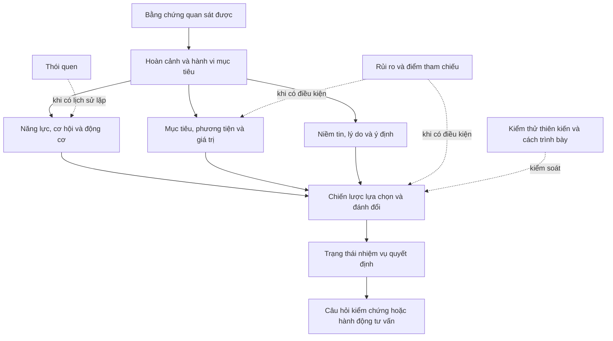

# Nền tảng khoa học cho khung tâm lý hành vi mua hàng thích nghi

**Ngày khảo sát:** 18 tháng 7 năm 2026

**Câu hỏi:** Những lý thuyết, mô hình và bằng chứng nghiên cứu gốc nào phù hợp làm thư viện lăng kính khởi đầu cho hồ sơ giả thuyết hành vi mua hàng đa ngành; phần nào có thể kết hợp, phần nào mâu thuẫn, và ranh giới nào ngăn hệ thống suy diễn tâm lý quá mức?

**Trạng thái:** Tài liệu cung cấp bằng chứng và tiêu chuẩn đề xuất chiều mới. Tài liệu không chốt lược đồ thay người ra quyết định.

## Kết luận điều hành

Không có một mô hình đơn lẻ bao phủ đáng tin cậy toàn bộ hoàn cảnh, mục tiêu, động cơ, năng lực, cơ hội, rào cản, niềm tin, ý định, rủi ro, đánh đổi, trạng thái quyết định và thiên kiến. Phương án có căn cứ hơn là một **thư viện lăng kính phân tầng**, trong đó mỗi lăng kính chỉ trả lời một loại câu hỏi và mọi kết luận về khách hàng vẫn là giả thuyết có phạm vi, thời điểm, bằng chứng ủng hộ, bằng chứng phản bác và phép kiểm chứng.

Thư viện khởi đầu nên có các vai trò khác nhau:

1. Lập chỉ mục điều kiện hành vi bằng năng lực, cơ hội và động cơ.
2. Biểu diễn hoàn cảnh và nhiệm vụ mua cụ thể.
3. Nối mục tiêu với phương tiện có thể thay thế hoặc phục vụ nhiều mục tiêu.
4. Phân loại giá trị mà lựa chọn có thể mang lại.
5. Tách niềm tin, lý do ủng hộ và phản đối, chuẩn chủ quan, kiểm soát được cảm nhận và ý định.
6. Biểu diễn rủi ro theo hậu quả được cảm nhận và theo điểm tham chiếu, không gán một nhãn chung.
7. Biểu diễn chiến lược đánh đổi có bù trừ hoặc không bù trừ, cùng sự thay đổi chiến lược theo nhiệm vụ.
8. Ghi trạng thái quyết định từ hành động quan sát được, không từ nhãn tính cách.
9. Xem thói quen và thiên kiến là cơ chế ứng viên cần phép thử, không phải thuộc tính ổn định của một người.

Điểm lõi chi phối toàn bộ thư viện là: **mỗi lăng kính là một cách tạo giả thuyết có thể bác bỏ về một hành vi cụ thể trong một hoàn cảnh cụ thể, không phải công cụ đọc nội tâm khách hàng**.

## Phạm vi và phương pháp

### Phạm vi

Khảo sát phục vụ khung hồ sơ giả thuyết trong [thiết kế khung tư vấn sản phẩm thích nghi](../superpowers/specs/2026-07-18-khung-tu-van-san-pham-thich-nghi-design.md). Tài liệu tập trung vào các khái niệm có thể dùng chung cho nhiều ngành hàng. Mô hình chỉ phù hợp với một loại sản phẩm hoặc một can thiệp chuyên biệt không được dùng làm lõi.

### Quy tắc chọn nguồn

- Chỉ dùng bài báo nghiên cứu gốc, sách hoặc chương do tác giả mô hình công bố.
- Trỏ tới trang nhà xuất bản, kho của cơ quan tác giả hoặc bản do tác giả công bố khi có thể.
- Phân biệt điều tác giả thực sự tuyên bố với phép suy ra phục vụ thiết kế.
- Không dùng mức độ phổ biến, bài tổng hợp thương mại hoặc sơ đồ trên mạng làm bằng chứng.
- Ghi giới hạn hiệu lực ngay bên cạnh giá trị sử dụng, không để ở phần chú thích xa nguồn.

### Cách đọc bằng chứng

Trong tài liệu này:

- **Nguồn nói** là nội dung được nguồn gốc trực tiếp hỗ trợ.
- **Hệ quả cho khung** là phép suy ra thiết kế từ nhiều nguồn và phải được kiểm chứng bằng dữ liệu dự án.
- **Không được suy ra** là ranh giới chống biến mô hình nhóm thành chẩn đoán một cá nhân.

## Ma trận lăng kính và bằng chứng

| Lăng kính | Câu hỏi hợp lệ | Nguồn sở hữu lý thuyết | Giá trị cho hồ sơ | Giới hạn hiệu lực |
|---|---|---|---|---|
| Năng lực, cơ hội và động cơ (Capability, Opportunity, Motivation, Behavior, COM-B) | Hành vi đang thiếu điều kiện nào: năng lực, cơ hội hay động cơ? | Michie, van Stralen và West, 2011 | Tạo chỉ mục rộng cho năng lực, cơ hội, rào cản và động cơ, gồm cả phản tư lẫn tự động | Được phát triển để phân tích và thiết kế can thiệp thay đổi hành vi, chủ yếu kiểm tra độ tin cậy phân loại trong kiểm soát thuốc lá và béo phì; không phải mô hình xếp hạng sản phẩm |
| Hành vi có kế hoạch (Theory of Planned Behavior, TPB) | Niềm tin hành vi, chuẩn chủ quan và kiểm soát được cảm nhận liên quan thế nào tới ý định cho một hành vi cụ thể? | Ajzen, 1991 | Tách niềm tin, thái độ với hành vi, áp lực xã hội được cảm nhận, kiểm soát được cảm nhận và ý định | Ý định chỉ dự báo hành vi khi có đủ kiểm soát thực tế; khái niệm phải khớp hành vi, mục tiêu, hoàn cảnh và thời gian cụ thể |
| Giá trị tiêu dùng (Theory of Consumption Values, TCV) | Lựa chọn đang hứa hẹn loại giá trị chức năng, xã hội, cảm xúc, nhận thức mới hay điều kiện nào? | Sheth, Newman và Gross, 1991 | Tạo từ vựng khởi đầu cho động cơ và lợi ích được tìm kiếm trong lựa chọn tiêu dùng | Năm giá trị là các thành phần lý thuyết của lựa chọn tiêu dùng, không phải năm nét tính cách; đóng góp khác nhau theo đúng tình huống lựa chọn |
| Chuỗi phương tiện và mục đích (Means-End Chain, MEC) | Thuộc tính được cảm nhận nối với hệ quả và giá trị nào? | Gutman, 1982 | Nối bằng chứng sản phẩm với kết quả sử dụng và lý do kết quả đó quan trọng | Nguồn đề xuất mô hình liên kết thuộc tính được cảm nhận với giá trị; không chứng minh mọi khách hàng có cùng một chuỗi tuyến tính |
| Biến hoàn cảnh trong hành vi tiêu dùng | Điều gì trong môi trường vật lý, xã hội, thời gian, nhiệm vụ và trạng thái tức thời làm lựa chọn này khác đi? | Belk, 1975 | Giữ hồ sơ gắn với tình huống, người sử dụng, dịp dùng và thời điểm | Phân loại hoàn cảnh, không phải mô hình nhân quả hoàn chỉnh; trạng thái tức thời đặc biệt khó quan sát từ hội thoại ngắn |
| Hệ mục tiêu (Goal Systems Theory, GST) | Một mục tiêu có những phương tiện thay thế nào, và một phương tiện phục vụ hoặc cản trở những mục tiêu nào? | Kruglanski và cộng sự, 2002 | Thay chuỗi tuyến tính bằng mạng mục tiêu và phương tiện có thể thay thế, đa mục đích hoặc xung đột | Liên kết mục tiêu và phương tiện có thể đổi theo kích hoạt và khung hoàn cảnh; không được coi đồ thị suy ra là cấu trúc bền vững của cá nhân |
| Lý thuyết lý do hành vi (Behavioral Reasoning Theory, BRT) | Lý do ủng hộ và phản đối cụ thể nào nối niềm tin với ý định? | Westaby, 2005 | Giữ riêng lý do thuận, lý do chống, niềm tin và động cơ tổng quát | Bốn nghiên cứu gốc dùng quyết định nghỉ việc và chuyển nơi làm việc; cần kiểm chứng lại trong mua hàng và lý do sau hành vi có thể là hợp lý hóa |
| Lựa chọn tiêu dùng được kiến tạo | Chiến lược xử lý thông tin và đánh đổi thay đổi thế nào theo nhiệm vụ? | Bettman, Luce và Payne, 1998; Payne, Bettman và Johnson, 1993 | Biểu diễn chiến lược, chi phí nhận thức, áp lực thời gian, độ khó đánh đổi và tập cân nhắc | Là khung xử lý lựa chọn, không cho phép đọc chiến lược từ một lần nhấp; cùng một người có thể dùng nhiều chiến lược |
| Loại trừ theo khía cạnh (Elimination by Aspects, EBA) | Khách hàng có loại phương án không đạt ngưỡng trên từng tiêu chí theo thứ tự không? | Tversky, 1972 | Biểu diễn quy tắc không bù trừ và ràng buộc loại trừ | Không phải mọi lựa chọn đều dùng loại trừ tuần tự; thứ tự và ngưỡng phải được khai thác hoặc kiểm chứng |
| Rủi ro được cảm nhận | Khách hàng lo hậu quả nào: hiệu năng, tài chính, thể chất, tâm lý hay xã hội? | Jacoby và Kaplan, 1972; Kaplan, Szybillo và Jacoby, 1974 | Tách nỗi lo thành hậu quả cụ thể và câu hỏi kiểm chứng | Bản kiểm chứng gốc dùng **104** sinh viên và **12** loại sản phẩm; cấu trúc đóng góp thay đổi theo loại sản phẩm |
| Lý thuyết triển vọng (Prospect Theory) | Kết quả rủi ro đang được nhìn như lợi hay mất so với điểm tham chiếu nào? | Kahneman và Tversky, 1979 | Biểu diễn điểm tham chiếu, khung lợi hoặc mất và trọng số xác suất khi có lựa chọn rủi ro | Phạm vi gốc là quyết định dưới rủi ro; không được gọi mọi nỗi lo hoặc mọi phản đối giá là ác cảm mất mát |
| Pha hành động và kiểu tư duy (Action Phases and Mind-Sets) | Khách hàng đang cân nhắc mục tiêu, lập kế hoạch, hành động hay đánh giá kết quả? | Gollwitzer, 1990 | Tạo lăng kính cho trạng thái quyết định và loại câu hỏi phù hợp | Bốn pha mô tả tiến trình hành động nói chung, không phải phễu mua hàng đã được xác nhận; hành trình thực tế có thể quay lại hoặc dừng |
| Thói quen và giao diện mục tiêu | Phản ứng có được gợi bởi dấu hiệu hoàn cảnh do lặp lại trước đó không? | Wood và Neal, 2007 | Giải thích trường hợp hành vi lặp lại không đi qua ý định hiện tại | Cần lịch sử lặp lại trong hoàn cảnh ổn định; một lần mua lại không đủ chứng minh thói quen |
| Phép chẩn đoán thiên kiến và kiến trúc lựa chọn | Khung trình bày, neo, độ sẵn có hoặc phương án mồi có làm đổi phán đoán không? | Tversky và Kahneman, 1974, 1981; Huber, Payne và Puto, 1982 | Tạo kiểm thử phản thực cho hệ thống và giao diện | Hiệu ứng ở cấp nhiệm vụ không phải nhãn cá nhân; cần so sánh điều kiện tương đương thay vì suy đoán từ một lựa chọn |

## Nhóm nguồn thứ nhất: điều kiện, niềm tin và giá trị

### Năng lực, cơ hội và động cơ

Michie, van Stralen và West định nghĩa năng lực là khả năng tâm lý và thể chất để thực hiện hoạt động, cơ hội là các yếu tố bên ngoài làm hành vi có thể xảy ra hoặc gợi nó, còn động cơ gồm cả đánh giá và kế hoạch có ý thức lẫn cảm xúc, xung lực và thói quen. Ba thành phần tương tác với hành vi và với nhau, thay vì tạo thành một chuỗi một chiều. Bài báo cũng kết luận cần nghiên cứu thêm để biết bánh xe thay đổi hành vi có giúp thiết kế can thiệp hiệu quả hơn hay không [Michie, van Stralen và West, 2011](https://doi.org/10.1186/1748-5908-6-42).

**Hệ quả cho khung:**

- Dùng COM-B làm chỉ mục phủ rộng để tìm khoảng trống, không dùng như điểm số phù hợp mua hàng.
- Tách năng lực thực tế khỏi năng lực được cảm nhận.
- Tách cơ hội vật lý và xã hội khỏi động cơ nội tại.
- Cho phép quan hệ hai chiều và thay đổi theo thời gian.

**Không được suy ra:** một câu hỏi chậm hoặc một lần trì hoãn không chứng minh khách hàng thiếu năng lực hay động cơ.

### Niềm tin, kiểm soát và ý định

Ajzen đặt ý định ở trung tâm của hành vi có kế hoạch. Ý định phản ánh mức sẵn sàng cố gắng, nhưng chỉ có thể chuyển thành hành vi khi hành vi nằm trong kiểm soát ý chí và khi có đủ cơ hội, nguồn lực, thời gian, tiền, kỹ năng hoặc sự hợp tác cần thiết. Lý thuyết phân biệt niềm tin hành vi, niềm tin chuẩn mực và niềm tin kiểm soát; các biến gần gồm thái độ với hành vi, chuẩn chủ quan, kiểm soát được cảm nhận và ý định. Ajzen cũng nêu rõ thái độ chung và nét tính cách dự báo hành động cụ thể kém hơn các yếu tố gắn với hành vi và hoàn cảnh cụ thể [Ajzen, 1991](https://doi.org/10.1016/0749-5978(91)90020-T).

**Hệ quả cho khung:**

- Mọi giả thuyết về ý định phải nêu đúng hành động, đối tượng, hoàn cảnh và khoảng thời gian.
- Lưu riêng kiểm soát được cảm nhận, rào cản quan sát được và nguồn lực thực tế.
- Không biến ý định mua thành dự báo chắc chắn về giao dịch.
- Niềm tin phải là mệnh đề có đối tượng, chẳng hạn “chi phí điện có khả năng cao hơn”, không phải nhãn “khách hàng đa nghi”.

### Giá trị tiêu dùng

Sheth, Newman và Gross đề xuất năm giá trị có thể ảnh hưởng lựa chọn: chức năng, xã hội, cảm xúc, nhận thức mới và điều kiện. Các giá trị có thể đóng góp khác nhau trong từng hoàn cảnh lựa chọn. Cùng một lớp sản phẩm, quyết định mua hay không, chọn loại nào và chọn nhãn hiệu nào có thể do các giá trị khác nhau chi phối. Tác giả cũng mô tả sự đánh đổi giữa các giá trị khi không thể tối đa tất cả [Sheth, Newman và Gross, 1991](https://doi.org/10.1016/0148-2963(91)90050-8), [trang do Jagdish Sheth công bố](https://www.jagsheth.com/consumer-behavior/why-we-buy-what-we-buy-a-theory-of-consumption-values/amp/).

**Hệ quả cho khung:**

- Dùng năm loại như từ vựng gợi ý ban đầu, không coi là danh sách đóng.
- Gắn giá trị với một lựa chọn và hoàn cảnh cụ thể.
- Cho phép một sản phẩm tạo nhiều giá trị và một giá trị được phục vụ bởi nhiều sản phẩm.

### Chuỗi phương tiện và mục đích

Gutman đề xuất mô hình nối thuộc tính sản phẩm được khách hàng cảm nhận với giá trị của họ. Giá trị sử dụng của mô hình là buộc hệ thống đi qua mắt xích “thuộc tính có ý nghĩa gì trong sử dụng” trước khi nhảy tới động cơ sâu [Gutman, 1982](https://doi.org/10.1177/002224298204600207).

**Hệ quả cho khung:**

- Biểu diễn thuộc tính, hệ quả và giá trị bằng các nút riêng.
- Mỗi mắt xích cần bằng chứng riêng và điều kiện áp dụng.
- Không suy ra giá trị cá nhân trực tiếp từ việc người dùng nhắc một thông số.

## Nhóm nguồn thứ hai: hoàn cảnh, mục tiêu và mạng phương tiện

### Hoàn cảnh của hành vi tiêu dùng

Belk lập luận rằng việc nhận diện rõ biến hoàn cảnh giúp giải thích hành vi tiêu dùng tốt hơn. Ông phân biệt đối tượng được phản ứng, đặc điểm tương đối bền của người và hoàn cảnh tức thời. Phân loại khởi đầu gồm môi trường vật lý, môi trường xã hội, góc nhìn thời gian, định nghĩa nhiệm vụ và trạng thái tiền đề tức thời [Belk, 1975](https://doi.org/10.1086/208627).

**Hệ quả cho khung:**

- “Mua máy lạnh cho phòng ngủ của trẻ vào mùa nóng” khác “thay máy cho văn phòng trước kỳ kiểm tra”, dù cùng người hỏi và cùng danh mục.
- Tách người mua, người dùng, dịp sử dụng và nhiệm vụ đang thực hiện.
- Trạng thái tức thời chỉ được ghi khi khách hàng nói rõ hoặc tín hiệu đủ trực tiếp. Không suy ra mệt mỏi, lo âu hoặc thiếu tiền từ tốc độ gõ, thời gian phản hồi hay kiểu thiết bị.

### Hệ mục tiêu thay cho một chuỗi duy nhất

Lý thuyết hệ mục tiêu mô tả liên kết giữa mục tiêu và phương tiện. Nhiều phương tiện có thể phục vụ cùng một mục tiêu, gọi là nhiều đường tới cùng đích. Một phương tiện cũng có thể phục vụ nhiều mục tiêu, gọi là một phương tiện nhiều đích. Số lượng và độ độc đáo của liên kết có thể ảnh hưởng tính thay thế, giá trị được cảm nhận và độ mạnh liên tưởng. Các tác giả cũng xem lựa chọn, thay thế và xung đột mục tiêu là những hiện tượng trung tâm [Kruglanski và cộng sự, 2002](https://doi.org/10.1016/S0065-2601(02)80008-9).

**Hệ quả cho khung:**

- Một mục tiêu như “ngủ ngon” có thể được phục vụ bởi độ ồn thấp, kiểm soát nhiệt ổn định hoặc thay đổi bố trí phòng.
- Một phương tiện như “máy nhỏ gọn” có thể đồng thời phục vụ không gian, thẩm mỹ và lắp đặt, nhưng cũng có thể cản trở công suất cần thiết.
- Biểu diễn quan hệ dạng đồ thị có hướng, có điều kiện và có khả năng thay thế, không ép thành một đường thuộc tính tới giá trị duy nhất.

### Phần kết hợp được giữa ba lăng kính mục tiêu và giá trị

Ba lăng kính có thể phối hợp theo ba câu hỏi riêng:

1. Giá trị tiêu dùng gợi **loại lợi ích** mà lựa chọn có thể mang lại.
2. Chuỗi phương tiện và mục đích hỏi **thuộc tính được cảm nhận nối tới hệ quả và giá trị nào**.
3. Hệ mục tiêu hỏi **có bao nhiêu đường thay thế, một phương tiện phục vụ bao nhiêu mục tiêu và nó cản trở mục tiêu nào**.

Không được đồng nhất chúng. Lý thuyết giá trị tiêu dùng giả định năm giá trị có đóng góp độc lập và cộng thêm trong một lựa chọn. Lý thuyết hệ mục tiêu nhấn mạnh các liên kết, sự pha loãng, thay thế và xung đột. Vì vậy, nếu dữ liệu cho thấy tương tác giữa các mục tiêu hoặc một phương tiện vừa có lợi vừa có hại, mô hình cộng trọng số đơn giản không đủ.

## Nhóm nguồn thứ ba: lý do, ý định và khoảng cách tới hành vi

### Lý do ủng hộ và phản đối

Westaby đề xuất rằng lý do cụ thể cho và chống một hành vi là mắt xích riêng giữa niềm tin, động cơ tổng quát, ý định và hành vi. Trong bốn nghiên cứu, lý do được phân biệt với thái độ, chuẩn chủ quan và kiểm soát được cảm nhận, đồng thời giải thích thêm biến thiên của ý định. Nguồn cũng lưu ý lý do sau hành vi có thể được dùng để củng cố, bóp méo hoặc hợp lý hóa hành vi đã xảy ra [Westaby, 2005](https://doi.org/10.1016/j.obhdp.2005.07.003).

**Hệ quả cho khung:**

- Lưu lý do ủng hộ và phản đối thành hai tập, không ép thành một điểm ròng.
- Gắn lý do với hành vi cụ thể, chẳng hạn “mua trong tuần này”, không với nhãn chung “thích thương hiệu”.
- Đánh dấu thời điểm lý do được nêu trước hay sau hành vi.
- Không dùng lời giải thích sau mua làm bằng chứng nhân quả duy nhất cho quyết định mua.

### Ghép TPB, BRT và COM-B

Ba khung có thể ghép ở mức từ vựng, nhưng không được nhập các khái niệm khác nhau thành một:

| Khái niệm | Vai trò | Không được đồng nhất với |
|---|---|---|
| Năng lực thực tế | Có kiến thức, kỹ năng hoặc khả năng cần thiết | Kiểm soát được cảm nhận |
| Cơ hội thực tế | Có thời gian, tiền, quyền quyết định, hàng hóa hoặc hỗ trợ xã hội | Ý định |
| Kiểm soát được cảm nhận | Khách hàng tin rằng mình có thể thực hiện hành vi | Khả năng khách quan đã được xác minh |
| Ý định | Mức sẵn sàng thực hiện hành vi cụ thể | Hành vi hoặc giao dịch chắc chắn |
| Lý do thuận và chống | Biện minh cụ thể theo hoàn cảnh | Toàn bộ niềm tin hoặc động cơ |
| Động cơ tự động | Cảm xúc, xung lực và thói quen có thể hướng hành vi | Thái độ có cân nhắc |

Mâu thuẫn quan trọng nằm ở phạm vi. TPB tập trung vào tự điều chỉnh nhận thức và ý định cho hành vi cụ thể. COM-B cố ý bao gồm cả động cơ tự động và điều kiện bên ngoài. Mô hình thói quen còn cho thấy phản ứng có thể được kích hoạt bởi hoàn cảnh mà không cần mục tiêu hiện tại làm trung gian. Do đó, khung không được coi ý định là cửa bắt buộc của mọi hành vi.

## Nhóm nguồn thứ tư: chiến lược đánh đổi và sở thích được kiến tạo

Bettman, Luce và Payne lập luận rằng lựa chọn tiêu dùng mang tính kiến tạo. Do năng lực xử lý có giới hạn, người tiêu dùng thường không có sẵn một bộ sở thích hoàn chỉnh mà dùng nhiều chiến lược tùy yêu cầu nhiệm vụ. Bài báo phân biệt lượng thông tin được xử lý, mức chọn lọc, xử lý theo phương án hay theo thuộc tính, và chiến lược có bù trừ hay không bù trừ. Tập phương án lớn hơn, nhiều thuộc tính hơn, thiếu dữ liệu, áp lực thời gian và độ khó cảm xúc của đánh đổi có thể làm đổi chiến lược [Bettman, Luce và Payne, 1998](https://doi.org/10.1086/209535), [Payne, Bettman và Johnson, 1993](https://doi.org/10.1017/CBO9781139173933).

Tversky mô tả loại trừ theo khía cạnh như một quy trình xác suất: chọn một khía cạnh, loại mọi phương án không có khía cạnh đó và lặp lại đến khi còn một phương án. Đây là bằng chứng nền cho việc không ép mọi quyết định thành tổng trọng số có bù trừ [Tversky, 1972](https://doi.org/10.1037/h0032955).

**Hệ quả cho khung:**

- Ghi riêng ràng buộc loại trừ và ưu tiên có thể đánh đổi.
- Cho phép chiến lược hai bước: sàng lọc không bù trừ, sau đó so sánh bù trừ trên tập nhỏ.
- Xem “trọng số” là giả thuyết cục bộ theo phiên và tập lựa chọn, không phải sở thích bền vững.
- Khi khách hàng đổi lựa chọn sau khi tập phương án hoặc cách trình bày đổi, trước hết kiểm tra hiệu ứng nhiệm vụ và hoàn cảnh, không gắn nhãn thiếu nhất quán.

## Nhóm nguồn thứ năm: rủi ro và điểm tham chiếu

### Hậu quả rủi ro được cảm nhận

Kaplan, Szybillo và Jacoby kiểm chứng năm loại hậu quả rủi ro được cảm nhận gồm hiệu năng, tài chính, thể chất, tâm lý và xã hội. Trong mẫu **104** sinh viên đánh giá **12** loại sản phẩm, năm loại hậu quả dự báo khá tốt rủi ro tổng thể, nhưng mức đóng góp và thứ bậc khác nhau theo loại sản phẩm; rủi ro hiệu năng dự báo mạnh nhất trong mẫu đó [Kaplan, Szybillo và Jacoby, 1974](https://doi.org/10.1037/h0036657). Nghiên cứu này kiểm chứng công trình trước của Jacoby và Kaplan, không chứng minh năm loại là đầy đủ cho mọi ngành hàng.

**Hệ quả cho khung:**

- Khởi đầu bằng hậu quả cụ thể, không bằng một điểm “ngại rủi ro” tổng quát.
- Cho phép gói ngành hàng bổ sung loại rủi ro, chẳng hạn quyền riêng tư hoặc thời gian, sau kiểm chứng.
- Tách xác suất được cảm nhận, mức nghiêm trọng được cảm nhận và bằng chứng khách quan về hậu quả.

### Điểm tham chiếu và khung lợi hoặc mất

Kahneman và Tversky đề xuất lý thuyết triển vọng như một mô hình mô tả lựa chọn dưới rủi ro thay cho lý thuyết hữu dụng kỳ vọng. Giá trị được gán cho lợi và mất so với điểm tham chiếu, không chỉ cho tài sản cuối; hàm giá trị thường lõm ở miền lợi, lồi ở miền mất và dốc hơn ở miền mất. Xác suất được thay bằng trọng số quyết định [Kahneman và Tversky, 1979](https://doi.org/10.2307/1914185).

**Hệ quả cho khung:**

- Chỉ đề xuất ác cảm mất mát khi đã nhận diện được điểm tham chiếu và một kết quả thực sự được mã hóa như mất mát.
- Không coi phản đối giá là bằng chứng đủ. Nó có thể là thiếu ngân sách, ràng buộc cứng, giá trị thấp hoặc rủi ro tài chính.
- Ghi rõ lời diễn đạt theo khung lợi hay khung mất, vì Tversky và Kahneman cho thấy các mô tả tương đương có thể làm đổi sở thích [Tversky và Kahneman, 1981](https://doi.org/10.1126/science.7455683).

Hai lăng kính rủi ro không thay thế nhau. Rủi ro được cảm nhận phân loại **loại hậu quả khách hàng lo**. Lý thuyết triển vọng mô tả **cách đánh giá kết quả và xác suất quanh một điểm tham chiếu** trong lựa chọn rủi ro.

## Nhóm nguồn thứ sáu: trạng thái quyết định, thói quen và thiên kiến

### Trạng thái quyết định là trạng thái nhiệm vụ

Gollwitzer chia tiến trình hành động thành bốn pha: trước quyết định để cân nhắc mong muốn và mục tiêu, sau quyết định nhưng trước hành động để lập kế hoạch, hành động để thực hiện, và sau hành động để đánh giá kết quả so với điều mong muốn [Gollwitzer, 1990](https://bpb-us-e1.wpmucdn.com/wp.nyu.edu/dist/c/6235/files/2019/02/gollwitzer-1990-action-phases-and-mind-sets.pdf).

**Hệ quả cho khung:**

- Có thể dùng bốn nhiệm vụ làm lăng kính để phân biệt khám phá, chuẩn bị thực hiện, thực hiện và đánh giá.
- Các trạng thái “tìm hiểu, thu hẹp, xác nhận, sẵn sàng hành động” trong thiết kế là trạng thái vận hành cần kiểm chứng, không phải bản sao đã được khoa học xác nhận của bốn pha.
- Trạng thái phải suy ra chủ yếu từ hành động quan sát được, chẳng hạn yêu cầu so sánh rộng, đặt ngưỡng, hỏi điều kiện giao hàng hoặc báo đã mua.
- Cho phép trạng thái quay lại khi xuất hiện thông tin, rào cản hoặc mục tiêu mới.

### Thói quen cần bằng chứng lặp lại

Wood và Neal mô tả thói quen là liên kết học dần giữa dấu hiệu hoàn cảnh và phản ứng. Khi đã hình thành, dấu hiệu hoàn cảnh có thể kích hoạt phản ứng mà không cần mục tiêu hiện tại làm trung gian. Mục tiêu vẫn có thể dẫn tới hình thành thói quen, đưa người vào hoàn cảnh kích hoạt thói quen hoặc xung đột với phản ứng quen thuộc [Wood và Neal, 2007](https://doi.org/10.1037/0033-295X.114.4.843).

**Hệ quả cho khung:**

- Chỉ tạo giả thuyết thói quen khi có hành vi lặp lại và dấu hiệu hoàn cảnh ổn định.
- Phân biệt mua lại vì thói quen với mua lại do mục tiêu hiện tại, khuyến mãi, tồn kho hoặc thiếu phương án.
- Không suy ngược mục tiêu hoặc tính cách từ lịch sử lặp lại, vì chính tác giả nêu con người có thể suy mục tiêu từ thói quen sau sự kiện.

### Thiên kiến là phép chẩn đoán, không phải hồ sơ con người

Tversky và Kahneman mô tả ba phép rút gọn trong phán đoán dưới bất định: tính đại diện, độ sẵn có và điều chỉnh từ điểm neo. Chúng tiết kiệm công sức và thường hữu hiệu, nhưng có thể tạo sai lệch có hệ thống trong các nhiệm vụ xác suất tương ứng [Tversky và Kahneman, 1974](https://doi.org/10.1126/science.185.4157.1124). Huber, Payne và Puto cho thấy thêm một phương án bị phương án khác trội bất đối xứng có thể làm tăng xác suất chọn phương án trội nó, tức tập lựa chọn có thể đổi sở thích [Huber, Payne và Puto, 1982](https://doi.org/10.1086/208899).

**Hệ quả cho khung:**

- Thư viện thiên kiến nên là bộ tạo phép thử phản thực cho giao diện và giải thích.
- Muốn nêu “neo”, cần quan sát phán đoán trước và sau một neo có kiểm soát hoặc mẫu lặp đủ mạnh.
- Muốn nêu “hiệu ứng mồi”, cần thay tập phương án trong điều kiện tương đương.
- Không lưu “khách hàng bị thiên kiến X” như một đặc điểm ổn định.

## Thư viện lăng kính khởi đầu được đề xuất

Đề xuất dưới đây xác định **vai trò và điều kiện kích hoạt**, không chốt tên trường, kiểu dữ liệu hoặc quan hệ bắt buộc trong lược đồ.

| Tầng | Lăng kính | Khi nào dùng | Dạng giả thuyết được phép | Không được làm |
|---|---|---|---|---|
| Nền quan sát | Hoàn cảnh và nhiệm vụ | Luôn dùng | Ai dùng, dùng ở đâu, khi nào, cho việc gì, dưới ràng buộc nào | Gán trạng thái cảm xúc hoặc điều kiện tài chính khi chưa có bằng chứng |
| Lõi | Năng lực, cơ hội và động cơ | Khi xem khả năng thực hiện một hành vi cụ thể | Điều kiện nội tại, bên ngoài, phản tư hoặc tự động có thể hỗ trợ hay cản hành vi | Chấm một điểm “động lực” tổng hợp rồi dùng để xếp hạng |
| Lõi | Mục tiêu, phương tiện và giá trị | Khi cần hiểu kết quả mong muốn và vì sao nó quan trọng | Mục tiêu, phương tiện thay thế, phương tiện đa mục tiêu, xung đột và loại giá trị | Ép mọi quan hệ thành chuỗi tuyến tính hoặc suy giá trị sâu từ một thuộc tính |
| Lõi | Niềm tin, lý do thuận và chống, chuẩn chủ quan, kiểm soát được cảm nhận, ý định | Khi khách hàng đang cân nhắc hành động | Mệnh đề niềm tin, lý do theo hoàn cảnh và ý định gắn hành vi, thời gian | Coi ý định là giao dịch chắc chắn hoặc coi lời hợp lý hóa sau mua là nguyên nhân |
| Lõi | Chiến lược lựa chọn và đánh đổi | Khi có nhiều phương án hoặc tiêu chí | Sàng lọc không bù trừ, so sánh bù trừ, tiêu chí khó đánh đổi, chi phí nhận thức | Mặc định mọi sở thích là trọng số cộng ổn định |
| Lõi | Trạng thái nhiệm vụ quyết định | Khi chọn câu hỏi hoặc độ chi tiết phù hợp | Cân nhắc, chuẩn bị thực hiện, hành động hoặc đánh giá dựa trên tín hiệu quan sát | Gán một phễu tuyến tính bất biến hoặc cấm quay lại trạng thái trước |
| Có điều kiện | Rủi ro được cảm nhận và điểm tham chiếu | Khi có hậu quả bất định, nỗi lo hoặc khung lợi và mất rõ | Loại hậu quả, xác suất và mức nghiêm trọng được cảm nhận, điểm tham chiếu | Gọi mọi phản đối là ác cảm mất mát hoặc gộp mọi rủi ro thành một điểm |
| Có điều kiện | Thói quen | Khi có lịch sử lặp lại trong hoàn cảnh ổn định | Dấu hiệu hoàn cảnh có thể kích hoạt phản ứng đã học | Suy thói quen từ một lần lặp hoặc suy mục tiêu hiện tại từ hành vi quá khứ |
| Lớp kiểm soát | Thiên kiến và kiến trúc lựa chọn | Khi có phép so sánh phản thực hoặc thử nghiệm có kiểm soát | Hiệu ứng ở cấp nhiệm vụ hoặc cách trình bày | Gắn nhãn thiên kiến vào cá nhân từ một quan sát |

### Quan hệ giữa các tầng

Mũi tên trong sơ đồ là luồng đặt câu hỏi, không tuyên bố quan hệ nhân quả đã được chứng minh.

### Hợp đồng ngữ nghĩa tối thiểu cho một giả thuyết

Mỗi lăng kính có từ vựng riêng, nhưng một giả thuyết đủ điều kiện sử dụng cần trả lời được các câu hỏi sau:

- Hành vi, lựa chọn hoặc kết quả cụ thể nào đang được giải thích?
- Giả thuyết thuộc lăng kính và khái niệm nào?
- Phạm vi là phiên hiện tại, hoàn cảnh sử dụng, ngành hàng hay mẫu hành vi lặp nào?
- Bằng chứng quan sát trực tiếp nào ủng hộ?
- Bằng chứng nào phản bác hoặc tạo mâu thuẫn?
- Có giải thích thay thế nào phù hợp cùng tín hiệu?
- Giả thuyết được tạo trước hay sau hành vi?
- Mức không chắc chắn và thời hạn hiệu lực là gì?
- Giả thuyết có thể thay đổi câu hỏi, tập hợp lệ, xếp hạng hay chỉ cách giải thích?
- Câu hỏi, quan sát hoặc thử nghiệm nào có thể xác nhận hoặc bác bỏ?

Đây là hợp đồng kiểm soát chất lượng, không phải quyết định lược đồ lưu trữ.

## Phần có thể kết hợp và phần phải giữ mâu thuẫn

| Cặp hoặc nhóm lăng kính | Có thể kết hợp | Mâu thuẫn hoặc khác biệt phải giữ | Quy tắc thiết kế |
|---|---|---|---|
| COM-B và TPB | TPB làm giàu phần động cơ phản tư và kiểm soát được cảm nhận; COM-B bổ sung năng lực, cơ hội và động cơ tự động | Kiểm soát được cảm nhận không phải kiểm soát thực tế; ý định không bao phủ mọi hành vi | Lưu riêng cảm nhận và thực tế, không tính trung bình |
| TPB và BRT | Niềm tin có thể dẫn tới lý do thuận, chống, thái độ và ý định | Lý do không đồng nhất với niềm tin; lý do sau hành vi có thể hợp lý hóa | Gắn thời điểm, giữ lý do thuận và chống riêng |
| TCV, MEC và GST | TCV gợi loại giá trị, MEC nối thuộc tính với hệ quả, GST thêm thay thế và xung đột | TCV mô tả đóng góp độc lập và cộng thêm; GST cho phép liên kết pha loãng, nhiều đích và phản đích | Dùng đồ thị quan hệ có điều kiện; chỉ dùng tổng cộng khi dữ liệu ủng hộ |
| TPB và mô hình thói quen | Mục tiêu có thể khởi đầu sự lặp lại tạo thói quen | Thói quen đã hình thành có thể được kích hoạt mà không qua ý định hiện tại | Không bắt mọi hành vi đi qua nút ý định |
| Điểm số bù trừ và EBA | Có thể sàng lọc trước rồi tính điểm trên tập còn lại | Điểm cao ở tiêu chí khác không cứu được phương án vi phạm ngưỡng trong chiến lược không bù trừ | Biểu diễn chiến lược đang dùng và lý do loại |
| Sở thích ổn định và lựa chọn được kiến tạo | Kiến thức trước có thể tạo ưu tiên tương đối bền trong một phạm vi | Tập phương án, cách trình bày, áp lực thời gian và nhiệm vụ có thể đổi ưu tiên biểu hiện | Gắn mọi trọng số với phiên, tập lựa chọn và phương pháp khai thác |
| Rủi ro được cảm nhận và triển vọng | Cả hai giúp hiểu phản ứng với hậu quả bất định | Một bên phân loại hậu quả, một bên cần điểm tham chiếu và triển vọng rủi ro | Không dùng tên khái niệm thay nhau |
| Pha hành động và trạng thái mua hàng | Cùng nhắc hệ thống điều chỉnh câu hỏi theo nhiệm vụ hiện tại | Bốn pha hành động không xác nhận các bước của một phễu thương mại | Chỉ ánh xạ như giả thuyết vận hành và cho phép chuyển ngược |
| Phép rút gọn và thiên kiến | Một phép rút gọn có thể vừa tiết kiệm công sức vừa gây lỗi trong một nhiệm vụ | “Dùng phép rút gọn” không đồng nghĩa “phi lý” | Đánh giá kết quả trong nhiệm vụ, không phán xét người |

## Ranh giới chống suy diễn tâm lý quá mức

### Những suy luận bị cấm hoặc phải hạ xuống câu hỏi

- Không suy nét tính cách, sức khỏe tâm thần, thu nhập, giới, tuổi, tình trạng gia đình hoặc thuộc tính nhạy cảm từ từ ngữ, tốc độ phản hồi, thiết bị hay lịch sử nhấp.
- Không suy động cơ sâu từ một thuộc tính sản phẩm được nhắc tới.
- Không biến thiếu tín hiệu thành phủ định, chẳng hạn không nhắc thương hiệu không có nghĩa là không tin thương hiệu.
- Không coi tương quan giữa xem, nhấp, mua hoặc trả hàng là quan hệ nhân quả.
- Không coi lời giải thích sau quyết định là nguyên nhân trước quyết định nếu thiếu bằng chứng độc lập.
- Không gán thiên kiến, thói quen hoặc chiến lược lựa chọn từ một hành vi đơn lẻ.
- Không chuyển kết quả ở cấp nhóm hoặc mẫu thí nghiệm thành kết luận chắc chắn về một cá nhân.
- Không kéo kết luận từ lĩnh vực sức khỏe, nhân sự hoặc phòng thí nghiệm sang mua hàng mà thiếu kiểm chứng tại chỗ.
- Không giữ giả thuyết hết hạn sau khi hoàn cảnh, người sử dụng, ngân sách, tập sản phẩm hoặc mục tiêu đổi.
- Không dùng hồ sơ giả thuyết để thao túng điểm yếu, che điểm đánh đổi hoặc tạo áp lực giả.

### Bậc bằng chứng vận hành

| Bậc | Ví dụ | Mục đích được phép | Cảnh báo |
|---|---|---|---|
| Phát biểu trực tiếp | “Tôi cần máy dưới 15 triệu cho phòng ngủ 20 mét vuông” | Dùng làm dữ kiện phiên sau kiểm tra mâu thuẫn | Có thể đổi theo hoàn cảnh hoặc do người mua chưa có đủ thông tin |
| Hành vi đơn | Mở bảng so sánh độ ồn một lần | Chọn câu hỏi kiểm chứng | Không đủ để xác nhận ưu tiên hoặc thiên kiến |
| Mẫu lặp cùng hoàn cảnh | Nhiều lần loại phương án trên cùng một ngưỡng đã nêu | Nâng độ tin cậy của giả thuyết chiến lược | Vẫn cần loại nhiễu do tồn kho, vị trí và cách trình bày |
| Phản thực hoặc thử nghiệm có kiểm soát | Đổi cách trình bày nhưng giữ nội dung tương đương | Kiểm tra hiệu ứng khung hoặc kiến trúc lựa chọn | Chỉ kết luận trong phạm vi phép thử và nhóm đủ điều kiện |
| Xác nhận chủ động | Khách hàng xác nhận lại giả thuyết có ảnh hưởng xếp hạng | Dùng cho quyết định hiện tại | Không biến xác nhận phiên này thành thuộc tính lâu dài |

Không có bậc bằng chứng nào tự động cho phép chẩn đoán tâm lý. Độ tin cậy cần được hiệu chỉnh trên tập có nhãn và được theo dõi theo ngành hàng, nguồn tín hiệu và loại giả thuyết.

## Tiêu chuẩn để hệ thống đề xuất chiều mới

Hệ thống chỉ được **đề xuất**, không tự thêm chiều vào hồ sơ đang hoạt động. Một đề xuất đủ điều kiện đưa cho chuyên gia xem xét cần vượt các cổng sau:

1. **Khoảng trống lặp lại:** có tập tín hiệu hoặc lỗi quyết định lặp lại mà thư viện hiện tại không biểu diễn được, không chỉ một trường hợp lạ.
2. **Định nghĩa có chủ sở hữu:** có nguồn gốc định nghĩa khái niệm, phạm vi và cơ chế; nếu là chiều nghiệp vụ mới, phải ghi rõ nó là khái niệm vận hành chứ không mượn uy tín tâm lý học.
3. **Không trùng khái niệm:** phân biệt được với các chiều hiện có bằng ví dụ dương, ví dụ âm và trường hợp biên.
4. **Có thể quan sát và bác bỏ:** nêu được bằng chứng nào hỗ trợ, bằng chứng nào phản bác và phép đo nào có thể sai.
5. **Giá trị tăng thêm:** trên tập giữ lại, chiều mới cải thiện đo lường, giảm câu hỏi thừa, tăng độ hiệu chỉnh hoặc sửa lỗi khuyến nghị sau khi đã tính các chiều hiện có.
6. **Có ảnh hưởng quyết định rõ:** cho biết chiều mới thay đổi câu hỏi, ràng buộc, xếp hạng, giải thích hay chỉ mô tả. Chiều không tạo hành động hữu ích không vào lõi.
7. **Độ ổn định và phạm vi:** xác định đây là chiều lõi đa ngành hay chiều của gói ngành hàng; kiểm tra theo thời gian và hoàn cảnh.
8. **An toàn và tối thiểu dữ liệu:** chứng minh không cần thuộc tính nhạy cảm, không tạo đại diện gần cho nhóm được bảo vệ và lợi ích vượt chi phí riêng tư.
9. **Bằng chứng phản bác:** hồ sơ đề xuất phải trình bày kết quả âm, mâu thuẫn và giải thích thay thế, không chỉ ví dụ thuận.
10. **Phê duyệt và quay lui:** chuyên gia quyết định ngưỡng, thử nghiệm hạn chế, điều kiện dừng và phiên bản quay lui trước khi phát hành.

### Kiểm thử tối thiểu cho một chiều được đề xuất

- So sánh mô hình hiện tại với mô hình có chiều mới trên cùng tập giữ lại.
- Đo giá trị tăng thêm theo loại quyết định, không chỉ một chỉ số trung bình.
- Kiểm tra độ hiệu chỉnh của độ tin cậy và tỷ lệ xác nhận hoặc bác bỏ.
- Kiểm tra trùng lặp với chiều gần nhất và nguy cơ đa cộng tuyến.
- Kiểm tra hồi quy theo ngành hàng, hoàn cảnh, nguồn dữ liệu và nhóm người dùng được phép đánh giá.
- Thử trường hợp thiếu dữ liệu, dữ liệu mâu thuẫn và tín hiệu gây nhiễu.
- Đánh giá số câu hỏi mới, chi phí nhận thức và mức riêng tư.
- Lưu phiên bản nguồn, tập dữ liệu, kết quả, người duyệt và lý do chấp nhận hoặc từ chối.

Ngưỡng định lượng phải do người ra quyết định chốt cùng bộ đánh giá. Nghiên cứu này không đặt ngưỡng thay họ.

## Gợi ý phép thử cho bản mẫu

Một phép thử nhỏ có thể kiểm tra thư viện mà chưa chốt lược đồ:

1. Chọn các tình huống máy lạnh có cùng nhu cầu bề mặt nhưng khác hoàn cảnh, người dùng hoặc mục tiêu.
2. Yêu cầu người gán nhãn tách dữ kiện, giả thuyết, giải thích thay thế và câu hỏi kiểm chứng.
3. So sánh hai cách xử lý đánh đổi: cộng trọng số và sàng lọc rồi cộng trọng số.
4. Tạo trường hợp ý định mạnh nhưng cơ hội thực tế thiếu, chẳng hạn ngân sách, quyền quyết định hoặc hàng sẵn có.
5. Tạo trường hợp cùng nội dung nhưng khung lợi và mất khác để kiểm tra tính ổn định của hệ thống, không dùng để thao túng khách hàng.
6. Tạo trường hợp hành vi lặp nhưng hoàn cảnh thay đổi để bảo đảm hệ thống không gán thói quen quá sớm.
7. Đo độ đúng trích xuất, số giả thuyết không có bằng chứng, tỷ lệ câu hỏi làm đổi quyết định và vi phạm ràng buộc.

Điều cần chứng minh không phải hệ thống “hiểu tâm lý”, mà là nó biết **tách điều đã biết khỏi điều đang giả định, hỏi để bác bỏ giả thuyết quan trọng và không dùng lăng kính ngoài phạm vi**.

## Rủi ro và quyết định còn mở

### Rủi ro chính

| Rủi ro | Vì sao có thể xảy ra | Kiểm soát đề xuất |
|---|---|---|
| Thư viện quá rộng | Mỗi tín hiệu khớp nhiều lăng kính và tạo quá nhiều giả thuyết | Ưu tiên lăng kính lõi, chỉ bật rủi ro, thói quen và thiên kiến khi đạt điều kiện kích hoạt |
| Khái niệm trùng nhau | Động cơ, giá trị, lý do, niềm tin và mục tiêu dễ bị nhập làm một | Định nghĩa, ví dụ âm, quan hệ được phép và kiểm thử phân biệt cho từng chiều |
| Suy diễn sâu từ tín hiệu yếu | Mô hình ngôn ngữ có thể tạo câu chuyện hợp lý sau một hành vi | Giải thích thay thế bắt buộc, xác nhận chủ động và giới hạn ảnh hưởng của giả thuyết yếu |
| Tổng quát hóa sai lĩnh vực | Nhiều nguồn gốc đến từ sức khỏe, nhân sự hoặc phòng thí nghiệm | Kiểm chứng trên tập mua hàng đa ngành và ghi phạm vi nguồn ngay trong phiên bản |
| Đóng băng sở thích | Trọng số cũ được tái sử dụng khi tập phương án hoặc hoàn cảnh đã đổi | Hạn sử dụng, phạm vi phiên và kiểm tra lại khi hoàn cảnh đổi |
| Tối ưu thao túng | Kiến thức về khung, neo hoặc rủi ro được dùng để đẩy mua | Dùng thiên kiến cho kiểm thử công bằng và chống thao túng, không làm biến cá nhân hóa thuyết phục |
| Vòng phản hồi tự xác nhận | Hệ thống chỉ quan sát sản phẩm nó đã ưu tiên hiển thị | Nhóm đối chứng, ghi mức hiển thị và không học trực tiếp từ đầu ra chưa hiệu chỉnh |

### Quyết định còn mở cho người ra quyết định

- Chọn tập con tối thiểu của thư viện cho bản mẫu **48 giờ**.
- Chọn tên và ranh giới chính xác giữa mục tiêu, giá trị, lý do, niềm tin và yếu tố quyết định.
- Chọn loại bằng chứng nào đủ để một giả thuyết ảnh hưởng lọc, xếp hạng hoặc chỉ chọn câu hỏi.
- Chọn trạng thái vận hành cho hành trình mua và tiêu chí chuyển trạng thái.
- Chọn có lưu lịch sử qua phiên hay chỉ giữ trong phiên cho từng loại giả thuyết.
- Chọn ngưỡng định lượng cho giá trị tăng thêm, độ hiệu chỉnh, riêng tư và hồi quy khi duyệt chiều mới.
- Chọn thuộc tính nào bị cấm suy luận dù mô hình có thể tạo ra.
- Chọn quy trình chuyên gia xử lý mâu thuẫn giữa lăng kính và giữa nguồn khoa học với bằng chứng tại chỗ.

## Danh mục nguồn sơ cấp đã dùng

| Nguồn | Quyền sở hữu lý thuyết hoặc bằng chứng | Phạm vi cần nhớ |
|---|---|---|
| [Belk, 1975, *Situational Variables and Consumer Behavior*](https://doi.org/10.1086/208627) | Tác giả đề xuất định nghĩa và phân loại hoàn cảnh trong hành vi tiêu dùng | Bài khái niệm và tổng hợp nghiên cứu, không phải mô hình nhân quả cá nhân |
| [Michie, van Stralen và West, 2011, *The Behaviour Change Wheel*](https://doi.org/10.1186/1748-5908-6-42) | Nhóm tác giả phát triển COM-B và bánh xe thay đổi hành vi | Kiểm tra độ tin cậy phân loại ở hai lĩnh vực sức khỏe; chính tác giả yêu cầu nghiên cứu thêm về hiệu quả thiết kế can thiệp |
| [Ajzen, 1991, *The Theory of Planned Behavior*](https://doi.org/10.1016/0749-5978(91)90020-T) | Tác giả lý thuyết trình bày mô hình và bằng chứng lúc đó | Hành vi và phép đo phải cụ thể; ý định phụ thuộc kiểm soát thực tế để chuyển thành hành vi |
| [Sheth, Newman và Gross, 1991, *Why We Buy What We Buy*](https://doi.org/10.1016/0148-2963(91)90050-8) | Nhóm tác giả đề xuất lý thuyết giá trị tiêu dùng | Minh họa gốc tập trung vào lựa chọn liên quan thuốc lá; năm giá trị là điểm khởi đầu cần kiểm chứng ở ngành khác |
| [Gutman, 1982, *A Means-End Chain Model Based on Consumer Categorization Processes*](https://doi.org/10.1177/002224298204600207) | Tác giả đề xuất mô hình nối thuộc tính được cảm nhận với giá trị | Không bảo đảm một chuỗi tuyến tính hoặc chung cho mọi khách hàng |
| [Kruglanski và cộng sự, 2002, *A Theory of Goal Systems*](https://doi.org/10.1016/S0065-2601(02)80008-9) | Nhóm tác giả phát triển hệ mục tiêu và quan hệ mục tiêu, phương tiện | Mạng liên kết có thể thay đổi theo kích hoạt và hoàn cảnh |
| [Westaby, 2005, *Behavioral Reasoning Theory*](https://doi.org/10.1016/j.obhdp.2005.07.003) | Tác giả phát triển và kiểm tra BRT bằng bốn nghiên cứu | Ngữ cảnh gốc là nghỉ việc và chuyển nơi làm việc; cần kiểm chứng lại trong mua hàng |
| [Payne, Bettman và Johnson, 1993, *The Adaptive Decision Maker*](https://doi.org/10.1017/CBO9781139173933) | Nhóm tác giả phát triển khung đánh đổi công sức và độ chính xác | Sách về quá trình quyết định, không phải thang đo hồ sơ cá nhân |
| [Bettman, Luce và Payne, 1998, *Constructive Consumer Choice Processes*](https://doi.org/10.1086/209535) | Nhóm tác giả tích hợp bằng chứng về lựa chọn tiêu dùng được kiến tạo | Nêu rõ khoảng trống nghiên cứu; không biến mọi hiệu ứng hoàn cảnh thành quy luật cho từng người |
| [Tversky, 1972, *Elimination by Aspects*](https://doi.org/10.1037/h0032955) | Tác giả đề xuất lý thuyết loại trừ theo khía cạnh | Là một chiến lược ứng viên, không phải quy tắc mặc định của mọi lựa chọn |
| [Jacoby và Kaplan, 1972, *The Components of Perceived Risk*, bản do tác giả công bố](https://www.researchgate.net/publication/247814928_The_Components_Of_Perceived_Risk) và [Kaplan, Szybillo và Jacoby, 1974, bản kiểm chứng chéo](https://doi.org/10.1037/h0036657) | Nhóm tác giả đề xuất rồi kiểm chứng các thành phần hậu quả rủi ro được cảm nhận | Bản kiểm chứng dùng 104 sinh viên và 12 sản phẩm; thứ bậc rủi ro phụ thuộc sản phẩm |
| [Kahneman và Tversky, 1979, *Prospect Theory*](https://doi.org/10.2307/1914185) | Nhóm tác giả đề xuất lý thuyết triển vọng | Phạm vi là lựa chọn dưới rủi ro; cần điểm tham chiếu và triển vọng xác định |
| [Gollwitzer, 1990, *Action Phases and Mind-Sets*](https://bpb-us-e1.wpmucdn.com/wp.nyu.edu/dist/c/6235/files/2019/02/gollwitzer-1990-action-phases-and-mind-sets.pdf) | Tác giả mô hình trình bày bốn pha hành động | Tiến trình hành động nói chung, không phải phễu mua hàng riêng |
| [Wood và Neal, 2007, *A New Look at Habits and the Habit-Goal Interface*](https://doi.org/10.1037/0033-295X.114.4.843) | Nhóm tác giả phát triển mô hình thói quen và giao diện mục tiêu | Cần lặp lại cùng dấu hiệu hoàn cảnh; không suy thói quen từ một lần mua |
| [Tversky và Kahneman, 1974, *Judgment under Uncertainty*](https://doi.org/10.1126/science.185.4157.1124) và [Tversky và Kahneman, 1981, *The Framing of Decisions*](https://doi.org/10.1126/science.7455683) | Nhóm tác giả mô tả phép rút gọn và hiệu ứng khung trong nhiệm vụ xác suất, lựa chọn | Hiệu ứng nhiệm vụ không phải thuộc tính cá nhân ổn định |
| [Huber, Payne và Puto, 1982, *Adding Asymmetrically Dominated Alternatives*](https://doi.org/10.1086/208899) | Nhóm tác giả chứng minh hiệu ứng thêm phương án bị trội bất đối xứng | Phụ thuộc cấu trúc tập lựa chọn; thích hợp làm kiểm thử giao diện hơn là nhãn hồ sơ |

## Kết luận

Thư viện nên bắt đầu bằng các lăng kính bổ sung nhau về hoàn cảnh, điều kiện hành vi, mục tiêu, giá trị, niềm tin, lý do, ý định, chiến lược lựa chọn và trạng thái nhiệm vụ; chỉ kích hoạt rủi ro, thói quen và thiên kiến khi có điều kiện bằng chứng tương ứng. Mọi lăng kính phải giữ phạm vi khoa học, mâu thuẫn và giải thích thay thế, còn mọi chiều mới phải chứng minh giá trị tăng thêm, khả năng bác bỏ, an toàn và được chuyên gia phê duyệt trước khi trở thành một phần của khung.
