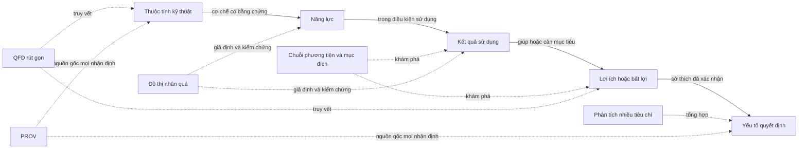

# Phương pháp ánh xạ cấu hình sản phẩm thành giá trị và quyết định

Ngày khảo sát: **18/07/2026**

Phạm vi: nối thuộc tính kỹ thuật với năng lực, hệ quả sử dụng, lợi ích hoặc bất lợi, giá trị, điều kiện, điểm đánh đổi và yếu tố quyết định trong [khung tư vấn sản phẩm thích nghi](../superpowers/specs/2026-07-18-khung-tu-van-san-pham-thich-nghi-design.md).

Trạng thái: tài liệu đề xuất **thư viện loại quan hệ** và **tiêu chuẩn bằng chứng khởi đầu** để người ra quyết định cân nhắc. Tài liệu **không chốt lược đồ**, trọng số hoặc phương pháp duy nhất.

## Tóm lược điều hành

Không có một phương pháp gốc nào bao trọn chuỗi từ thông số đến quyết định mà vẫn xử lý tốt điều kiện, tương tác, nhân quả và kiểm toán. Lựa chọn ít rủi ro nhất cho bản mẫu **48 giờ** là ghép bốn lớp có ranh giới rõ:

1. Dùng chuỗi phương tiện và mục đích (means-end chain), thang bậc (laddering), mô hình giá trị khách hàng và Kano để **khám phá từ vựng cùng giả thuyết** về thuộc tính, hệ quả, lợi ích và mục tiêu.
2. Dùng triển khai chức năng chất lượng (Quality Function Deployment, QFD) như **ma trận truy vết** giữa nhu cầu và đặc tính kỹ thuật, nhưng không coi điểm trong ô là bằng chứng nhân quả.
3. Dùng ràng buộc cứng, loại trừ theo khía cạnh và một mô hình giá trị nhiều thuộc tính nhỏ để **lọc và ưu tiên**. Trọng số chỉ biểu diễn sở thích đã được xác nhận, không chứng minh quan hệ kỹ thuật.
4. Dùng đồ thị nhân quả có điều kiện làm **ngôn ngữ giả thuyết và kiểm chứng**, kèm nguồn gốc dữ liệu theo Khuyến nghị mô hình dữ liệu nguồn gốc PROV (PROV Data Model, PROV-DM) của Hiệp hội Web Toàn cầu (World Wide Web Consortium, W3C). Một mũi tên chỉ được gọi là nhân quả khi bằng chứng và giả định nhận dạng phù hợp.

Điểm lõi là tách ba câu hỏi thường bị trộn lẫn:

- **Cơ chế:** thay đổi thuộc tính có làm thay đổi kết quả sử dụng không?
- **Ý nghĩa:** kết quả đó giúp hoặc cản mục tiêu nào trong hoàn cảnh nào?
- **Sở thích:** người mua sẵn sàng đánh đổi bao nhiêu để ưu tiên kết quả đó?

Ba câu hỏi cần ba loại bằng chứng khác nhau. Một tương quan bán hàng không trả lời được câu hỏi cơ chế; một phép thử kỹ thuật không trả lời được mức quan trọng đối với từng khách hàng; một trọng số chuyên gia không biến giả thuyết thành nhân quả.

## Câu hỏi, tiêu chí và giới hạn

Khảo sát trả lời bốn câu hỏi:

- Phương pháp nào giúp tìm và biểu diễn các mắt xích từ thuộc tính đến quyết định?
- Phương pháp nào xử lý được điều kiện, tương tác thuộc tính và điểm đánh đổi?
- Cần bằng chứng gì để tránh trình bày tương quan hoặc phán đoán như nhân quả?
- Lát ghép nào đủ nhỏ cho bản mẫu **48 giờ** nhưng không khóa thiết kế dài hạn?

Mỗi họ phương pháp được so theo sáu tiêu chí:

1. Khả năng kiểm toán.
2. Xử lý điều kiện và tương tác thuộc tính.
3. Dữ liệu cần có.
4. Nguy cơ nhầm tương quan với nhân quả.
5. Khả năng tổng quát qua nhiều ngành.
6. Mức phù hợp với bản mẫu **48 giờ**.

Ngoài phạm vi:

- Không thiết kế lược đồ lưu trữ cuối cùng.
- Không chốt thuật toán xếp hạng hoặc trọng số.
- Không chọn ngưỡng bằng chứng cuối cùng cho vận hành thật.
- Không dùng số lượng trích dẫn như thước đo độ đúng.
- Không suy rộng kết quả khảo sát sở thích sang cơ chế vật lý của sản phẩm.

## Những lớp vấn đề khác nhau

| Lớp | Câu hỏi | Đầu ra cần có | Phương pháp phù hợp hơn |
|---|---|---|---|
| Khám phá ý nghĩa | Vì sao thuộc tính này quan trọng? | Chuỗi thuộc tính, hệ quả, mục tiêu, giá trị | Chuỗi phương tiện và mục đích, thang bậc, giá trị cảm nhận |
| Phân loại phản ứng | Khi có hoặc thiếu đặc tính, hài lòng thay đổi thế nào? | Loại bắt buộc, một chiều, hấp dẫn, trung tính | Kano |
| Truy vết thiết kế | Nhu cầu nào liên quan đặc tính kỹ thuật nào? | Ma trận nhu cầu và đặc tính, ưu tiên, xung đột kỹ thuật | Triển khai chức năng chất lượng |
| Tổng hợp quyết định | Các mục tiêu xung đột được đánh đổi thế nào? | Hàm giá trị, trọng số, ngưỡng, thứ tự | Phân tích quyết định nhiều tiêu chí, quá trình phân cấp phân tích |
| Học sở thích | Thuộc tính nào làm thay đổi lựa chọn và bao nhiêu? | Giá trị thành phần, hiệu ứng trung bình, dị biệt nhóm | Phân tích kết hợp, thí nghiệm lựa chọn |
| Kiểm chứng nhân quả | Thay đổi thuộc tính có gây ra kết quả không? | Giả định, đường nhân quả, yếu tố gây nhiễu, hiệu ứng can thiệp | Đồ thị nhân quả, thí nghiệm hoặc thiết kế nhận dạng |
| Kiểm toán | Ai tạo nhận định từ dữ liệu nào, khi nào và bằng cách nào? | Nguồn, tác nhân, hoạt động, dẫn xuất, phiên bản | Mô hình nguồn gốc PROV |

Không nên dùng đầu ra của một lớp để thay bằng chứng cho lớp khác.

## Khảo sát các họ phương pháp

### 1. Chuỗi phương tiện và mục đích cùng thang bậc

Gutman trình bày mô hình nối **thuộc tính sản phẩm được cảm nhận** với **giá trị** của người tiêu dùng. Reynolds và Gutman phát triển phương pháp thang bậc để phỏng vấn, mã hóa các nấc thuộc tính, hệ quả và giá trị, rồi tổng hợp liên kết trực tiếp và gián tiếp thành ma trận hàm ý cùng bản đồ giá trị phân cấp ([Gutman, 1982](https://doi.org/10.1177/002224298204600207); [Reynolds và Gutman, 1988](https://doi.org/10.1080/00218499.1988.12467766)).

Woodruff làm rõ vai trò của hoàn cảnh sử dụng bằng hệ phân cấp gồm thuộc tính hoặc hiệu năng thuộc tính, hệ quả mong muốn trong tình huống sử dụng, rồi mục tiêu và mục đích của khách hàng. Zeithaml phân biệt giá, chất lượng cảm nhận và giá trị cảm nhận, đồng thời mô hình hóa giá trị như đánh giá tổng thể về phần nhận được so với phần phải bỏ ra ([Woodruff, 1997](https://doi.org/10.1007/BF02894350); [Zeithaml, 1988](https://doi.org/10.1177/002224298805200302)).

**Khả năng đóng góp**

- Cung cấp từ vựng gần đúng với chuỗi thiết kế đang cần: thuộc tính, hệ quả, lợi ích, mục tiêu và giá trị.
- Buộc người nghiên cứu hỏi tiếp “điều đó giúp gì?” thay vì dừng ở thông số.
- Cho phép giữ chuỗi của từng người trước khi tổng hợp, nên có thể truy ngược giả thuyết về lời nói gốc.
- Woodruff làm rõ rằng cùng một hệ quả chỉ có giá trị trong **tình huống sử dụng** và đối với **mục tiêu** cụ thể.

**Giới hạn**

- Đây chủ yếu là phương pháp khám phá cấu trúc nhận thức và ý nghĩa, không phải phép kiểm chứng cơ chế vật lý.
- Mã hóa lời phỏng vấn, gộp khái niệm và chọn ngưỡng đưa liên kết lên bản đồ đều chứa phán đoán của nhà nghiên cứu.
- Liên kết được nhiều người nhắc tới vẫn chỉ là liên kết nhận thức hoặc liên tưởng, không tự trở thành quan hệ nhân quả.
- Tương tác giữa hai thuộc tính không có biểu diễn mạnh sẵn có. Phải hỏi và mã hóa rõ cấu hình kết hợp, ngưỡng hoặc hoàn cảnh.

**Vai trò trong bản mẫu**

Dùng để khởi tạo từ vựng và chuỗi giả thuyết từ hội thoại có sẵn cùng phỏng vấn chuyên gia. Không cần dựng bản đồ giá trị phân cấp toàn ngành trong **48 giờ**. Mỗi mắt xích đã mã hóa phải giữ con trỏ tới đoạn lời nói hoặc tài liệu nguồn và trạng thái “giả thuyết”, cho đến khi có bằng chứng đúng loại.

### 2. Chất lượng và giá trị cảm nhận

Zeithaml xây mô hình khái niệm liên hệ giá, chất lượng cảm nhận và giá trị cảm nhận từ nghiên cứu khám phá cùng tổng hợp bằng chứng. Bài gốc tự mô tả đầu ra là các định nghĩa, quan hệ và mệnh đề cần nghiên cứu tiếp, vì vậy không nên biến trực tiếp các mệnh đề đó thành quy tắc nhân quả ([Zeithaml, 1988](https://doi.org/10.1177/002224298805200302)).

Woodruff đặt giá trị trong quan hệ giữa hiệu năng thuộc tính, hệ quả sử dụng và mục tiêu. Cách nhìn này phù hợp với yêu cầu “cùng một thuộc tính có thể là lợi ích, không liên quan hoặc bất lợi trong ba hoàn cảnh khác nhau” của thiết kế hiện tại ([Woodruff, 1997](https://doi.org/10.1007/BF02894350)).

**Khả năng đóng góp**

- Ngăn hệ thống đồng nhất “chất lượng cao hơn” với “giá trị cao hơn”.
- Nhắc phải biểu diễn cả phần nhận được và phần phải bỏ ra như tiền, thời gian, công sức, rủi ro hoặc bất tiện.
- Tách giá trị mong muốn trước mua với kết quả và hài lòng sau sử dụng.

**Giới hạn**

- Đây là khung khái niệm mạnh để đặt câu hỏi, nhưng chưa phải quy trình tạo đồ thị có thể chạy tự động.
- Chất lượng và giá trị là đánh giá cảm nhận, có thể đổi theo kinh nghiệm, hoàn cảnh, giá và phương án so sánh.
- Dữ liệu đánh giá hoặc hành vi quan sát có thể bị gây nhiễu bởi thương hiệu, hiển thị, khuyến mãi và tồn kho.

**Vai trò trong bản mẫu**

Dùng làm quy tắc ngữ nghĩa: không gắn nhãn “lợi ích” nếu chưa có mục tiêu và hoàn cảnh; không gắn nhãn “giá trị” nếu chưa ghi phần được, phần mất và chủ thể đánh giá.

### 3. Mô hình Kano

Kano và cộng sự đề xuất thay cách nhìn chất lượng một chiều bằng nhận thức hai chiều, rồi phân loại yếu tố chất lượng thành hấp dẫn, bắt buộc, một chiều và các loại khác. Nhóm tác giả kiểm tra lý thuyết bằng bảng hỏi về tivi và đồng hồ để bàn, sau đó minh họa ứng dụng vào hoạch định sản phẩm ([Kano và cộng sự, 1984](https://doi.org/10.20684/quality.14.2_147)).

**Khả năng đóng góp**

- Biểu diễn được phản ứng không đối xứng: có đặc tính có thể làm hài lòng mạnh, nhưng thiếu nó chưa chắc gây bất mãn; đặc tính khác có thể chỉ gây bất mãn khi thiếu.
- Hữu ích để phân biệt ràng buộc nền với yếu tố tạo khác biệt, tránh cộng mọi đặc tính bằng cùng một hàm tuyến tính.
- Bảng hỏi có cấu trúc tạo dấu vết kiểm toán rõ hơn nhận định tự do của chuyên gia.

**Giới hạn**

- Phân loại phản ứng hài lòng không giải thích cơ chế thuộc tính tạo kết quả sử dụng.
- Kết quả thuộc về nhóm người, cách diễn đạt câu hỏi, cấu hình đặc tính và thời điểm khảo sát cụ thể.
- Mô hình gốc không đủ để biểu diễn tương tác nhiều thuộc tính, yếu tố gây nhiễu hoặc chuỗi trung gian.
- Không có dữ liệu bảng hỏi phù hợp thì nhãn Kano chỉ là giả thuyết, không phải bằng chứng.

**Vai trò trong bản mẫu**

Chỉ dùng các loại Kano như nhãn giả thuyết cho hình dạng phản ứng và để thiết kế ca kiểm thử. Không chạy khảo sát mới chỉ để hoàn thành bản mẫu. Không dùng nhãn chuyên gia tự gán làm trọng số xếp hạng đã được xác thực.

### 4. Triển khai chức năng chất lượng

Akao mô tả triển khai chức năng chất lượng là phương pháp chuyển yêu cầu khách hàng thành mục tiêu thiết kế và điểm bảo đảm chất lượng. Tiêu chuẩn của Tổ chức Tiêu chuẩn hóa Quốc tế (International Organization for Standardization, ISO) 16355-1 mô tả quy trình, mục đích, người dùng và công cụ của QFD cho phần cứng, phần mềm, dịch vụ và hệ thống. ISO 16355-4 đi sâu vào phân tích tiếng nói khách hàng và bên liên quan, dịch thành nhu cầu thật, ưu tiên nhu cầu và so sánh phương án từ góc nhìn khách hàng ([Akao, sách về QFD](https://www.routledge.com/Quality-Function-Deployment-Integrating-Customer-Requirements-into-Pro/Akao/p/book/9781563273131); [ISO 16355-1:2021](https://www.iso.org/standard/74103.html); [ISO 16355-4:2017](https://www.iso.org/standard/62631.html)).

**Khả năng đóng góp**

- Ma trận quan hệ làm rõ nhu cầu nào được nối với đặc tính kỹ thuật nào và ai đã đánh giá độ mạnh.
- Ma trận tương quan kỹ thuật có thể ghi xung đột, hỗ trợ hoặc phụ thuộc giữa các đặc tính.
- Chuỗi bảng triển khai có thể giữ truy vết từ tiếng nói khách hàng tới thiết kế, bộ phận và kiểm thử.
- Tiêu chuẩn ISO đặt QFD trong nhiều loại tổ chức và sản phẩm, nên có khả năng tổng quát đa ngành tốt.

**Giới hạn**

- Điểm mạnh, vừa, yếu trong ô thường là phán đoán của nhóm. Tính kiểm toán cao không đồng nghĩa với độ đúng nhân quả cao.
- Ma trận dễ làm mất điều kiện nếu một ô chỉ có một con số. Cần gắn hoàn cảnh, hướng tác động, hình dạng và bằng chứng vào từng quan hệ.
- Phép cộng trọng số có thể tạo cảm giác chính xác giả và che quan hệ không bù trừ, ngưỡng hoặc nút thắt.
- Làm đầy “ngôi nhà chất lượng” toàn diện trong **48 giờ** có thể tốn công hơn giá trị nhận được.

**Vai trò trong bản mẫu**

Dùng một ma trận QFD rút gọn như **chế độ xem kiểm toán**, không dùng làm lược đồ lõi và không buộc điền mọi ô. Chỉ đưa vào các đặc tính máy lạnh cốt lõi, các kết quả sử dụng có khả năng đổi thứ tự sản phẩm và quan hệ có con trỏ bằng chứng.

### Tóm tắt bốn họ phương pháp khám phá và truy vết

- Chuỗi phương tiện và mục đích trả lời tốt câu hỏi **“vì sao quan trọng?”**, nhưng không chứng minh **“có thật sự gây ra không?”**.
- Kano trả lời tốt hình dạng phản ứng hài lòng, nhưng không thay thế chuỗi cơ chế hoặc mô hình tương tác.
- QFD trả lời tốt câu hỏi **“nhu cầu nào liên quan đặc tính nào và ai đã đánh giá?”**, nhưng điểm quan hệ không phải hệ số nhân quả.
- Giá trị cảm nhận buộc quan hệ phải có chủ thể, hoàn cảnh, phần được và phần mất.
- Vì vậy thư viện lõi phải tách **loại quan hệ ngữ nghĩa**, **trạng thái nhận thức luận** và **bằng chứng**, thay vì nhét tất cả vào một trường “ảnh hưởng”.

### 5. Phân tích quyết định nhiều tiêu chí và mô hình ưu tiên

Keeney và Raiffa đặt bài toán nhiều mục tiêu như một bài toán đánh đổi: thường không có phương án trội hơn trên mọi mục tiêu, nên người ra quyết định phải nói rõ sẵn sàng hy sinh bao nhiêu ở mục tiêu này để cải thiện mục tiêu khác. Lý thuyết giá trị hoặc độ hữu dụng nhiều thuộc tính cung cấp hàm giá trị cho từng tiêu chí và quy tắc tổng hợp dưới các giả định độc lập phù hợp ([Keeney và Raiffa, chương về đánh đổi](https://doi.org/10.1017/CBO9781139174084.005)).

Quá trình phân cấp phân tích (Analytic Hierarchy Process, AHP) của Saaty dùng so sánh từng cặp để suy ra thang ưu tiên tương đối, đồng thời đo mức không nhất quán trong phán đoán. Phương pháp dựa vào đánh giá của chuyên gia hoặc người ra quyết định, vì vậy nó đo ưu tiên chứ không kiểm chứng cơ chế ([Saaty, 2008](https://doi.org/10.1504/IJSSCI.2008.017590)).

Loại trừ theo khía cạnh (elimination by aspects) của Tversky mô hình hóa lựa chọn như quá trình loại dần phương án theo các khía cạnh. Đây là lời nhắc quan trọng rằng người mua không nhất thiết bù trừ mọi tiêu chí bằng một tổng điểm. Một vi phạm ngân sách, kiểu lắp đặt hoặc ràng buộc an toàn có thể loại phương án trước khi so ưu tiên mềm ([Tversky, 1972](https://doi.org/10.1037/h0032955)).

**Khả năng đóng góp**

- Tách mục tiêu, thước đo hiệu năng, ràng buộc, trọng số và hàm giá trị.
- Biểu diễn được điểm đánh đổi và kiểm tra độ nhạy khi trọng số hoặc hiệu năng thay đổi.
- Hàm giá trị có thể biểu diễn ngưỡng, bão hòa và bất lợi khi “cao hơn” không còn tốt hơn.
- So sánh cặp của AHP dễ giải thích hơn việc yêu cầu người dùng nêu trọng số tuyệt đối.
- Loại trừ theo khía cạnh phù hợp với luồng lọc cứng trước xếp hạng của thiết kế.

**Giới hạn**

- Mô hình cộng chỉ hợp lệ khi các điều kiện độc lập ưu tiên phù hợp được thỏa mãn. Nếu hai thuộc tính tương tác, phải dùng hàm nhiều thuộc tính có tương tác hoặc mô hình khác, kéo theo nhiều dữ liệu gợi hỏi hơn.
- AHP kiểm tra tính nhất quán nội tại của phán đoán, không kiểm tra phán đoán có đúng thực tế hoặc đúng nhân quả không.
- Một tổng điểm có thể che phương án vi phạm ràng buộc cứng, nên lọc và bù trừ phải là hai giai đoạn riêng.
- Trọng số chuyên gia dễ bị dùng nhầm như sở thích khách hàng. Trọng số trung bình cũng có thể che các nhóm ưu tiên đối nghịch.

**Vai trò trong bản mẫu**

Dùng một mô hình nhỏ gồm ràng buộc cứng, vài hàm giá trị đơn tiêu chí và đóng góp điểm có thể truy vết. Chỉ dùng AHP nếu cần lấy ưu tiên ban đầu từ một nhóm chuyên gia trên số tiêu chí nhỏ. Phải chạy phân tích độ nhạy, không trình bày thứ tự như chân lý ổn định nếu đổi trọng số hợp lý làm đảo hạng.

### 6. Phân tích kết hợp và thí nghiệm lựa chọn

Luce và Tukey đặt nền tảng đo lường kết hợp bằng hệ tiên đề để so sánh tác động của các tổ hợp thuộc tính. Trong nghiên cứu người tiêu dùng, phân tích kết hợp (conjoint analysis) phân rã đánh giá hoặc lựa chọn của người trả lời thành đóng góp của nhiều thuộc tính. Green và Srinivasan mô tả các vấn đề triển khai, phát triển kỹ thuật và vùng ứng dụng của phương pháp ([Luce và Tukey, 1964](https://doi.org/10.1016/0022-2496(64)90015-X); [Green và Srinivasan, 1978](https://doi.org/10.1086/208721)).

Hainmueller, Hopkins và Yamamoto chứng minh rằng khi mức thuộc tính trong hồ sơ được **ngẫu nhiên hóa đầy đủ**, thí nghiệm kết hợp có thể nhận dạng không tham số hiệu ứng nhân quả trung bình của các thành phần lên lựa chọn hoặc đánh giá đã nêu, đồng thời cung cấp kiểm tra chẩn đoán cho giả định nhận dạng. Chính bài báo cũng nêu rủi ro giá trị ngoại tại: điều người trả lời chọn trong bảng hỏi có thể khác hành vi thực và việc xem nhiều thuộc tính cùng lúc có thể đổi cách xử lý thông tin ([Hainmueller, Hopkins và Yamamoto, 2014](https://doi.org/10.1093/pan/mpt024)).

**Khả năng đóng góp**

- Ước lượng đóng góp tương đối của mức thuộc tính trên cùng một kết quả lựa chọn.
- Có thể kiểm tra tương tác thuộc tính và dị biệt giữa nhóm nếu thiết kế cùng cỡ mẫu hỗ trợ.
- Khi hồ sơ được ngẫu nhiên hóa đúng, giảm đáng kể nguy cơ nhầm tương quan thuộc tính với tác động lên lựa chọn đã nêu.
- Dữ liệu, thiết kế ngẫu nhiên và mô hình ước lượng tạo dấu vết kiểm toán tốt.

**Giới hạn**

- Hiệu ứng nhân quả trên **lựa chọn đã nêu** không chứng minh thuộc tính tạo ra hệ quả sử dụng trong đời thực.
- Tương tác làm số cấu hình cần khảo sát tăng nhanh; cấu hình phi thực tế làm giảm giá trị ngoại tại.
- Mẫu khách hàng, cách trình bày, tập mức thuộc tính và phương án so sánh xác định phạm vi suy rộng.
- Cần thiết kế khảo sát, người trả lời và phân tích, nên không phù hợp để tạo bằng chứng mới trong **48 giờ**.

**Vai trò trong bản mẫu**

Không chạy nghiên cứu kết hợp mới. Chỉ dành chỗ cho loại bằng chứng “thí nghiệm lựa chọn ngẫu nhiên” và dùng về sau để hiệu chỉnh yếu tố quyết định hoặc trọng số. Dữ liệu hành vi mua sẵn có không được gọi là phân tích kết hợp nhân quả nếu không có phân bổ ngẫu nhiên và giả định nhận dạng.

### 7. Đồ thị nhân quả và mô hình nhân quả cấu trúc

Pearl trình bày đồ thị nhân quả như ngôn ngữ tích hợp tri thức chuyên môn với thông tin thống kê. Đồ thị cho phép hỏi liệu các giả định hiện có có đủ nhận dạng hiệu ứng nhân quả từ dữ liệu quan sát hay không; nếu chưa đủ, nó chỉ ra quan sát hoặc thí nghiệm bổ sung cần có ([Pearl, 1995](https://doi.org/10.1093/biomet/82.4.669)).

Mô hình nhân quả cấu trúc (Structural Causal Model, SCM) mở rộng từ liên hệ thống kê sang can thiệp và phản thực. Tổng quan của Pearl nhấn mạnh mọi suy luận nhân quả đều dựa trên giả định, mọi phát biểu nhân quả hoặc phản thực đều có điều kiện, và phải dùng ngôn ngữ riêng để biểu diễn các giả định đó ([Pearl, 2009](https://doi.org/10.1214/09-SS057); [Pearl, sách Nhân quả (Causality)](https://www.cambridge.org/core/books/causality/B0046844FAE10CBF274D4ACBDAEB5F5B)).

**Khả năng đóng góp**

- Tách nguyên nhân, biến trung gian, yếu tố gây nhiễu, điều kiện điều biến và kết quả.
- Biểu diễn được chuỗi nhiều mắt xích và các đường cạnh tranh giữa thuộc tính với kết quả.
- Hàm cấu trúc có thể chứa ngưỡng, phi tuyến và tương tác giữa nhiều thuộc tính.
- Biến câu hỏi “X có gây Y không?” thành câu hỏi kiểm tra được về can thiệp, phạm vi và nhận dạng.
- Cho biết khi dữ liệu quan sát hiện có **không đủ** để kết luận nhân quả.

**Giới hạn**

- Vẽ mũi tên không tạo bằng chứng. Sai hoặc thiếu giả định cho kết luận sai dù phép tính đúng.
- Cấu trúc nhân quả thường không thể học duy nhất từ dữ liệu quan sát nếu thiếu giả định chuyên môn hoặc can thiệp.
- Đồ thị có hướng không chu trình không biểu diễn trực tiếp vòng phản hồi theo thời gian nếu chưa tách biến theo thời điểm.
- Mô hình đầy đủ cho toàn ngành vượt xa phạm vi **48 giờ**.

**Vai trò trong bản mẫu**

Dùng đồ thị như sổ giả thuyết có kiểu quan hệ, điều kiện và bằng chứng. Chỉ mã hóa lát máy lạnh cần cho ca tư vấn. Không ước lượng đồ thị nhân quả từ danh mục sản phẩm. Chỉ dùng ngôn ngữ “gây”, “làm tăng” hoặc “làm giảm” khi mắt xích qua cổng bằng chứng nhân quả; trường hợp còn lại dùng “giả thuyết đóng góp” hoặc “đồng biến”.

### 8. Nguồn gốc và kiểm toán bằng PROV

PROV-DM của W3C mô tả thực thể, hoạt động, tác nhân, thời điểm, dẫn xuất và trách nhiệm trong quá trình tạo dữ liệu hoặc nhận định. Mô hình không phụ thuộc ngành và có điểm mở rộng cho miền cụ thể ([W3C, PROV-DM](https://www.w3.org/TR/prov-dm/)).

PROV trả lời **ai, dùng cái gì, qua hoạt động nào, tạo ra phiên bản nào**. Nó không tự đánh giá nhận định đúng hay sai. Vì vậy, PROV là lớp kiểm toán bao quanh thư viện quan hệ và bằng chứng, không phải phương pháp ánh xạ giá trị hoặc tiêu chuẩn sức mạnh nhân quả.

**Vai trò trong bản mẫu**

Mỗi nhận định và quan hệ cần giữ tối thiểu nguồn đầu vào, hoạt động tạo hoặc duyệt, tác nhân chịu trách nhiệm, thời điểm, phiên bản và quan hệ dẫn xuất. Không cần triển khai toàn bộ bản thể PROV trong **48 giờ**; chỉ cần trường tương thích để không khóa đường mở rộng.

## So sánh theo tiêu chí bắt buộc

Thang đánh giá **cao, vừa, thấp** là kết luận của khảo sát cho bài toán hiện tại, không phải điểm được các nguồn gốc công bố.

| Họ phương pháp | Khả năng kiểm toán | Điều kiện và tương tác | Dữ liệu cần | Nguy cơ nhầm tương quan với nhân quả |
|---|---|---|---|---|
| Chuỗi phương tiện và mục đích, thang bậc | **Vừa**: truy được thang cá nhân, nhưng mã hóa và ngưỡng tổng hợp có phán đoán | **Vừa với điều kiện**, **thấp với tương tác** nếu không hỏi rõ cấu hình | Phỏng vấn sâu, đoạn lời nói, quy tắc mã hóa | **Cao** nếu coi liên tưởng hoặc tần suất nhắc tới là cơ chế |
| Giá trị hoặc chất lượng cảm nhận | **Thấp đến vừa**: khung khái niệm, phụ thuộc phép đo cụ thể | **Cao với hoàn cảnh**, **thấp với tương tác kỹ thuật** | Đánh giá trước và sau dùng, chi phí, mục tiêu, hoàn cảnh | **Cao** với dữ liệu quan sát bị thương hiệu, giá và hiển thị gây nhiễu |
| Kano | **Vừa đến cao** nếu giữ bảng hỏi và quy tắc phân loại | **Vừa với phi tuyến**, **thấp với tương tác** | Câu hỏi có và không có từng đặc tính, mẫu theo phân khúc | **Cao** nếu suy từ hài lòng sang cơ chế sử dụng |
| Triển khai chức năng chất lượng | **Cao** về truy vết ma trận và người đánh giá | **Vừa**: ghi được tương quan kỹ thuật, nhưng điều kiện dễ bị nén mất | Tiếng nói khách hàng, đặc tính kỹ thuật, chuyên gia, kiểm thử | **Cao** nếu điểm quan hệ chuyên gia bị gọi là hệ số nhân quả |
| Giá trị hoặc độ hữu dụng nhiều thuộc tính | **Cao** nếu lưu hàm, trọng số và phân tích độ nhạy | **Cao** khi mô hình đúng dạng, nhưng chi phí gợi hỏi tăng | Hiệu năng phương án, mục tiêu, hàm giá trị, đánh đổi | **Vừa**: mô hình là sở thích có điều kiện, không phải cơ chế |
| Quá trình phân cấp phân tích | **Cao** về so sánh cặp và nhất quán nội tại | **Thấp đến vừa** trong dạng phân cấp đơn giản | So sánh cặp của chuyên gia hoặc người ra quyết định | **Cao** nếu ưu tiên chuyên gia bị coi là sự thật khách hàng hoặc nhân quả |
| Loại trừ theo khía cạnh | **Cao** nếu tiêu chí loại và thứ tự được lưu | **Vừa** với ràng buộc, **thấp** với tương tác phức tạp | Quy tắc loại, ngưỡng, hoặc dữ liệu lựa chọn | **Thấp** nếu chỉ dùng như quy tắc quyết định, không diễn giải cơ chế |
| Phân tích kết hợp ngẫu nhiên | **Cao** với thiết kế, dữ liệu và mã phân tích | **Cao** nếu thiết kế đủ lực cho tương tác và nhóm | Hồ sơ ngẫu nhiên, lựa chọn hoặc đánh giá, mẫu khách hàng | **Thấp** cho tác động lên lựa chọn đã nêu; **cao** nếu suy sang kết quả sử dụng thật |
| Đồ thị nhân quả cấu trúc | **Cao** khi lưu giả định, đồ thị, dữ liệu và phép nhận dạng | **Cao**: điều kiện, trung gian, gây nhiễu, phi tuyến, tương tác | Tri thức miền, dữ liệu phù hợp, can thiệp hoặc giả định nhận dạng | **Thấp** nếu tuân thủ cổng; **rất cao** nếu coi mũi tên là bằng chứng |
| PROV | **Rất cao** về nguồn gốc | Không mô hình hóa nội dung điều kiện hoặc tương tác nếu chưa mở rộng | Thực thể, hoạt động, tác nhân, thời gian, dẫn xuất | Không giải quyết trực tiếp; nguồn gốc tốt vẫn có thể dẫn tới nhận định sai |

| Họ phương pháp | Tổng quát đa ngành | Phù hợp bản mẫu 48 giờ | Vai trò khởi đầu |
|---|---|---|---|
| Chuỗi phương tiện và mục đích | **Cao** ở ngữ pháp, nội dung phải theo ngành | **Vừa** | Khám phá chuỗi và từ vựng từ dữ liệu có sẵn |
| Giá trị hoặc chất lượng cảm nhận | **Cao** | **Cao** như quy tắc ngữ nghĩa, **thấp** nếu muốn đo đầy đủ | Buộc ghi chủ thể, hoàn cảnh, phần được và phần mất |
| Kano | **Cao** ở mô hình phản ứng | **Thấp đến vừa** nếu chưa có khảo sát | Nhãn giả thuyết và ca thử phi tuyến |
| Triển khai chức năng chất lượng | **Cao**, được ISO áp dụng cho phần cứng, phần mềm, dịch vụ và hệ thống | **Cao** nếu dùng ma trận rút gọn | Chế độ xem truy vết giữa nhu cầu và kỹ thuật |
| Giá trị hoặc độ hữu dụng nhiều thuộc tính | **Cao** | **Vừa đến cao** với ít tiêu chí | Tổng hợp ưu tiên mềm và phân tích độ nhạy |
| Quá trình phân cấp phân tích | **Cao** | **Vừa** với số tiêu chí nhỏ | Gợi hỏi ưu tiên chuyên gia tạm thời |
| Loại trừ theo khía cạnh | **Cao** | **Cao** | Lọc ràng buộc cứng trước bù trừ |
| Phân tích kết hợp ngẫu nhiên | **Cao** | **Thấp** để tạo nghiên cứu mới | Lộ trình sau bản mẫu để hiệu chỉnh sở thích |
| Đồ thị nhân quả cấu trúc | **Rất cao** ở ngữ pháp, rất phụ thuộc tri thức ngành | **Cao** như biểu diễn giả thuyết, **thấp** như mô hình ước lượng | Ghi giả định, đường nhân quả và khoảng trống kiểm chứng |
| PROV | **Rất cao** | **Cao** với tập trường tối thiểu | Lớp nguồn gốc và trách nhiệm |

## Phép ghép đề xuất để kiểm chứng

Đây là **phép ghép cần kiểm chứng**, không phải lược đồ đã chốt. QFD và chuỗi phương tiện và mục đích cung cấp ứng viên quan hệ; đồ thị nhân quả và bằng chứng quyết định trạng thái nhận thức luận; mô hình quyết định chỉ tổng hợp những quan hệ đã qua cổng phù hợp.

## Thư viện loại quan hệ khởi đầu

Thư viện dưới đây là danh mục ngữ nghĩa để thảo luận. Người ra quyết định còn phải chọn tên, hướng cạnh, số ngôi và cách lưu điều kiện.

### Nhóm A: từ dữ liệu tới năng lực

| Loại quan hệ | Ý nghĩa | Không được suy diễn |
|---|---|---|
| **được đo bởi** | Đại lượng hoặc thuộc tính được xác định bởi phép đo, trường nguồn hoặc quy tắc chuẩn hóa | Có số đo không có nghĩa số đó quan trọng |
| **là trường hợp của** | Giá trị cụ thể thuộc một loại thuộc tính chuẩn | Không suy ra hiệu năng |
| **cho phép** | Thuộc tính mở ra một năng lực trong điều kiện xác định | Không đồng nghĩa năng lực luôn được dùng |
| **giới hạn** | Thuộc tính đặt trần, sàn hoặc miền hoạt động cho năng lực | Không đồng nghĩa sản phẩm luôn kém hơn |
| **không tương thích với** | Cấu hình không thể cùng tồn tại hoặc vi phạm điều kiện kỹ thuật | Không cho phép bù bằng điểm ưu tiên khác |

### Nhóm B: từ năng lực tới kết quả sử dụng

| Loại quan hệ | Ý nghĩa | Thuộc tính bắt buộc đi kèm |
|---|---|---|
| **làm tăng** | Can thiệp vào nguồn làm kết quả tăng trong phạm vi xác định | Điều kiện, độ lớn hoặc khoảng, trạng thái nhân quả |
| **làm giảm** | Can thiệp vào nguồn làm kết quả giảm trong phạm vi xác định | Điều kiện, độ lớn hoặc khoảng, trạng thái nhân quả |
| **duy trì** | Năng lực giữ kết quả trong miền mục tiêu | Miền mục tiêu, thời gian, tải |
| **làm trung gian** | Nút truyền một phần tác động từ nguồn tới đích | Đường nhân quả và bằng chứng trung gian |
| **đồng biến với** | Nguồn và đích thay đổi cùng nhau nhưng chưa chứng minh nhân quả | Yếu tố gây nhiễu đã xét, phạm vi dữ liệu |
| **giả thuyết đóng góp** | Chuyên gia hoặc phương pháp khám phá đề xuất quan hệ chưa đủ bằng chứng | Câu hỏi kiểm chứng và trạng thái không được dùng để khẳng định |

### Nhóm C: từ kết quả tới lợi ích, bất lợi và giá trị

| Loại quan hệ | Ý nghĩa | Điều kiện bắt buộc |
|---|---|---|
| **hỗ trợ mục tiêu** | Kết quả giúp chủ thể đạt mục tiêu | Chủ thể, mục tiêu, hoàn cảnh sử dụng |
| **cản trở mục tiêu** | Kết quả làm khó hoặc tăng chi phí đạt mục tiêu | Chủ thể, mục tiêu, hoàn cảnh sử dụng |
| **được cảm nhận là lợi ích** | Chủ thể đánh giá hệ quả là phần nhận được | Nguồn xác nhận hoặc nghiên cứu người dùng |
| **được cảm nhận là bất lợi** | Chủ thể đánh giá hệ quả là phần phải chịu hoặc hy sinh | Nguồn xác nhận hoặc nghiên cứu người dùng |
| **đánh đổi với** | Cải thiện một kết quả đi cùng suy giảm hoặc chi phí ở kết quả khác | Hướng, miền, chủ thể đánh giá, khả năng bù trừ |

### Nhóm D: điều kiện, hình dạng và tương tác

| Loại hoặc bổ nghĩa | Ý nghĩa |
|---|---|
| **chỉ khi** | Quan hệ chỉ có hiệu lực khi điều kiện đúng |
| **mạnh hơn hoặc yếu hơn khi** | Một biến điều biến độ lớn hoặc hướng tác động |
| **ngưỡng** | Tác động xuất hiện sau một mức hoặc mất sau một mức |
| **bão hòa** | Tăng thêm thuộc tính tạo lợi ích biên rất nhỏ |
| **không đơn điệu** | Tăng thuộc tính có thể tốt ở miền này và xấu ở miền khác |
| **hiệp lực** | Hai thuộc tính cùng có tạo tác động lớn hơn tổng riêng rẽ theo mô hình đã chọn |
| **đối kháng** | Một thuộc tính làm giảm tác động của thuộc tính kia |
| **dư thừa** | Hai thuộc tính cung cấp phần năng lực trùng nhau |
| **nút thắt** | Hiệu năng bị giới hạn bởi mắt xích yếu nhất, không thể bù bằng tăng mắt xích khác |

### Nhóm E: quan hệ quyết định

| Loại quan hệ | Ý nghĩa | Chính sách |
|---|---|---|
| **loại trừ** | Vi phạm ràng buộc cứng | Áp dụng trước xếp hạng, không bù trừ |
| **trội hơn** | Không kém trên mọi tiêu chí đang xét và tốt hơn trên ít nhất một tiêu chí | Chỉ trong phạm vi tiêu chí và dữ liệu đủ |
| **được ưu tiên hơn** | Chủ thể chọn A hơn B trong hoàn cảnh xác định | Ghi chủ thể, thời điểm, tập so sánh |
| **đóng góp vào điểm** | Một tiêu chí làm thay đổi điểm tổng hợp | Ghi hàm, trọng số, phiên bản và độ nhạy |
| **có thể đảo hạng** | Khoảng không chắc chắn hoặc trọng số hợp lý có thể đổi thứ tự | Kích hoạt hỏi thêm hoặc trình bày bất định |
| **không bù trừ** | Không được dùng lợi ích khác để bù vi phạm | Gắn với ràng buộc, an toàn hoặc ngưỡng bắt buộc |

### Nhóm F: vai trò trong nhân quả và bằng chứng

| Loại hoặc trạng thái | Ý nghĩa |
|---|---|
| **nguyên nhân giả thuyết** | Mũi tên chuyên môn chưa đủ nhận dạng hoặc kiểm chứng |
| **yếu tố gây nhiễu** | Tác động cả nguồn và đích, có thể tạo liên hệ giả |
| **biến trung gian** | Nằm trên đường tác động cần giải thích |
| **bằng chứng ủng hộ** | Nguồn trực tiếp hỗ trợ nhận định trong phạm vi ghi rõ |
| **bằng chứng phản bác** | Nguồn trực tiếp mâu thuẫn hoặc giới hạn nhận định |
| **dẫn xuất từ** | Nhận định được tạo từ dữ liệu, quy tắc hoặc mô hình nào |
| **thay thế hoặc sửa đổi** | Phiên bản mới thay quan hệ cũ mà không xóa lịch sử |

Ba trục phải lưu riêng:

- **Ngữ nghĩa:** cho phép, làm tăng, hỗ trợ mục tiêu, đánh đổi với.
- **Hình dạng và điều kiện:** ngưỡng, bão hòa, chỉ khi, hiệp lực.
- **Trạng thái nhận thức luận:** giả thuyết, đồng biến, cơ chế được hỗ trợ, nhân quả được nhận dạng.

Nếu dùng một nhãn “ảnh hưởng” cho cả ba trục, hệ thống sẽ không thể kiểm toán hoặc dùng đúng chính sách.

## Tiêu chuẩn bằng chứng khởi đầu

### 1. Phân loại bằng chứng theo câu hỏi

Không dùng một tháp nguồn duy nhất cho mọi quan hệ. Bằng chứng phải phù hợp với loại nhận định:

| Loại nhận định | Bằng chứng trực tiếp phù hợp | Bằng chứng chưa đủ |
|---|---|---|
| Giá trị thuộc tính | Trang hoặc tệp sản phẩm có thẩm quyền, phép đo chuẩn, quy tắc chuẩn hóa có kiểm thử | Bài quảng cáo không nêu phương pháp; suy từ tên sản phẩm |
| Thuộc tính cho phép năng lực | Đặc tả kỹ thuật, tiêu chuẩn, định luật hoặc kiểm thử chức năng trong miền đã ghi | Cùng xuất hiện trong danh mục; ý kiến bán hàng không có phép thử |
| Năng lực làm đổi kết quả sử dụng | Thử nghiệm can thiệp, phép thử đối chứng, mô hình cơ chế đã kiểm chứng, thiết kế nhận dạng phù hợp | Tương quan đánh giá, doanh số hoặc sản phẩm cao cấp |
| Kết quả hỗ trợ mục tiêu | Nghiên cứu sử dụng trong hoàn cảnh tương ứng, lời xác nhận trực tiếp, dữ liệu kết quả sau dùng có kiểm soát gây nhiễu | Chuyên gia đoán mục tiêu người dùng |
| Lợi ích ảnh hưởng quyết định | Khách hàng xác nhận, thí nghiệm lựa chọn, hành vi có thiết kế nhận dạng và phạm vi rõ | Lượt nhấp hoặc mua quan sát chưa hiệu chỉnh hiển thị, giá, tồn kho |
| Tương tác hoặc đánh đổi | Thử nghiệm nhiều yếu tố, cơ chế kỹ thuật, hàm giá trị được gợi hỏi và kiểm tra độ nhạy | Cộng hai điểm đơn lẻ rồi gọi là hiệp lực |

### 2. Bốn mức sử dụng

| Mức | Điều kiện tối thiểu | Được dùng làm gì | Không được dùng làm gì |
|---|---|---|---|
| **B0, chưa có căn cứ** | Không có con trỏ nguồn trực tiếp | Ghi khoảng trống | Không hỏi, lọc, xếp hạng hoặc giải thích như sự thật |
| **B1, giả thuyết có nguồn** | Có lời nói, tài liệu hoặc phán đoán chuyên gia trực tiếp; điều kiện và câu hỏi kiểm chứng được ghi | Chọn câu hỏi, lập ca thử, ưu tiên thu thập bằng chứng | Không dùng làm lý do tư vấn hoặc ngôn ngữ nhân quả |
| **B2, quan hệ được hỗ trợ** | Nguồn sơ cấp trực tiếp đúng loại; phạm vi, phương pháp, hướng tác động và phản chứng đã xét; chuyên gia duyệt | Dùng có điều kiện trong lọc, xếp hạng hoặc giải thích, kèm phạm vi | Không gọi là nhân quả nếu thiết kế chỉ quan sát hoặc gợi hỏi sở thích |
| **B3, nhân quả hoặc sở thích đã kiểm chứng** | Can thiệp hoặc thiết kế nhận dạng phù hợp; giả định được ghi; kết quả qua kiểm thử giữ lại hoặc lặp lại phù hợp | Dùng ngôn ngữ nhân quả trong đúng phạm vi, hoặc hiệu chỉnh sở thích trong đúng nhóm | Không suy rộng sang ngành, hoàn cảnh, kết quả hay quần thể chưa kiểm chứng |

Mức được gán **cho từng nhận định**, không cho toàn bộ tài liệu. Cùng một tiêu chuẩn kỹ thuật có thể đưa phép đo thuộc tính lên B2 nhưng chưa đưa liên kết tới lợi ích khách hàng lên B2.

### 3. Các chiều chất lượng không được nén thành một điểm

Mỗi gói bằng chứng nên giữ riêng:

- **Độ trực tiếp:** nguồn đo đúng mắt xích hay chỉ hỗ trợ mắt xích lân cận.
- **Thiết kế:** mô tả, quan sát, gợi hỏi có cấu trúc, kiểm thử cơ chế, can thiệp ngẫu nhiên hoặc bán thực nghiệm.
- **Phù hợp phạm vi:** đúng sản phẩm, họ sản phẩm, ngành tương tự hay phép suy loại.
- **Điều kiện:** tải, môi trường, cách lắp đặt, nhóm khách hàng, mục tiêu và thời điểm.
- **Khả năng lặp lại:** một phép đo, lặp trong cùng nguồn hay lặp độc lập.
- **Tính mới:** còn hiệu lực với phiên bản sản phẩm và thị trường hiện tại không.
- **Xung đột:** có bằng chứng phản bác, kết quả không đồng nhất hoặc điều kiện đảo chiều không.
- **Quyền và nguồn gốc:** ai thu, ai biến đổi, ai duyệt, được phép dùng cho mục đích nào.

Độ tin cậy của mô hình là kết quả đánh giá có hiệu chỉnh, không phải cách thay thế các chiều trên bằng một số tùy ý.

### 4. Hồ sơ tối thiểu cho một mắt xích

Đây là danh sách trường thông tin cần giữ, **không phải lược đồ đã chốt**:

- Nút nguồn, nút đích và loại quan hệ.
- Hướng, hình dạng tác động và đơn vị nếu có.
- Điều kiện áp dụng, phạm vi sản phẩm, ngành, chủ thể và hoàn cảnh.
- Tương tác, ngưỡng, nút thắt hoặc quan hệ không bù trừ liên quan.
- Trạng thái: giả thuyết, đồng biến, được hỗ trợ hoặc nhân quả đã kiểm chứng.
- Bằng chứng ủng hộ và phản bác ở cấp nhận định.
- Phương pháp tạo bằng chứng, giả định nhận dạng và hạn chế.
- Tác nhân tạo, tác nhân duyệt, thời điểm, phiên bản và quan hệ dẫn xuất theo tinh thần PROV.
- Ảnh hưởng quyết định: chỉ để hỏi, có thể lọc, có thể đổi hạng hoặc chỉ dùng giải thích.
- Câu hỏi kiểm chứng tiếp theo và điều kiện hết hạn.

### 5. Cổng sử dụng ban đầu

- Quan hệ **B0** không được đi vào luồng tư vấn.
- Quan hệ **B1** chỉ được chọn câu hỏi hoặc tạo hồ sơ đề xuất cải tiến.
- Quan hệ **B2** chỉ được dùng trong đúng điều kiện, phải hiển thị giới hạn nếu có khả năng đổi lựa chọn.
- Chỉ quan hệ **B3** mới được dùng động từ nhân quả chắc chắn, vẫn phải ghi phạm vi.
- Quan hệ quyết định có thể dùng bằng chứng sở thích B2 hoặc B3 mà không cần giả vờ đó là cơ chế vật lý.
- Bằng chứng mâu thuẫn phải cùng tồn tại. Không lấy trung bình âm thầm hoặc chỉ giữ nguồn thuận.
- Một chuỗi giải thích chỉ mạnh bằng mắt xích yếu nhất. Không được lấy nguồn mạnh ở đầu chuỗi để che mắt xích yếu ở cuối.
- Tuyên bố của nhà sản xuất chỉ hỗ trợ đúng điều họ đo hoặc đặc tả. Nó không tự chứng minh lợi ích sử dụng hay ưu tiên khách hàng.

## Lát cắt khả thi cho bản mẫu 48 giờ

### Nên làm

1. Chọn một tập nhỏ thuộc tính máy lạnh có dữ liệu đủ và có khả năng đổi lựa chọn.
2. Dựng chuỗi ngắn từ thuộc tính tới năng lực, kết quả sử dụng, lợi ích hoặc bất lợi và yếu tố quyết định.
3. Với mỗi mắt xích, gắn điều kiện, loại quan hệ, mức B0 đến B3, nguồn ủng hộ và phản bác.
4. Dùng ma trận QFD rút gọn làm chế độ xem để chuyên gia tìm ô thiếu, xung đột và điểm tập trung quá mức.
5. Lọc ràng buộc cứng trước, sau đó dùng hàm giá trị đơn giản cho ưu tiên mềm.
6. Lưu đóng góp của từng tiêu chí và chạy độ nhạy trên trọng số hoặc khoảng hiệu năng.
7. Viết ít nhất một ca có tương tác, một ca có ngưỡng và một ca cùng thuộc tính đổi từ lợi ích sang bất lợi theo hoàn cảnh.
8. Kiểm tra rằng quan hệ B1 không lọt vào lý do tư vấn và mũi tên giả thuyết không được diễn đạt như nhân quả.

### Chưa nên làm

- Không dựng đầy đủ ngôi nhà chất lượng cho toàn bộ danh mục.
- Không học cấu trúc nhân quả từ bảng thông số sản phẩm.
- Không chạy khảo sát Kano hoặc phân tích kết hợp vội để có số đẹp nhưng mẫu yếu.
- Không gộp mọi tiêu chí vào một tổng điểm tuyến tính.
- Không tạo một “độ tin cậy” duy nhất rồi bỏ mất loại bằng chứng và phạm vi.
- Không dùng mô hình ngôn ngữ để tự nâng mức bằng chứng của quan hệ do chính nó sinh ra.

### Cổng thành công

Bản mẫu đủ sức mở khóa quyết định tiếp theo nếu:

- Chuyên gia truy được mọi mắt xích tới nguồn và hoạt động tạo nhận định.
- Ít nhất một quan hệ điều kiện, tương tác và không bù trừ được biểu diễn mà không sửa ngữ pháp lõi.
- Hệ thống phân biệt được giả thuyết, đồng biến và nhân quả trong lời giải thích.
- Đổi hoàn cảnh hoặc trọng số làm cập nhật lợi ích và thứ hạng theo cách giải thích được.
- Thêm ví dụ điện thoại bằng cùng thư viện loại quan hệ, chỉ thay nội dung gói ngành.

## Các kiểu thất bại cần chặn

| Cách thất bại | Cơ chế | Phép thử nhỏ nhất |
|---|---|---|
| **Ma trận có vẻ kiểm toán được nhưng chứa nhân quả tưởng tượng** | Mọi ô đều có điểm chuyên gia, không có loại bằng chứng | Chọn ngẫu nhiên một chuỗi, yêu cầu nguồn trực tiếp và thiết kế nhận dạng cho từng động từ nhân quả |
| **Tổng điểm che ràng buộc và tương tác** | Lợi ích ở tiêu chí này bù vi phạm bắt buộc hoặc nút thắt ở tiêu chí khác | Tạo ca một sản phẩm điểm mềm cao nhưng vi phạm một điều kiện cứng; kết quả bắt buộc bị loại |
| **Giá trị bị tách khỏi hoàn cảnh** | Một lợi ích được áp cho mọi người và mọi tình huống | Giữ sản phẩm, đổi mục tiêu hoặc môi trường; kiểm tra lợi ích và thứ hạng có đổi đúng không |
| **Tương quan hành vi bị gọi là cơ chế** | Sản phẩm được hiển thị nhiều vừa bán nhiều vừa có thông số cao | Thêm biến hiển thị, giá, tồn kho và khuyến mãi vào giả thuyết gây nhiễu; cấm nâng mức nếu chưa nhận dạng |
| **Mũi tên nhân quả trở thành trang trí** | Đồ thị không lưu giả định, phạm vi hoặc phép kiểm chứng | Mỗi mũi tên phải trả lời được “can thiệp gì, kết quả gì, trong điều kiện nào, dựa vào đâu” |
| **Lõi bị đặc thù hóa theo máy lạnh** | Loại quan hệ chứa tên linh kiện hoặc đơn vị riêng ngành | Thử biểu diễn một chuỗi điện thoại chỉ bằng thư viện hiện tại; khái niệm ngành phải nằm ở gói nội dung |

## Quyết định còn mở

Người ra quyết định cần chốt sau khi có bản mẫu hoặc phép thử:

1. Tập loại quan hệ tối thiểu nào đủ biểu đạt ca máy lạnh mà không trùng nghĩa.
2. Điều kiện và tương tác là nút, cạnh có điều kiện hay đối tượng quan hệ nhiều ngôi.
3. Mức B2 nào đủ để một mắt xích được dùng cho xếp hạng, và mức nào chỉ đủ để giải thích có cảnh báo.
4. Cách tách độ tin cậy thống kê, độ mạnh bằng chứng, độ phù hợp phạm vi và đồng thuận chuyên gia.
5. Khi nào dùng hàm giá trị nhiều thuộc tính, AHP, quy tắc loại trừ hoặc mô hình không bù trừ.
6. Bằng chứng nào hiện có cho từng mắt xích máy lạnh, bằng chứng nào phải thu trong thử nghiệm ba tháng.
7. Cách hiệu chỉnh sở thích từ hội thoại, hành vi, khảo sát và kết quả sau dùng mà không tạo vòng phản hồi tự khuếch đại.

## Nguồn sơ cấp chính

- [Gutman, mô hình chuỗi phương tiện và mục đích, 1982](https://doi.org/10.1177/002224298204600207).
- [Reynolds và Gutman, lý thuyết và phương pháp thang bậc, 1988](https://doi.org/10.1080/00218499.1988.12467766).
- [Zeithaml, mô hình giá, chất lượng và giá trị cảm nhận, 1988](https://doi.org/10.1177/002224298805200302).
- [Woodruff, hệ phân cấp giá trị khách hàng, 1997](https://doi.org/10.1007/BF02894350).
- [Kano và cộng sự, chất lượng hấp dẫn và chất lượng bắt buộc, 1984](https://doi.org/10.20684/quality.14.2_147).
- [Akao, sách triển khai chức năng chất lượng](https://www.routledge.com/Quality-Function-Deployment-Integrating-Customer-Requirements-into-Pro/Akao/p/book/9781563273131).
- [ISO 16355-1:2021, nguyên tắc và góc nhìn QFD](https://www.iso.org/standard/74103.html).
- [ISO 16355-4:2017, phân tích tiếng nói khách hàng và bên liên quan](https://www.iso.org/standard/62631.html).
- [Keeney và Raiffa, chương về đánh đổi nhiều mục tiêu](https://doi.org/10.1017/CBO9781139174084.005).
- [Saaty, ra quyết định bằng AHP, 2008](https://doi.org/10.1504/IJSSCI.2008.017590).
- [Tversky, loại trừ theo khía cạnh, 1972](https://doi.org/10.1037/h0032955).
- [Luce và Tukey, đo lường kết hợp đồng thời, 1964](https://doi.org/10.1016/0022-2496(64)90015-X).
- [Green và Srinivasan, phân tích kết hợp trong nghiên cứu người tiêu dùng, 1978](https://doi.org/10.1086/208721).
- [Hainmueller, Hopkins và Yamamoto, suy luận nhân quả trong phân tích kết hợp, 2014](https://doi.org/10.1093/pan/mpt024).
- [Pearl, đồ thị nhân quả cho nghiên cứu thực nghiệm, 1995](https://doi.org/10.1093/biomet/82.4.669).
- [Pearl, tổng quan suy luận nhân quả, 2009](https://doi.org/10.1214/09-SS057).
- [Pearl, sách Nhân quả (Causality)](https://www.cambridge.org/core/books/causality/B0046844FAE10CBF274D4ACBDAEB5F5B).
- [W3C, Khuyến nghị mô hình dữ liệu nguồn gốc PROV](https://www.w3.org/TR/prov-dm/).

## Kết luận

Khung nên bắt đầu bằng **một thư viện quan hệ có điều kiện và trạng thái bằng chứng**, dùng chuỗi phương tiện và mục đích để khám phá, QFD rút gọn để truy vết, mô hình nhiều tiêu chí để tổng hợp sở thích, đồ thị nhân quả để nêu giả định và PROV để kiểm toán. Không lớp nào được thay bằng chứng cho lớp khác. Bản mẫu **48 giờ** nên chứng minh rằng một chuỗi ngắn có thể đổi theo hoàn cảnh, biểu diễn tương tác, lọc ràng buộc, giải thích thứ hạng và từ chối ngôn ngữ nhân quả khi bằng chứng chưa đủ. Người ra quyết định vẫn phải chốt lược đồ, ngưỡng B2, loại mô hình ưu tiên và phạm vi quan hệ máy lạnh sau khi thấy kết quả phép thử.
