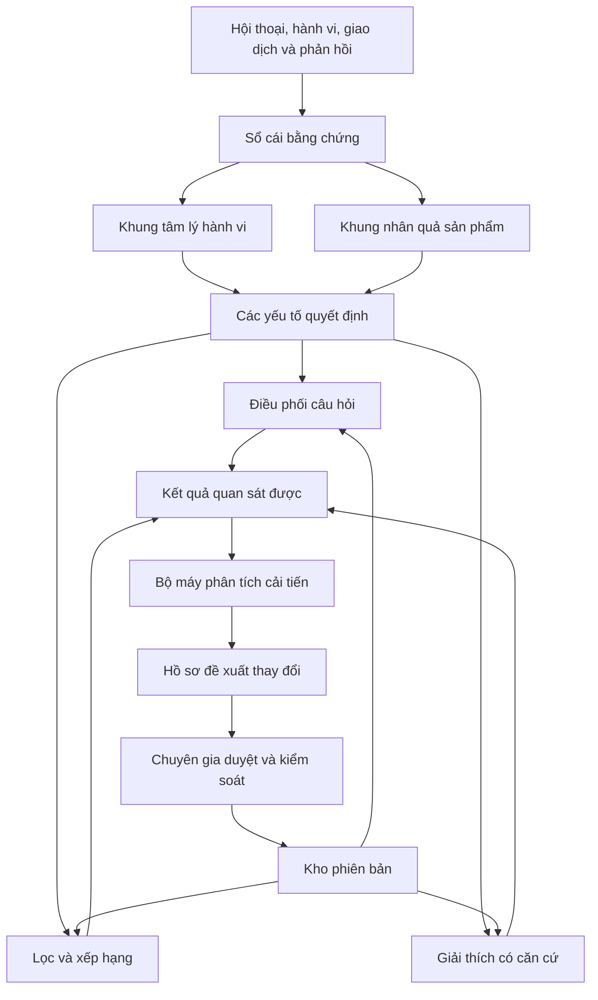
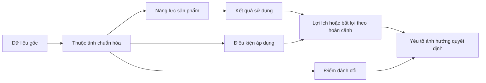
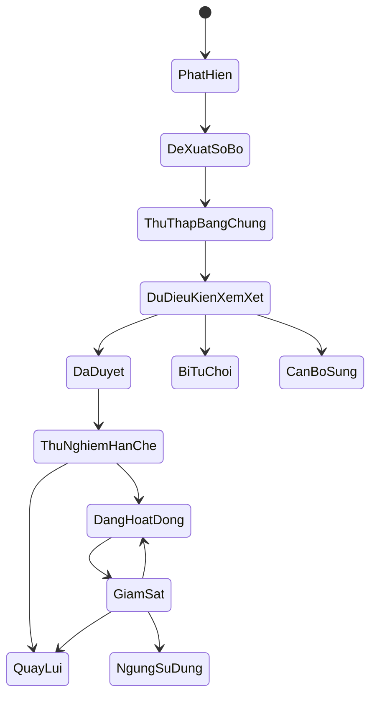

# Thiết kế khung tư vấn sản phẩm thích nghi

**Ngày:** 18 tháng 7 năm 2026

**Trạng thái:** Đã duyệt nội dung qua đối thoại, đang chờ duyệt tài liệu hoàn chỉnh

## 1. Đích đến

Thiết kế một lõi tư vấn sản phẩm dùng chung cho nhiều ngành hàng, có khả năng:

1. Xây hồ sơ giả thuyết về tâm lý và hành vi ra quyết định của khách hàng.
2. Chuyển cấu hình kỹ thuật của sản phẩm thành năng lực, kết quả sử dụng, lợi ích, giới hạn và điểm đánh đổi có điều kiện.
3. Ghép hai khung để hỏi đúng thông tin còn thiếu, xếp hạng sản phẩm và giải thích bằng bằng chứng.
4. Tự phân tích tín hiệu mới và chủ động đề xuất cải tiến.
5. Giữ chuyên gia ở vai trò xem xét, phê duyệt, kiểm soát và quay lui thay đổi.

Bản mẫu 48 giờ dùng máy lạnh để kiểm chứng chiều sâu. Lõi dùng chung không chứa khái niệm riêng của máy lạnh. Thử nghiệm 3 tháng dùng thêm điện thoại làm ngành hàng tương phản để chứng minh khả năng tổng quát hóa.

## 2. Quyết định đã chốt

| Chủ đề | Quyết định |
|---|---|
| Hình dạng insight | Hồ sơ giả thuyết có bằng chứng, độ tin cậy, mâu thuẫn và câu hỏi kiểm chứng |
| Phân tích sản phẩm | Chuỗi nhân quả từ thông số đến yếu tố quyết định, có điều kiện áp dụng và điểm đánh đổi |
| Kiến trúc khung | Siêu khung ổn định, nội dung được phiên bản hóa và có thể tiến hóa |
| Nguồn học | Hội thoại, hành vi, giao dịch, hủy, đổi trả, hài lòng và đánh giá chuyên gia |
| Quyền tự chủ | Hệ thống tự phân tích và tạo đề xuất; chuyên gia duyệt trước khi áp dụng |
| Phạm vi bản mẫu | Lõi dùng chung, một gói máy lạnh và một tập sản phẩm đủ bằng chứng |
| Chứng minh tổng quát | Thêm ngành hàng thứ hai mà không sửa ngữ pháp lõi |

## 3. Nguyên tắc thiết kế

### 3.1. Phân biệt sự thật và suy luận

- Sự thật phải trỏ tới nguồn, thời điểm và trạng thái chất lượng.
- Suy luận phải trỏ tới bằng chứng đầu vào, quy tắc tạo ra và độ tin cậy.
- Thiếu dữ liệu không được chuyển thành phủ định.
- Tương quan hành vi không được trình bày như quan hệ nhân quả đã được chứng minh.

### 3.2. Tách lõi dùng chung và gói ngành hàng

- Lõi định nghĩa bằng chứng, giả thuyết, quan hệ, độ tin cậy, phiên bản, đánh giá và quản trị thay đổi.
- Gói ngành hàng định nghĩa thuộc tính, quy tắc chuẩn hóa, chuỗi nhân quả và tiêu chí nghiệp vụ riêng.
- Thêm ngành hàng không được yêu cầu sửa cấu trúc lõi.

### 3.3. Học có quản trị

- Hệ thống phải chủ động tìm khoảng trống, suy giảm và mâu thuẫn.
- Hệ thống phải tự chuẩn bị hồ sơ đề xuất có bằng chứng ủng hộ và phản bác.
- Chuyên gia không phải tự tìm mọi cải tiến.
- Không thay đổi hành vi phục vụ khách hàng trước khi có phê duyệt và kiểm thử hồi quy.

## 4. Kiến trúc tổng thể



### 4.1. Các thành phần

| Thành phần | Trách nhiệm | Không được làm |
|---|---|---|
| Sổ cái bằng chứng | Lưu tín hiệu gốc, nguồn, thời điểm, quyền sử dụng và chất lượng | Không tự suy luận ý nghĩa |
| Khung tâm lý hành vi | Tạo và kiểm chứng giả thuyết về yếu tố ra quyết định | Không gán nhãn tính cách cố định |
| Khung nhân quả sản phẩm | Biến cấu hình thành giá trị và điểm đánh đổi có điều kiện | Không coi thông số cao hơn luôn tốt hơn |
| Bộ ghép quyết định | Nối nhu cầu với đặc điểm sản phẩm | Không nới ràng buộc cứng âm thầm |
| Bộ điều phối câu hỏi | Chọn câu hỏi có giá trị thông tin cao nhất | Không hỏi lại dữ kiện đã biết |
| Bộ phân tích cải tiến | Phát hiện khoảng trống và tạo đề xuất thay đổi | Không tự phát hành thay đổi |
| Kho phiên bản | Lưu cấu hình, nguồn gốc, kết quả đánh giá và quan hệ thay thế | Không xóa lịch sử đã dùng để tư vấn |
| Bảng kiểm soát chuyên gia | So sánh, duyệt, từ chối, thử nghiệm và quay lui | Không che bằng chứng phản bác |

## 5. Khung tâm lý hành vi

### 5.1. Các lớp hồ sơ giả thuyết

| Lớp | Ý nghĩa |
|---|---|
| Hoàn cảnh | Tình huống sử dụng và bối cảnh ra quyết định |
| Việc cần giải quyết | Kết quả khách hàng muốn đạt |
| Động cơ | Lý do kết quả đó quan trọng |
| Ràng buộc | Điều kiện không được vi phạm |
| Rào cản và nỗi lo | Điều làm khách hàng trì hoãn hoặc từ chối |
| Tiêu chí đánh đổi | Lợi ích khách hàng sẵn sàng ưu tiên hoặc hy sinh |
| Niềm tin | Nguồn, thương hiệu hoặc loại bằng chứng khách hàng tin hay nghi ngờ |
| Cách ra quyết định | Chiến lược so sánh, loại trừ hoặc giảm rủi ro |
| Trạng thái quyết định | Tìm hiểu, khám phá, thu hẹp, xác nhận hoặc sẵn sàng hành động |
| Khoảng trống | Dữ kiện chưa biết có khả năng thay đổi kết quả |

Các lớp trên là lăng kính khởi đầu, không phải danh sách đóng. Hệ thống được phép đề xuất lớp con, quan hệ hoặc yếu tố mới theo quy trình cải tiến.

### 5.2. Đơn vị insight

Mỗi insight là một giả thuyết có cấu trúc:

```json
{
  "hypothesis_id": "hyp_...",
  "scope": "customer_session",
  "dimension": "decision_driver",
  "statement": "Độ ồn có khả năng là yếu tố quyết định",
  "observations": ["obs_..."],
  "supporting_evidence": ["ev_..."],
  "contradicting_evidence": [],
  "alternatives": [],
  "confidence": 0.68,
  "freshness": "current_session",
  "decision_impact": "may_change_ranking",
  "verification_question": "Máy êm quan trọng hơn làm lạnh nhanh đúng không?",
  "model_version": "behavior-v1"
}
```

### 5.3. Điều kiện dùng insight

- Giả thuyết có độ tin cậy thấp chỉ được dùng để chọn câu hỏi kiểm chứng.
- Giả thuyết có thể thay đổi xếp hạng phải có bằng chứng trực tiếp hoặc được khách hàng xác nhận.
- Giả thuyết hết hạn khi hoàn cảnh hoặc mục tiêu thay đổi.
- Mâu thuẫn phải được giữ lại, không chọn một phía âm thầm.
- Thuộc tính nhạy cảm bị loại khỏi suy luận nếu không cần thiết và không có quyền sử dụng.

## 6. Khung nhân quả sản phẩm

### 6.1. Chuỗi giá trị



### 6.2. Cấu trúc quan hệ

Mỗi mắt xích phải có:

- Nút nguồn và nút đích.
- Loại quan hệ.
- Điều kiện áp dụng.
- Bằng chứng ủng hộ và phản bác.
- Độ tin cậy.
- Quy tắc hoặc mô hình đã tạo quan hệ.
- Phiên bản và thời điểm hiệu lực.
- Phạm vi ngành hàng, sản phẩm và hoàn cảnh.

### 6.3. Tiêu chuẩn đặc điểm cốt lõi

Một đặc điểm chỉ được coi là cốt lõi khi:

1. Ảnh hưởng đáng kể đến kết quả sử dụng quan trọng.
2. Có khả năng thay đổi lựa chọn hoặc thứ tự sản phẩm.
3. Ảnh hưởng không chỉ là hệ quả của giá, khuyến mãi hoặc mức độ hiển thị.
4. Có điều kiện áp dụng rõ ràng.
5. Có bằng chứng đủ mạnh để giải thích cho khách hàng.

Đặc điểm cốt lõi được tính theo hoàn cảnh. Cùng một thuộc tính có thể là lợi ích, không liên quan hoặc bất lợi trong ba hoàn cảnh khác nhau.

## 7. Ghép hai khung để ra quyết định

### 7.1. Luồng xử lý

1. Trích xuất dữ kiện quan sát được từ hội thoại.
2. Cập nhật hồ sơ giả thuyết khách hàng.
3. Xác định ràng buộc cứng, ưu tiên mềm và khoảng trống có ảnh hưởng cao.
4. Nếu còn khoảng trống quyết định, chọn một câu hỏi kiểm chứng.
5. Lọc sản phẩm bằng dữ kiện có căn cứ và quy tắc nghiệp vụ.
6. Ánh xạ hồ sơ khách hàng vào các yếu tố quyết định.
7. Truy vết từ yếu tố quyết định tới chuỗi nhân quả sản phẩm.
8. Xếp hạng ứng viên hợp lệ và lưu đóng góp của từng yếu tố.
9. Tạo đúng ba khuyến nghị, lý do, điểm đánh đổi và nguồn.
10. Kiểm tra lại ràng buộc, bằng chứng và trạng thái thiếu trước khi hiển thị.

### 7.2. Chính sách hỏi thêm

Giá trị của một câu hỏi được tính từ:

- Khả năng làm thay đổi tập sản phẩm hợp lệ.
- Khả năng làm thay đổi thứ tự ba sản phẩm đầu.
- Mức giảm không chắc chắn của giả thuyết quan trọng.
- Chi phí nhận thức và mức riêng tư của câu hỏi.
- Việc khách hàng đã cung cấp hoặc từ chối dữ kiện đó chưa.

Hệ thống dừng hỏi khi câu hỏi còn lại không có khả năng thay đổi đáng kể kết quả hoặc khách hàng muốn xem gợi ý ngay.

## 8. Vòng tự phân tích và đề xuất cải tiến

### 8.1. Tín hiệu phát hiện

- Nhu cầu thường xuyên không được biểu diễn.
- Câu hỏi làm rõ không tạo thay đổi hữu ích.
- Quan hệ sản phẩm không giải thích được lựa chọn hoặc kết quả sau sử dụng.
- Một nhóm khách hàng có chất lượng khuyến nghị thấp hơn.
- Chuyên gia lặp lại cùng một kiểu sửa lỗi.
- Kết quả mua tăng nhưng hủy, đổi trả hoặc không hài lòng cũng tăng.
- Quy tắc suy giảm sau thay đổi danh mục, giá hoặc thị trường.

### 8.2. Hồ sơ đề xuất

Mỗi đề xuất phải chứa:

- Vấn đề quan sát được.
- Giả thuyết nguyên nhân.
- Phần khung và phiên bản bị ảnh hưởng.
- Thay đổi được đề xuất.
- Bằng chứng ủng hộ và phản bác.
- Mức cải thiện dự kiến.
- Nhóm khách hàng và sản phẩm bị ảnh hưởng.
- Nguy cơ thiên kiến và ảnh hưởng liên đới.
- Bộ kiểm thử hồi quy.
- Điều kiện thành công, dừng và quay lui.

### 8.3. Vòng đời thay đổi



### 8.4. Chống vòng phản hồi sai

- Không tối ưu riêng tỷ lệ nhấp hoặc mua.
- Không học trực tiếp từ đầu ra do chính hệ thống tạo mà thiếu nhóm đối chứng.
- Điều chỉnh ảnh hưởng của giá, khuyến mãi, tồn kho và vị trí hiển thị khi phân tích hành vi.
- Không phát hành thay đổi nếu cải thiện trung bình nhưng gây hại nghiêm trọng cho một nhóm.
- Không dùng dữ liệu khách hàng ngoài mục đích và thời hạn đã được phê duyệt.

## 9. Quản lý phiên bản và khả năng quay lui

Một phiên bản phát hành phải khóa:

- Lược đồ hồ sơ khách hàng.
- Lược đồ đồ thị sản phẩm.
- Gói ngành hàng.
- Bộ quy tắc chuẩn hóa và lọc.
- Trọng số xếp hạng.
- Chính sách hỏi thêm.
- Chỉ dẫn và mô hình ngôn ngữ.
- Ảnh chụp dữ liệu đánh giá.
- Kết quả kiểm thử và người phê duyệt.

Nhật ký mỗi phiên tư vấn phải ghi phiên bản đã dùng. Quay lui là đổi cấu hình về phiên bản đã phê duyệt trước, không sửa trực tiếp lịch sử.

## 10. Xử lý lỗi và trạng thái không chắc chắn

| Tình huống | Hành vi bắt buộc |
|---|---|
| Thiếu dữ kiện khách hàng | Hỏi câu có giá trị thông tin cao nhất hoặc trình bày giới hạn |
| Dữ liệu sản phẩm thiếu | Ghi chưa có dữ liệu, không chấm như điểm yếu |
| Nguồn mâu thuẫn | Giữ cả hai, hạ độ tin cậy và yêu cầu xác minh |
| Không đủ ba sản phẩm | Nói rõ và xin nới đúng một ràng buộc |
| Giả thuyết hành vi yếu | Chỉ dùng để chọn câu hỏi, không dùng để xếp hạng |
| Chuỗi nhân quả thiếu bằng chứng | Không dùng làm lý do tư vấn |
| Đề xuất cải tiến không vượt tập giữ lại | Giữ ở trạng thái thu thập bằng chứng |
| Phiên bản mới suy giảm | Cảnh báo, dừng thử nghiệm và quay lui |
| Dữ liệu nhạy cảm không có quyền | Không lưu, không suy luận và không dùng để học |

## 11. Đánh giá

### 11.1. Khung tâm lý hành vi

- Độ đúng của dữ kiện trích xuất.
- Độ hiệu chỉnh của độ tin cậy.
- Tỷ lệ giả thuyết được xác nhận hoặc bác bỏ đúng.
- Mức giảm không chắc chắn sau câu hỏi làm rõ.
- Số câu hỏi thừa và tỷ lệ hỏi lại.

### 11.2. Khung nhân quả sản phẩm

- Độ đúng chuẩn hóa thuộc tính.
- Mức đồng thuận chuyên gia về chuỗi nhân quả.
- Độ phủ bằng chứng cho từng mắt xích.
- Độ ổn định khi dữ liệu thiếu hoặc mâu thuẫn.
- Khả năng phát hiện tương tác giữa nhiều thuộc tính.

### 11.3. Khuyến nghị

- **0 vi phạm ràng buộc cứng** trên tập khóa.
- Độ phù hợp của ba sản phẩm do chuyên gia chấm.
- Tỷ lệ nhận định nguyên tử có bằng chứng.
- Chất lượng và tính trung thực của điểm đánh đổi.
- Độ dễ hiểu đối với khách hàng phổ thông.

### 11.4. Tự cải tiến

- Tỷ lệ đề xuất được chuyên gia đánh giá là có ích.
- Mức cải thiện trên tập giữ lại.
- Hồi quy theo nhóm khách hàng và ngành hàng.
- Tỷ lệ đề xuất bị bác vì thiếu bằng chứng hoặc thiên kiến.
- Thời gian phát hiện suy giảm và thời gian quay lui.

### 11.5. Tổng quát hóa

Khung chỉ được coi là tổng quát khi thêm ngành hàng thứ hai mà:

- Không sửa ngữ pháp bằng chứng, giả thuyết, phiên bản và quản trị của lõi.
- Chỉ bổ sung gói thuộc tính, quan hệ và quy tắc ngành hàng.
- Vẫn dùng cùng cơ chế hỏi thêm, đánh giá, duyệt và quay lui.
- Đạt ngưỡng chất lượng riêng của ngành hàng mới.

## 12. Phạm vi bản mẫu 48 giờ

### 12.1. Bắt buộc

- Lược đồ lõi cho hồ sơ giả thuyết và đồ thị sản phẩm.
- Gói máy lạnh đầu tiên.
- Tập con sản phẩm đủ dữ liệu và bằng chứng.
- Luồng hội thoại tạo, cập nhật và kiểm chứng giả thuyết.
- Chuỗi nhân quả cho các đặc điểm máy lạnh cốt lõi.
- Lọc, xếp hạng và giải thích ba sản phẩm.
- Một ví dụ hệ thống tự phát hiện vấn đề và tạo hồ sơ đề xuất cải tiến.

### 12.2. Không nằm trong bản mẫu

- Tự động phát hành thay đổi.
- Triển khai nhiều ngành hàng.
- Tích hợp giỏ hàng hoặc thanh toán.
- Tự lưu trữ mô hình ngôn ngữ.
- Học trực tuyến trực tiếp trên khách hàng thật.

## 13. Lộ trình thử nghiệm 3 tháng

### Tháng 1: nền đo lường và gói máy lạnh

- Hoàn thiện tập đánh giá có nhãn chuyên gia.
- Thu tín hiệu đa lớp theo quyền sử dụng đã duyệt.
- Vận hành gói máy lạnh với người dùng thử.
- Thiết lập kho phiên bản và đường quay lui.

### Tháng 2: vòng đề xuất và ngành hàng thứ hai

- Tự động phát hiện mẫu lỗi và tạo hồ sơ đề xuất.
- Xây bảng kiểm soát chuyên gia.
- Thêm gói điện thoại làm ngành hàng tương phản.
- Đo chi phí mở rộng và phần lõi phải thay đổi.

### Tháng 3: thử nghiệm có kiểm soát

- Chạy thử nghiệm hạn chế với phiên bản đã duyệt.
- Đo chất lượng, thiên kiến, độ trễ và chi phí.
- Diễn tập quay lui và xử lý dữ liệu mâu thuẫn.
- Chốt ranh giới lõi, gói ngành hàng và điều kiện mở rộng tiếp.

## 14. Rủi ro và đánh đổi

| Rủi ro | Cơ chế | Kiểm soát |
|---|---|---|
| Suy diễn tâm lý quá mức | Biến tín hiệu yếu thành kết luận chắc chắn | Giả thuyết có độ tin cậy, bằng chứng phản bác và câu hỏi kiểm chứng |
| Khung lõi quá chung | Không đủ sức giải thích quyết định thật | Gói ngành hàng và kiểm thử bằng hai ngành tương phản |
| Gói ngành hàng quá đặc thù | Khó tái sử dụng | Cổng tổng quát hóa không cho sửa ngữ pháp lõi |
| Tối ưu sai mục tiêu | Tăng mua nhưng tăng hủy hoặc không hài lòng | Đánh giá đa tín hiệu và kết quả sau sử dụng |
| Vòng phản hồi tự khuếch đại | Hệ thống học từ chính sản phẩm nó ưu tiên hiển thị | Nhóm đối chứng, hiệu chỉnh mức hiển thị và tập giữ lại |
| Chuyên gia quá tải | Quá nhiều đề xuất chất lượng thấp | Ngưỡng bằng chứng, gom nhóm và xếp ưu tiên theo ảnh hưởng |
| Khó quay lui | Phiên bản phụ thuộc lẫn nhau | Khóa gói phát hành, kiểm thử tương thích và cấu hình bất biến |
| Dữ liệu nhạy cảm | Suy luận hoặc lưu quá mức cần thiết | Giảm thiểu dữ liệu, phân quyền, thời hạn lưu và cấm suy luận không cần thiết |

## 15. Các quyết định tiếp theo trên bản đồ

Thiết kế này cố định ranh giới và cơ chế tổng quát. Các quyết định chi tiết tiếp tục được xử lý trên bản đồ tìm đường:

- Nền tảng khoa học và lăng kính hành vi nào được dùng làm thư viện khởi đầu.
- Lược đồ chính xác của hồ sơ giả thuyết và đồ thị sản phẩm.
- Tiêu chuẩn bằng chứng cho từng loại quan hệ nhân quả.
- Bộ tín hiệu hiện có đủ để học và kiểm chứng những gì.
- Ngưỡng đánh giá, quy trình chuyên gia và quyền truy cập dữ liệu.
- Lát cắt máy lạnh nhỏ nhất cho bản mẫu 48 giờ.

## 16. Tiêu chí chấp nhận thiết kế

Thiết kế được coi là sẵn sàng chuyển sang lập kế hoạch khi:

- Hai khung có ranh giới và giao diện rõ ràng.
- Sự thật, suy luận và đề xuất thay đổi được tách riêng.
- Có cơ chế tự phân tích nhưng không tự phát hành thay đổi.
- Có chiến lược phiên bản hóa, kiểm thử và quay lui.
- Bản mẫu 48 giờ có lát cắt thực thi được.
- Thử nghiệm 3 tháng có cổng chứng minh tính tổng quát.
- Các quyết định chưa chốt đã được đưa lên bản đồ, không nằm dưới dạng giả định ẩn.
