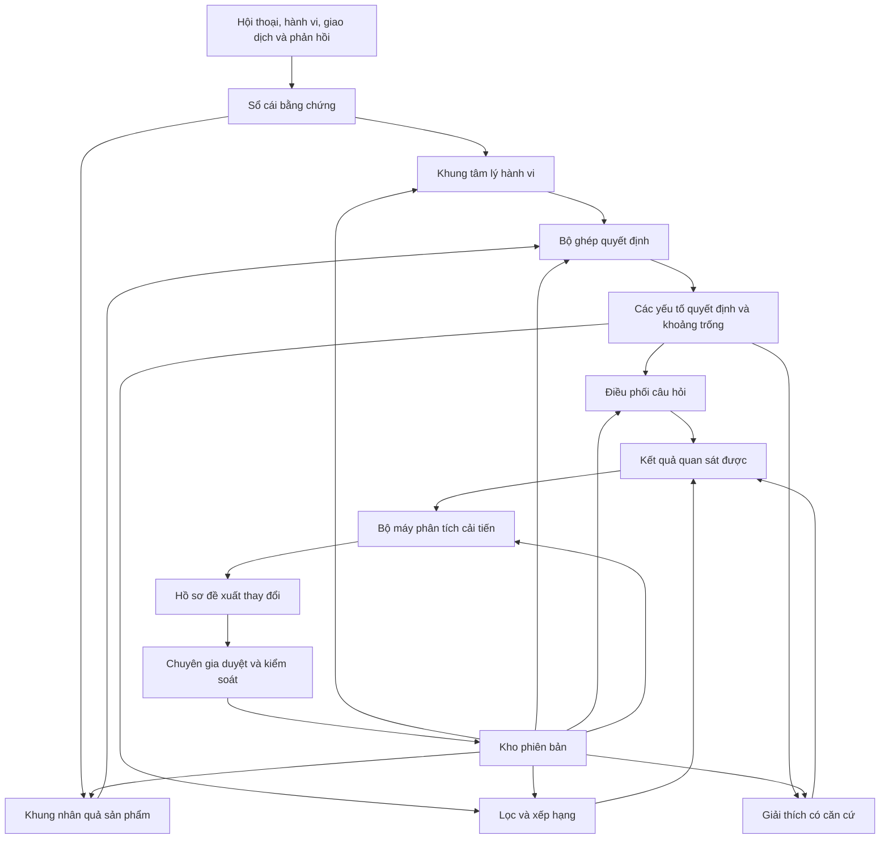
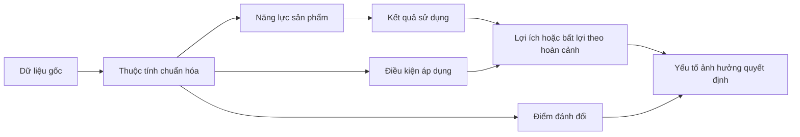
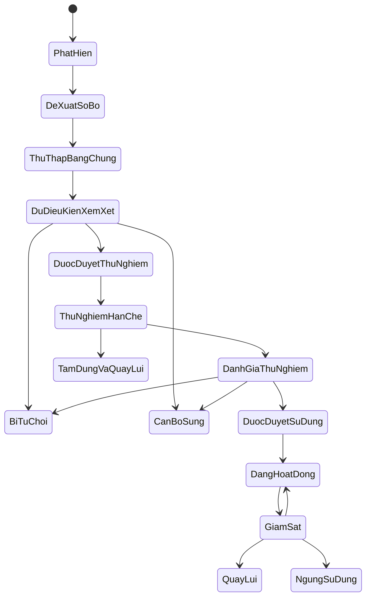

# Thiết kế khung tư vấn sản phẩm thích nghi

**Ngày:** 18 tháng 7 năm 2026

**Trạng thái:** Đã duyệt nội dung qua đối thoại, đang chờ duyệt tài liệu hoàn chỉnh

## 1. Đích đến

Thiết kế một lõi tư vấn sản phẩm dùng chung cho nhiều ngành hàng, có khả năng:

1. Xây hồ sơ giả thuyết về tâm lý và hành vi ra quyết định của khách hàng.
2. Chuyển cấu hình kỹ thuật của sản phẩm thành năng lực, kết quả sử dụng, lợi ích, giới hạn và điểm đánh đổi có điều kiện.
3. Ghép hai khung để hỏi đúng thông tin còn thiếu, xếp hạng sản phẩm và giải thích bằng bằng chứng.
4. Tự phân tích tín hiệu mới và chủ động đề xuất cải tiến.
5. Giữ chuyên gia ở vai trò xem xét, phê duyệt, kiểm soát và quay lui thay đổi.

Bản mẫu 48 giờ dùng máy lạnh để kiểm chứng chiều sâu. Lõi dùng chung không chứa khái niệm riêng của máy lạnh. Thử nghiệm 3 tháng dùng thêm điện thoại làm ngành hàng tương phản để chứng minh khả năng tổng quát hóa.

## 2. Quyết định đã chốt

| Chủ đề                                | Quyết định                                                                                                                                                                                                                                   |
| ------------------------------------- | -------------------------------------------------------------------------------------------------------------------------------------------------------------------------------------------------------------------------------------------- |
| Hình dạng nhận định giúp hiểu nhu cầu | Hồ sơ giả thuyết có bằng chứng, độ tin cậy, mâu thuẫn và câu hỏi kiểm chứng                                                                                                                                                                  |
| Phân tích sản phẩm                    | Chuỗi nhân quả từ thông số đến yếu tố quyết định, có điều kiện áp dụng và điểm đánh đổi                                                                                                                                                      |
| Kiến trúc khung                       | Siêu khung ổn định, nội dung được phiên bản hóa và có thể tiến hóa                                                                                                                                                                           |
| Nguồn học                             | Hội thoại, hành vi, giao dịch, hủy, đổi trả, hài lòng và đánh giá chuyên gia                                                                                                                                                                 |
| Quyền tự chủ                          | Hệ thống tự phân tích và tạo đề xuất; chuyên gia duyệt trước khi áp dụng                                                                                                                                                                     |
| Phạm vi bản mẫu                       | Lõi dùng chung, một gói máy lạnh và một tập sản phẩm đủ bằng chứng                                                                                                                                                                           |
| Chứng minh tổng quát                  | Thêm ngành hàng thứ hai mà không sửa cấu trúc và quy tắc chung của lõi                                                                                                                                                                       |
| Nền tâm lý hành vi                    | Thư viện lăng kính phân tầng tạo giả thuyết có thể bác bỏ về hành vi trong hoàn cảnh, không gán bản chất con người                                                                                                                           |
| Ánh xạ giá trị sản phẩm               | Ghép chuỗi phương tiện và mục đích, triển khai chức năng chất lượng rút gọn (Quality Function Deployment, QFD), mô hình nhiều tiêu chí, đồ thị nhân quả và mô hình dữ liệu nguồn gốc (PROV Data Model, PROV-DM) theo đúng vai trò bằng chứng |
| Giới hạn dữ liệu hiện có              | Chỉ dùng có điều kiện để kiểm tra việc tách dữ kiện khỏi hội thoại và chọn câu hỏi làm rõ, chưa dùng để học nhãn tâm lý hoặc hiệu quả sau tư vấn                                                                                             |


### 2.1. Căn cứ nghiên cứu

- [Nền tảng khoa học cho khung tâm lý hành vi mua hàng thích nghi](../../research/nen-tang-khoa-hoc-khung-tam-ly-hanh-vi.md).
- [Phương pháp ánh xạ cấu hình sản phẩm thành giá trị và quyết định](../../research/phuong-phap-anh-xa-cau-hinh-thanh-gia-tri.md).
- [Kiểm định tín hiệu hành vi trong dữ liệu hội thoại và giao dịch hiện có](../../research/kiem-dinh-tin-hieu-hanh-vi-hoi-thoai.md).

## 3. Cách đọc tài liệu và từ điển khái niệm

Phần này giúp người chưa có kiến thức về trí tuệ nhân tạo, dữ liệu hoặc kiến trúc hệ thống hiểu thống nhất các tên gọi được dùng trong tài liệu. Một thuật ngữ chỉ có ích khi người đọc biết nó mô tả điều gì, dùng để làm gì và không được hiểu sai theo hướng nào.

Tài liệu này chốt ý nghĩa và ranh giới của các khái niệm, nhưng chưa chốt mọi con số vận hành. Các cụm như “đủ mạnh”, “đáng kể”, “độ tin cậy thấp” hoặc “phạm vi nhỏ” đánh dấu nơi cần đặt ngưỡng bằng tập đánh giá và quyết định chuyên gia. Trước khi ngưỡng được chốt, hệ thống không được tự diễn giải các cụm này thành quyền lọc, xếp hạng hoặc đưa thay đổi vào sử dụng.

### 3.1. Một hành trình tư vấn bằng ngôn ngữ đời thường

Có thể hình dung toàn bộ hệ thống qua tình huống sau:

1. Khách hàng nói: “Tôi cần máy lạnh cho phòng ngủ rộng 20 mét vuông, ưu tiên máy êm vì có trẻ nhỏ.”
2. Hệ thống lưu nguyên văn nhu cầu, thời điểm và nguồn hội thoại. Đây là dữ liệu gốc, chưa phải kết luận.
3. Hệ thống tách điều đã biết, chẳng hạn diện tích phòng và nhu cầu yên tĩnh, khỏi điều đang phỏng đoán, chẳng hạn khách hàng có thể ưu tiên độ ồn hơn tốc độ làm lạnh.
4. Hệ thống kiểm tra xem còn thiếu thông tin nào có thể làm thay đổi lựa chọn, chẳng hạn ngân sách, hướng nắng hoặc số người thường ở trong phòng.
5. Nếu cần, hệ thống hỏi thêm đúng một câu có khả năng giảm nhiều nhất sự không chắc chắn.
6. Hệ thống loại những sản phẩm vi phạm điều kiện bắt buộc, sau đó so sánh những sản phẩm còn lại theo các ưu tiên đã được xác nhận.
7. Hệ thống đưa ra ba sản phẩm, giải thích vì sao từng sản phẩm phù hợp, điểm nào phải đánh đổi và phần nào còn chưa chắc chắn.
8. Mỗi lời giải thích đều có thể truy ngược về câu nói của khách hàng, dữ liệu sản phẩm hoặc quy tắc chuyên môn đã được duyệt.
9. Sau phiên tư vấn, hệ thống ghi nhận điều gì đã xảy ra, chẳng hạn khách hàng hỏi tiếp, chọn xem sản phẩm, mua, hủy, đổi trả hoặc đánh giá không hài lòng.
10. Hệ thống dùng các kết quả đó để tìm vấn đề lặp lại và chuẩn bị đề xuất cải tiến. Chuyên gia quyết định có thử nghiệm hoặc áp dụng đề xuất hay không.

### 3.2. Bốn loại thông tin phải luôn được tách riêng

| Loại thông tin      | Hiểu đơn giản                                                                                 | Ví dụ                                                                   | Điều không được làm                                           |
| ------------------- | --------------------------------------------------------------------------------------------- | ----------------------------------------------------------------------- | ------------------------------------------------------------- |
| Dữ liệu gốc         | Nội dung được ghi nhận trực tiếp từ khách hàng, sản phẩm hoặc hệ thống nguồn                  | Khách hàng nói phòng rộng 20 mét vuông                                  | Không tự thêm ý mà nguồn chưa nói                             |
| Sự thật đã kiểm tra | Dữ liệu gốc đã được kiểm tra đủ để sử dụng trong đúng phạm vi và thời điểm                    | Thông số độ ồn lấy từ tài liệu kỹ thuật còn hiệu lực                    | Không coi sự thật ở một sản phẩm là đúng cho cả dòng sản phẩm |
| Giả thuyết          | Cách giải thích hoặc dự đoán mà hệ thống đang xem xét và vẫn có thể sai                       | Độ ồn có thể là yếu tố quyết định của khách hàng                        | Không trình bày như điều khách hàng đã xác nhận               |
| Quyết định đã duyệt | Quy tắc, cấu hình hoặc thay đổi đã vượt kiểm tra và được người có thẩm quyền cho phép sử dụng | Cho phép dùng độ ồn để xếp hạng khi khách hàng xác nhận nhu cầu ngủ yên | Không tự động áp dụng đề xuất chưa được duyệt                 |


### 3.3. Dữ liệu, bằng chứng và mức chắc chắn

- **Tín hiệu:** bất kỳ thông tin mới nào có khả năng giúp hiểu khách hàng, sản phẩm hoặc chất lượng tư vấn. Một lượt nhấp là tín hiệu, nhưng chưa đủ để kết luận khách hàng thực sự thích sản phẩm đó vì lượt nhấp còn có thể bị ảnh hưởng bởi vị trí hiển thị hoặc khuyến mãi.
- **Quan sát:** điều hệ thống ghi nhận được mà chưa thêm cách giải thích. “Khách hàng mở bảng so sánh độ ồn hai lần” là quan sát; “khách hàng rất sợ tiếng ồn” là một giả thuyết khác.
- **Bằng chứng:** dữ liệu hoặc quan sát đủ rõ về nguồn và chất lượng để ủng hộ hoặc phản bác một nhận định cụ thể. Không phải mọi tín hiệu đều là bằng chứng đủ mạnh và một bằng chứng chỉ có giá trị trong phạm vi nó thực sự hỗ trợ.
- **Bằng chứng ủng hộ:** thông tin làm một giả thuyết có cơ sở hơn. Ví dụ, khách hàng trực tiếp nói “tôi khó ngủ nếu máy kêu” ủng hộ giả thuyết độ ồn là yếu tố quan trọng.
- **Bằng chứng phản bác:** thông tin cho thấy giả thuyết có thể sai hoặc chỉ đúng trong phạm vi hẹp hơn. Ví dụ, khách hàng nói “phòng này chỉ dùng ban ngày” làm yếu đi giả thuyết độ ồn khi ngủ là yếu tố quyết định.
- **Sổ cái bằng chứng:** nơi lưu lịch sử dữ liệu và bằng chứng để có thể kiểm tra lại. Sổ này ghi nội dung gốc, nguồn, thời điểm, quyền sử dụng, chất lượng, các bước biến đổi và phiên bản đã sử dụng; nó không tự quyết định khách hàng cần sản phẩm nào. Nếu một bản ghi sai, hệ thống thêm bản sửa có liên kết tới bản cũ thay vì âm thầm ghi đè; việc xóa hoặc ẩn dữ liệu theo quyền riêng tư cũng phải để lại trạng thái xử lý mà không giữ nội dung đã hết quyền lưu.
- **Nguồn gốc dữ liệu:** thông tin trả lời các câu hỏi “dữ liệu đến từ đâu, ai tạo, ai thay đổi, ai duyệt và phiên bản nào đã sử dụng”. Nguồn gốc rõ giúp kiểm tra trách nhiệm, nhưng không tự chứng minh nội dung là đúng.
- **Truy vết:** khả năng đi ngược từ một kết quả hoặc lời giải thích về đúng dữ liệu, quy tắc và phiên bản đã tạo ra nó. Truy vết giúp kiểm tra “vì sao hệ thống nói điều này” mà không phải đoán từ kết quả cuối.
- **Độ tin cậy:** mức hệ thống đánh giá một giả thuyết có khả năng đúng trong phạm vi hiện tại. Đây không phải tỷ lệ chắc chắn tuyệt đối; mức này phải giảm khi bằng chứng yếu, cũ, mâu thuẫn hoặc khác hoàn cảnh.
- **Độ hiệu chỉnh:** mức độ khớp giữa độ tin cậy hệ thống công bố và kết quả thực tế. Nếu các giả thuyết được gán độ tin cậy 70 phần trăm nhưng chỉ khoảng 30 phần trăm được xác nhận, hệ thống đang tự tin quá mức.
- **Mâu thuẫn:** tình huống có ít nhất hai bằng chứng hoặc nhận định không thể cùng đúng hoàn toàn trong cùng phạm vi. Hệ thống phải giữ lại mâu thuẫn, hỏi để làm rõ hoặc hạ độ tin cậy, thay vì âm thầm chọn phía thuận tiện hơn.
- **Nhận định nguyên tử:** một câu chỉ khẳng định một ý để có thể kiểm tra bằng chứng riêng. “Máy này êm, tiết kiệm điện và tốt nhất cho trẻ nhỏ” phải được tách thành nhiều nhận định vì mỗi phần cần nguồn và điều kiện khác nhau.
- **Tương quan:** hai hiện tượng thường xuất hiện cùng nhau nhưng chưa chứng minh hiện tượng này gây ra hiện tượng kia. Sản phẩm có thông số cao hơn bán nhiều hơn có thể do thương hiệu, giá, tồn kho hoặc vị trí hiển thị.
- **Quan hệ nhân quả:** nhận định rằng thay đổi một yếu tố thực sự làm thay đổi một kết quả trong điều kiện xác định. Chỉ được dùng cách nói chắc chắn như “làm tăng” hoặc “làm giảm” khi có cơ chế và bằng chứng phù hợp, không chỉ vì hai dữ liệu cùng tăng hoặc giảm.

### 3.4. Khách hàng, nhu cầu và cách ra quyết định

- **Hồ sơ giả thuyết khách hàng:** tập hợp có cấu trúc những điều đã biết, điều đang phỏng đoán, bằng chứng, mâu thuẫn và câu hỏi cần xác minh trong một hoàn cảnh mua cụ thể. Đây không phải hồ sơ tính cách cố định của một con người.
- **Hoàn cảnh:** điều kiện cụ thể bao quanh việc mua và sử dụng sản phẩm, gồm ai sử dụng, sử dụng ở đâu, khi nào, cho việc gì và dưới giới hạn nào. Cùng một khách hàng có thể cần hai lựa chọn khác nhau khi mua máy cho phòng trẻ nhỏ và khi mua cho cửa hàng đông người.
- **Việc cần giải quyết:** kết quả thực tế khách hàng muốn đạt được, không chỉ là tên sản phẩm họ đang tìm. “Giúp trẻ ngủ dễ chịu trong phòng nóng” cụ thể hơn “mua máy lạnh”.
- **Mục tiêu:** trạng thái khách hàng muốn hướng tới, chẳng hạn ngủ ngon, giảm tiền điện hoặc lắp đặt trước cuối tuần. Một sản phẩm có thể hỗ trợ nhiều mục tiêu và cũng có thể giúp mục tiêu này nhưng cản trở mục tiêu khác.
- **Động cơ:** lý do khiến mục tiêu trở nên quan trọng trong hoàn cảnh hiện tại. Hệ thống chỉ ghi động cơ khi khách hàng nói rõ hoặc có bằng chứng đủ mạnh; không được suy ra động cơ sâu từ một lần nhấp.
- **Ràng buộc cứng:** điều kiện bắt buộc phải thỏa mãn; sản phẩm vi phạm sẽ bị loại trước khi chấm điểm. Ràng buộc do khách hàng tự đặt, chẳng hạn ngân sách, chỉ được nới khi chính khách hàng đồng ý. Ràng buộc về an toàn, pháp luật, quyền riêng tư, tương thích kỹ thuật hoặc quy tắc bắt buộc của doanh nghiệp không được đề nghị nới.
- **Ưu tiên mềm:** điều khách hàng muốn có nhưng có thể chấp nhận đánh đổi. Ví dụ, khách hàng thích máy màu trắng nhưng vẫn chọn màu khác nếu máy êm hơn rõ rệt.
- **Rào cản:** điều kiện làm khách hàng chưa thể hoặc khó thực hiện quyết định, chẳng hạn chưa đủ ngân sách, chưa có quyền quyết định hoặc chưa xác định được vị trí lắp đặt. Rào cản khác với việc khách hàng không thích sản phẩm.
- **Nỗi lo:** hậu quả bất lợi mà khách hàng sợ có thể xảy ra, chẳng hạn máy ồn, tốn điện hoặc khó bảo hành. Nỗi lo phải gắn với hậu quả cụ thể, không gộp thành nhãn chung như “khách hàng ngại rủi ro”.
- **Niềm tin:** điều khách hàng cho là đúng về sản phẩm, thương hiệu, nguồn thông tin hoặc kết quả sử dụng. Niềm tin có thể đúng, sai hoặc chưa đủ căn cứ và phải được tách khỏi sự thật đã kiểm tra.
- **Điểm đánh đổi:** phần lợi ích phải hy sinh để nhận được lợi ích khác. Ví dụ, một máy có thể êm hơn nhưng giá cao hơn; hệ thống phải nói rõ hai mặt thay vì chỉ nêu ưu điểm.
- **Cách ra quyết định:** phương pháp khách hàng đang dùng để thu hẹp lựa chọn, chẳng hạn loại mọi máy vượt ngân sách trước rồi mới so độ ồn. Cách này có thể thay đổi theo số phương án, áp lực thời gian và thông tin mới.
- **Trạng thái quyết định:** công việc khách hàng đang thực hiện tại thời điểm hiện tại, chẳng hạn khám phá nhu cầu, thu hẹp lựa chọn, xác nhận điều kiện mua hoặc chuẩn bị hành động. Trạng thái có thể quay lại bước trước khi xuất hiện thông tin mới.
- **Yếu tố quyết định:** tiêu chí có khả năng làm thay đổi việc sản phẩm được chọn, bị loại hoặc đổi thứ hạng. Một điều khách hàng thấy thú vị chưa chắc là yếu tố quyết định nếu nó không làm thay đổi lựa chọn.
- **Khoảng trống thông tin:** dữ kiện chưa biết có khả năng ảnh hưởng đến câu hỏi, bộ lọc, thứ hạng hoặc lời giải thích. Hệ thống không cần hỏi mọi điều chưa biết, chỉ ưu tiên khoảng trống có ảnh hưởng đáng kể.

### 3.5. Sản phẩm, giá trị sử dụng và quan hệ kỹ thuật

- **Dữ liệu sản phẩm gốc:** thông tin lấy trực tiếp từ tài liệu kỹ thuật, hệ thống danh mục, giá, tồn kho, khuyến mãi hoặc chính sách. Dữ liệu này phải giữ nguồn và thời điểm vì giá hoặc tồn kho có thể thay đổi nhanh.
- **Thuộc tính chuẩn hóa:** một thông số được đổi về tên, kiểu và đơn vị thống nhất để có thể so sánh giữa nhiều sản phẩm. Ví dụ, các cách ghi “1,5 mã lực (HP)”, “1,5 ngựa” và “khoảng 12.000 đơn vị nhiệt Anh mỗi giờ (BTU/giờ)” cần được chuẩn hóa nhưng vẫn phải giữ giá trị gốc.
- **Năng lực sản phẩm:** điều sản phẩm có khả năng thực hiện nhờ một hoặc nhiều thuộc tính kỹ thuật. Năng lực “điều chỉnh công suất linh hoạt” khác với thông số linh kiện và cũng chưa phải lợi ích đối với mọi khách hàng.
- **Kết quả sử dụng:** điều có thể quan sát hoặc đo được khi sản phẩm được dùng trong điều kiện cụ thể. Ví dụ, nhiệt độ phòng ổn định hơn hoặc mức tiếng ồn tại vị trí ngủ thấp hơn.
- **Lợi ích:** kết quả sử dụng giúp một người đạt mục tiêu trong hoàn cảnh xác định. Độ ồn thấp là lợi ích đối với phòng ngủ nhạy tiếng, nhưng có thể ít quan trọng hơn trong cửa hàng nhiều âm thanh nền.
- **Bất lợi:** kết quả, chi phí hoặc giới hạn làm khó mục tiêu của người sử dụng. Giá mua cao, chi phí lắp đặt hoặc khả năng làm lạnh chậm trong một điều kiện cụ thể đều có thể là bất lợi.
- **Điều kiện áp dụng:** hoàn cảnh bắt buộc để một quan hệ hoặc lợi ích còn đúng, chẳng hạn diện tích phòng, hướng nắng, số người, cách lắp đặt và thời gian sử dụng. Bỏ điều kiện có thể biến một nhận định đúng thành lời khuyên sai.
- **Tương tác thuộc tính:** tình huống tác động của một thuộc tính phụ thuộc vào thuộc tính khác. Ví dụ, công suất danh nghĩa phù hợp chưa đủ nếu khả năng phân phối gió hoặc điều kiện lắp đặt tạo thành nút thắt.
- **Ngưỡng:** mức mà trước hoặc sau đó kết quả thay đổi rõ rệt. Ví dụ, sản phẩm vượt ngân sách tối đa bị loại; điểm tốt ở tiêu chí khác không được dùng để bù cho vi phạm này.
- **Bão hòa:** tình huống tăng thêm thông số nhưng lợi ích tăng rất ít hoặc không còn tăng. Công suất cao hơn không phải lúc nào cũng tạo giá trị cao hơn nếu phòng đã được làm mát đủ và ổn định.
- **Nút thắt:** mắt xích yếu nhất đang giới hạn kết quả chung. Tăng mạnh một thông số khác không giải quyết được vấn đề nếu nút thắt vẫn còn.
- **Chuỗi giá trị sản phẩm:** đường giải thích từ dữ liệu gốc, thuộc tính, năng lực, kết quả sử dụng tới lợi ích, bất lợi và yếu tố quyết định. Mỗi mắt xích cần bằng chứng riêng; nguồn mạnh ở đầu chuỗi không bù được mắt xích yếu ở cuối.
- **Ánh xạ:** thiết lập mối nối có quy tắc giữa hai loại thông tin để biết phần nào ở phía này tương ứng hoặc liên quan tới phần nào ở phía kia. Ví dụ, ánh xạ nhu cầu ngủ yên với kết quả sử dụng về độ ồn; mối nối vẫn cần điều kiện và bằng chứng, không chỉ dựa vào từ ngữ giống nhau.
- **Đồ thị nhân quả sản phẩm:** cách biểu diễn nhiều chuỗi và quan hệ kỹ thuật dưới dạng các điểm cùng đường nối có điều kiện. Mũi tên trong đồ thị trước hết có thể chỉ là giả thuyết cần kiểm chứng, không tự trở thành bằng chứng nhân quả.
- **Đặc điểm cốt lõi:** thuộc tính hoặc năng lực có khả năng làm thay đổi đáng kể kết quả sử dụng và quyết định trong một hoàn cảnh. Đặc điểm cốt lõi không cố định cho mọi người và không đồng nghĩa với thông số cao nhất.
- **Chuỗi phương tiện và mục đích:** phương pháp hỏi từ “sản phẩm có đặc điểm gì” tới “đặc điểm đó tạo kết quả gì” và “vì sao kết quả đó quan trọng”. Phương pháp này giúp khám phá ý nghĩa khách hàng cảm nhận, nhưng không tự chứng minh cơ chế kỹ thuật.
- **Triển khai chức năng chất lượng rút gọn (Quality Function Deployment, QFD):** bảng truy vết nối nhu cầu khách hàng với đặc tính kỹ thuật liên quan. Bảng giúp nhìn chỗ thiếu và chỗ xung đột, nhưng điểm do chuyên gia điền trong bảng không phải bằng chứng nhân quả.
- **Mô hình nhiều tiêu chí:** cách so sánh sản phẩm theo nhiều mục tiêu hoặc tiêu chí cùng lúc. Mô hình phải tách điều kiện bắt buộc khỏi ưu tiên có thể đánh đổi và phải cho thấy thứ hạng có đổi khi trọng số thay đổi hợp lý hay không.
- **Mô hình dữ liệu nguồn gốc (PROV Data Model, PROV-DM):** cách ghi ai đã tạo, dùng hoặc sửa dữ liệu nào để tạo ra nhận định mới. Mô hình này hỗ trợ kiểm tra lịch sử và trách nhiệm, nhưng không tự đánh giá nhận định đúng hay sai. Bản mẫu chỉ cần giữ các trường tối thiểu tương thích, không cần triển khai toàn bộ tiêu chuẩn ngay trong 48 giờ.

### 3.6. Lọc, xếp hạng, hỏi thêm và giải thích

- **Lọc sản phẩm:** loại các sản phẩm không đáp ứng ràng buộc cứng hoặc điều kiện kỹ thuật. Lọc diễn ra trước xếp hạng để một ưu điểm khác không thể bù cho vi phạm bắt buộc.
- **Xếp hạng sản phẩm:** sắp thứ tự những sản phẩm đã vượt bộ lọc theo mức phù hợp với ưu tiên đã được xác nhận. Thứ hạng phải giải thích được bằng đóng góp của từng tiêu chí và mức không chắc chắn.
- **Trọng số:** mức quan trọng tương đối được gán cho một tiêu chí trong một phép so sánh cụ thể. Trọng số không phải chân lý cố định về khách hàng và không được lấy ý kiến chuyên gia thay cho sở thích khách hàng mà không ghi rõ.
- **Đóng góp vào điểm:** phần một tiêu chí làm thay đổi điểm so sánh của sản phẩm. Hệ thống phải lưu cách tính để có thể giải thích vì sao sản phẩm này đứng trên sản phẩm khác.
- **Giá trị thông tin của câu hỏi:** mức một câu hỏi có thể làm thay đổi bộ sản phẩm hợp lệ, thứ hạng hoặc độ chắc chắn của quyết định. Câu hỏi có giá trị cao giúp tránh hỏi dài dòng những điều không ảnh hưởng kết quả.
- **Giải thích có căn cứ:** lời giải thích mà từng nhận định quan trọng đều truy được về nguồn và điều kiện áp dụng. Câu chữ dễ hiểu không được đánh đổi bằng việc che dữ liệu thiếu hoặc nói quá mức bằng chứng.
- **Độ phủ bằng chứng:** tỷ lệ các nhận định hoặc mắt xích quan trọng đã có bằng chứng đủ dùng. Con số cao không bảo đảm chất lượng nếu các nguồn không đúng loại hoặc không phù hợp hoàn cảnh.
- **Bộ ghép quyết định:** thành phần nối điều khách hàng cần với lợi ích, bất lợi và đặc điểm sản phẩm liên quan. Nó không tự tạo nhu cầu mới và không được âm thầm nới ràng buộc của khách hàng.
- **Bộ điều phối câu hỏi:** thành phần chọn xem có cần hỏi thêm hay không và nên hỏi câu nào trước. Nó ưu tiên câu có khả năng thay đổi quyết định nhiều nhất với chi phí trả lời và mức riêng tư thấp nhất.

### 3.7. Học hỏi, đánh giá và quản lý thay đổi

- **Phiên tư vấn:** một lần tương tác có ranh giới xác định giữa khách hàng và hệ thống để giải quyết một nhu cầu mua cụ thể. Mọi dữ kiện và giả thuyết trong phiên phải hết hạn hoặc được kiểm tra lại khi mục tiêu, người sử dụng hay hoàn cảnh thay đổi.
- **Lăng kính hành vi:** một cách đặt câu hỏi về hành vi, chẳng hạn nhìn theo hoàn cảnh, mục tiêu, rào cản hoặc cách đánh đổi. Lăng kính chỉ giúp tạo giả thuyết để kiểm tra, không phải công cụ đọc được suy nghĩ hoặc gán bản chất cho khách hàng.
- **Siêu khung:** bản thiết kế khái niệm quy định hệ thống được phép có những loại thông tin, quan hệ và trạng thái bằng chứng nào. Siêu khung trả lời “hệ thống phải biểu diễn vấn đề theo cách nào”, nhưng chưa phải chương trình đang chạy.
- **Lõi dùng chung:** phần chương trình và cấu hình thực hiện siêu khung cho mọi ngành hàng, gồm lưu bằng chứng, tạo giả thuyết, ghép quyết định, đánh giá, quản lý phiên bản và phê duyệt. Lõi trả lời “những quy tắc chung được vận hành bằng thành phần nào” và không chứa tên linh kiện hoặc quy tắc chỉ đúng cho máy lạnh.
- **Gói ngành hàng:** phần nội dung dành riêng cho một nhóm sản phẩm, chẳng hạn máy lạnh hoặc điện thoại. Gói này chứa thuộc tính, cách chuẩn hóa, quan hệ kỹ thuật và tiêu chí nghiệp vụ riêng nhưng không được thay đổi cấu trúc và quy tắc chung của lõi.
- **Lược đồ:** bản quy định một hồ sơ hoặc quan hệ được phép có những trường nào, kiểu dữ liệu gì và trường nào bắt buộc. Có thể hình dung lược đồ như mẫu biểu chuẩn giúp mọi phần của hệ thống ghi và đọc thông tin theo cùng một cách.
- **Cấu hình:** tập hợp các lựa chọn đang điều khiển cách hệ thống hoạt động, chẳng hạn lược đồ nào được dùng, trọng số bao nhiêu, chính sách hỏi nào đang bật và gói ngành hàng nào có hiệu lực. Cấu hình phải được lưu theo phiên bản để có thể kiểm tra và quay lui.
- **Quy tắc nghiệp vụ:** điều doanh nghiệp hoặc chuyên gia quy định hệ thống phải tuân theo trong vận hành, chẳng hạn không gợi ý sản phẩm hết hàng hoặc không được vượt ngân sách cứng. Quy tắc này khác với giả thuyết do mô hình tự sinh và phải có người chịu trách nhiệm phê duyệt.
- **Chính sách hỏi:** tập quy tắc quyết định khi nào cần hỏi thêm, nên hỏi gì trước và khi nào phải dừng. Chính sách này giúp cân bằng chất lượng tư vấn với thời gian, công sức và mức riêng tư của khách hàng.
- **Mô hình ngôn ngữ:** chương trình có khả năng đọc và tạo ngôn ngữ tự nhiên để hỗ trợ tách dữ kiện khỏi nội dung gốc, đặt câu hỏi và diễn đạt lời giải thích. Mô hình ngôn ngữ không phải nơi giữ sự thật; mọi dữ kiện, phép lọc và kiểm tra bắt buộc phải nằm trong các thành phần có thể kiểm soát.
- **Chỉ dẫn cho mô hình:** phần hướng dẫn bằng văn bản quy định mô hình ngôn ngữ phải thực hiện nhiệm vụ thế nào, được dùng dữ liệu nào và phải tránh điều gì. Chỉ dẫn phải được quản lý theo phiên bản vì thay một câu hướng dẫn cũng có thể làm kết quả thay đổi.
- **Tự lưu trữ mô hình:** vận hành mô hình trên hạ tầng do doanh nghiệp kiểm soát thay vì gọi dịch vụ của nhà cung cấp bên ngoài. Cách này có thể tăng quyền kiểm soát nhưng kéo theo trách nhiệm về phần cứng, bảo mật, độ ổn định, theo dõi và chi phí vận hành.
- **Phiên bản:** một ảnh chụp đã khóa của lược đồ, quy tắc, trọng số, chính sách hỏi, gói ngành hàng, chỉ dẫn và mô hình được dùng cùng nhau. Dữ liệu đánh giá dùng để so phiên bản cũng được cố định riêng. Giá, tồn kho và khuyến mãi đang hoạt động không bị đóng băng trong phiên bản; mỗi phiên tư vấn phải lưu giá trị, nguồn và thời điểm thực tế đã dùng.
- **Đưa phiên bản vào sử dụng:** chuyển một phiên bản đã được duyệt sang trạng thái được phép phục vụ trong phạm vi xác định. Việc này phải có người chịu trách nhiệm, thời điểm, điều kiện theo dõi và đường quay lui.
- **Cấu hình bất biến:** cấu hình đã được đưa vào sử dụng không bị sửa trực tiếp. Khi cần thay đổi, hệ thống tạo phiên bản mới để lịch sử cũ vẫn có thể kiểm tra lại.
- **Trạng thái chất lượng:** nhãn cho biết một dữ liệu hoặc quan hệ đang ở mức nào, chẳng hạn chưa kiểm tra, có mâu thuẫn, được chuyên gia duyệt hoặc đã hết hiệu lực. Nhãn này giúp phần sử dụng dữ liệu biết nó được phép hỏi, lọc, xếp hạng hay chỉ hiển thị cảnh báo.
- **Hồ sơ đề xuất cải tiến:** tài liệu do hệ thống chuẩn bị để mô tả vấn đề, nguyên nhân giả thuyết, thay đổi đề xuất, bằng chứng thuận và chống, tác động, rủi ro cùng cách kiểm thử. Đây là đề nghị để chuyên gia xem xét, chưa phải thay đổi được phép hoạt động.
- **Tập đánh giá có nhãn chuyên gia:** tập tình huống có câu trả lời hoặc tiêu chuẩn đúng được chuyên gia ghi rõ để đo hệ thống. Nhãn phải có hướng dẫn, người gán và cách xử lý bất đồng; một ý kiến đơn lẻ không tự trở thành chân lý cho mọi trường hợp.
- **Bộ đánh giá:** toàn bộ tình huống, đáp án tham chiếu, cách chấm và thước đo dùng để so sánh các phiên bản. Bộ này thường có phần dùng trong quá trình phát triển và phần giữ lại để kiểm tra độc lập.
- **Tập khóa:** một phiên bản của bộ đánh giá được cố định trong một giai đoạn để các hệ thống được so sánh trên cùng điều kiện. Tập khóa giúp phát hiện thay đổi chất lượng do hệ thống, không phải do đề bài hoặc cách chấm bị đổi giữa chừng.
- **Tập giữ lại:** phần thuộc bộ đánh giá nhưng không được dùng để tạo hoặc điều chỉnh đề xuất đang kiểm tra. Nó giúp phát hiện trường hợp hệ thống chỉ nhớ các tình huống đã thấy mà không thực sự cải thiện trên tình huống mới.
- **Kiểm thử hồi quy:** phép kiểm tra xem thay đổi mới có làm hỏng khả năng trước đây đang hoạt động tốt hay không. Một đề xuất cải thiện một nhóm tình huống nhưng làm tăng vi phạm ràng buộc ở nhóm khác phải bị chặn.
- **Kiểm thử tương thích:** phép kiểm tra các phần đang được sử dụng có tiếp tục đọc, hiểu và dùng được phiên bản mới hay không. Ví dụ, thêm trường mới vào hồ sơ không được làm phiên bản cũ đọc sai ràng buộc của khách hàng.
- **Suy giảm:** chất lượng giảm theo thời gian hoặc sau một thay đổi, chẳng hạn hỏi nhiều hơn nhưng chọn sản phẩm kém phù hợp hơn. Suy giảm phải được theo dõi theo từng ngành hàng và nhóm tình huống, không chỉ bằng một điểm trung bình.
- **Thiên kiến:** sai lệch có hệ thống khiến một nhóm, nguồn dữ liệu hoặc cách trình bày được ưu tiên hay bất lợi không hợp lý. Không được gán nhãn “khách hàng có thiên kiến” từ một hành vi đơn lẻ; hệ thống phải kiểm tra cơ chế và ảnh hưởng ở cấp nhiệm vụ.
- **Nhóm đối chứng:** nhóm không nhận thay đổi đang thử nghiệm để so sánh với nhóm có nhận thay đổi. Nhóm này giúp tách tác động của thay đổi khỏi biến động giá, mùa vụ, tồn kho hoặc hành vi thị trường.
- **Thử nghiệm hạn chế:** chỉ áp dụng phiên bản mới cho phạm vi nhỏ đã được phê duyệt, có điều kiện dừng và theo dõi chặt. Thử nghiệm hạn chế không có nghĩa được phép bỏ qua quyền riêng tư hoặc tiêu chuẩn bằng chứng.
- **Thử nghiệm có kiểm soát:** phép so sánh được thiết kế để chỉ thay đổi yếu tố cần kiểm tra và giữ các yếu tố khác gần tương đương nhất có thể. Mục tiêu là biết kết quả khác đi do thay đổi đang thử hay do hoàn cảnh bên ngoài.
- **Học trực tuyến:** cách cập nhật hệ thống liên tục từ dữ liệu mới khi đang phục vụ người dùng. Bản mẫu không dùng cách này vì một tín hiệu sai hoặc vòng phản hồi lệch có thể đi thẳng vào hành vi phục vụ trước khi chuyên gia kiểm tra.
- **Quay lui:** ngừng phiên bản mới và chuyển về phiên bản đã được duyệt trước đó khi xuất hiện lỗi hoặc suy giảm. Quay lui là thay cấu hình đang hoạt động, không xóa lịch sử hay sửa kết quả cũ.
- **Vòng phản hồi tự khuếch đại:** tình huống hệ thống ưu tiên một sản phẩm, sau đó quan sát nhiều tương tác với chính sản phẩm đó rồi dùng các tương tác ấy để tiếp tục ưu tiên nó. Nếu không kiểm soát mức hiển thị và có nhóm đối chứng, hệ thống có thể tự xác nhận sai lầm của mình.
- **Mức hiển thị:** số lần và vị trí một sản phẩm được đưa ra trước mắt khách hàng. Sản phẩm được hiển thị nhiều thường nhận nhiều lượt xem hơn, nên phải điều chỉnh yếu tố này trước khi dùng hành vi để kết luận sở thích.
- **Độ trễ:** thời gian từ lúc khách hàng gửi yêu cầu tới lúc hệ thống trả kết quả. Độ trễ thấp giúp trải nghiệm tốt hơn nhưng không được đánh đổi bằng việc bỏ kiểm tra ràng buộc hoặc nguồn bằng chứng.
- **Quyền truy cập dữ liệu:** quy định ai hoặc thành phần nào được xem, sửa, duyệt hay dùng loại dữ liệu nào cho mục đích gì. Có dữ liệu về mặt kỹ thuật không đồng nghĩa hệ thống được phép dùng dữ liệu đó để suy luận hoặc học.
- **Tổng quát hóa:** khả năng dùng cùng quy tắc lõi cho ngành hàng mới mà chỉ cần bổ sung nội dung chuyên ngành. Nếu thêm điện thoại buộc phải sửa cách lưu bằng chứng, giả thuyết hoặc phê duyệt, phiên bản lõi hiện tại chưa vượt cổng tổng quát hóa.
- **Ngành hàng tương phản:** ngành hàng thứ hai được chọn vì khác ngành đầu ở nhiều điểm quan trọng, chẳng hạn loại thuộc tính, vòng đời sử dụng, cách so sánh và loại rủi ro. Điện thoại được dùng để kiểm tra liệu lõi có thật sự chung hay chỉ đang che quy tắc máy lạnh dưới tên gọi tổng quát.
- **Cổng tổng quát hóa:** tập điều kiện phải vượt qua trước khi tuyên bố lõi dùng chung cho ngành hàng mới. Cổng phải kiểm tra cả chất lượng tư vấn, chi phí mở rộng, số phần lõi phải sửa và khả năng kiểm soát thay đổi.
- **Bảng kiểm soát chuyên gia:** nơi chuyên gia xem bằng chứng, so sánh phiên bản, duyệt, từ chối, giới hạn thử nghiệm và ra lệnh quay lui. Bảng này hỗ trợ chuyên gia kiểm soát hệ thống; nó không thay chuyên gia bằng một nút duyệt hình thức.
- **Bản mẫu:** phiên bản nhỏ được xây nhanh để trả lời một số câu hỏi thiết kế quan trọng, không phải sản phẩm hoàn chỉnh. Bản mẫu 48 giờ phải chứng minh luồng cốt lõi hoạt động trên phạm vi hẹp, không được dùng để che các khoảng trống cần giải quyết trước khi vận hành thật.

## 4. Nguyên tắc thiết kế

### 4.1. Phân biệt sự thật và suy luận

- Sự thật phải trỏ tới nguồn, thời điểm và trạng thái chất lượng.
- Suy luận phải trỏ tới bằng chứng đầu vào, quy tắc tạo ra và độ tin cậy.
- Thiếu dữ liệu không được chuyển thành phủ định.
- Tương quan hành vi không được trình bày như quan hệ nhân quả đã được chứng minh.

### 4.2. Tách siêu khung, lõi dùng chung và gói ngành hàng

- Siêu khung định nghĩa ý nghĩa và ranh giới của bằng chứng, giả thuyết, quan hệ, độ tin cậy, phiên bản, đánh giá và quản lý thay đổi.
- Lõi dùng chung biến các định nghĩa đó thành thành phần có thể chạy, lưu trữ, kiểm tra và kết nối với nhau.
- Gói ngành hàng định nghĩa thuộc tính, quy tắc chuẩn hóa, chuỗi nhân quả và tiêu chí nghiệp vụ riêng.
- Thêm ngành hàng không được tự tạo một siêu khung hoặc một lõi riêng dưới tên gọi gói ngành hàng.

### 4.3. Học có quản trị

- Hệ thống phải chủ động tìm khoảng trống, suy giảm và mâu thuẫn.
- Hệ thống phải tự chuẩn bị hồ sơ đề xuất có bằng chứng ủng hộ và phản bác.
- Chuyên gia không phải tự tìm mọi cải tiến.
- Không thay đổi hành vi phục vụ khách hàng trước khi có phê duyệt và kiểm thử hồi quy.

## 5. Kiến trúc tổng thể

Kiến trúc tổng thể là bản mô tả những phần chính của hệ thống, trách nhiệm của từng phần và cách thông tin đi từ nhu cầu khách hàng tới khuyến nghị rồi quay lại phục vụ cải tiến. Đây chưa phải sơ đồ máy chủ hoặc công nghệ triển khai.

### 5.1. Cách đọc sơ đồ

- Mỗi ô là một nhóm trách nhiệm. Khi triển khai, một ô có thể là một hoặc nhiều chương trình, nhưng ranh giới trách nhiệm phải được giữ nguyên.
- Mũi tên cho biết thông tin được chuyển sang bước tiếp theo. Mũi tên không tự khẳng định quan hệ nhân quả.
- Luồng đi xuống mô tả quá trình tư vấn hiện tại. Các mũi tên từ kho phiên bản quay lại những thành phần xử lý cho biết phiên bản đã duyệt sẽ cung cấp cấu hình cho các phiên tư vấn sau.
- Chuyên gia không cần tự phân tích mọi dữ liệu thô. Hệ thống chuẩn bị hồ sơ đề xuất, còn chuyên gia giữ quyền duyệt, giới hạn thử nghiệm, từ chối và quay lui.



### 5.2. Giải thích từng thành phần

#### 5.2.1. Nguồn thông tin ban đầu

Đây là những nơi hệ thống nhận thông tin về khách hàng, sản phẩm và kết quả tư vấn. Nguồn có thể gồm hội thoại, thao tác xem hoặc so sánh, giao dịch, hủy đơn, đổi trả, đánh giá hài lòng, dữ liệu sản phẩm và nhận xét của chuyên gia.

- **Thông tin nhận vào:** nội dung gốc cùng nguồn, thời điểm và quyền sử dụng.
- **Kết quả tạo ra:** các tín hiệu được chuyển tới sổ cái bằng chứng để lưu và kiểm tra chất lượng.
- **Ví dụ:** câu “phòng ngủ rộng 20 mét vuông” và thời điểm khách hàng nói câu đó.
- **Không được làm:** ghép dữ liệu từ nhiều nguồn hoặc nhiều người khi chưa có quyền và căn cứ nhận dạng phù hợp.

#### 5.2.2. Sổ cái bằng chứng

Có thể hiểu đây là cuốn sổ lịch sử có thể kiểm tra lại của hệ thống. Nó giữ dữ liệu gốc, nguồn, thời điểm, quyền sử dụng, chất lượng và các bước biến đổi để mọi nhận định sau này đều truy ngược được.

- **Thông tin nhận vào:** tín hiệu từ khách hàng, sản phẩm, giao dịch, phản hồi và chuyên gia.
- **Kết quả tạo ra:** các bản ghi có mã nhận diện để hai khung phân tích sử dụng mà không làm mất nguồn gốc.
- **Ví dụ:** lưu câu nói về diện tích phòng như một quan sát; không lưu kết luận “cần máy 1,5 HP” vào cùng trường dữ liệu gốc.
- **Không được làm:** tự suy luận nhu cầu, tự sửa nội dung gốc hoặc xóa bằng chứng phản bác vì không thuận với kết luận hiện tại.

#### 5.2.3. Khung tâm lý hành vi

Đây là bộ quy tắc giúp hệ thống tổ chức điều đã biết và điều đang phỏng đoán về cách khách hàng ra quyết định trong một hoàn cảnh cụ thể. Khung tạo hồ sơ giả thuyết để lựa chọn câu hỏi và tiêu chí phù hợp, không chẩn đoán tính cách con người.

- **Thông tin nhận vào:** quan sát trong sổ cái, lịch sử có quyền sử dụng và các giả thuyết còn hiệu lực.
- **Kết quả tạo ra:** hoàn cảnh, mục tiêu, ràng buộc, ưu tiên, nỗi lo, mâu thuẫn, khoảng trống và câu hỏi kiểm chứng.
- **Ví dụ:** từ câu “ưu tiên máy êm vì có trẻ nhỏ”, khung ghi độ ồn là yếu tố có khả năng ảnh hưởng quyết định và đã được khách hàng nêu trực tiếp.
- **Không được làm:** suy thu nhập, tính cách, sức khỏe tâm thần hoặc động cơ sâu từ một từ ngữ, một lượt nhấp hay tốc độ trả lời.

#### 5.2.4. Khung nhân quả sản phẩm

Đây là bộ quy tắc giúp chuyển thông số kỹ thuật thành điều sản phẩm có thể làm, kết quả khi sử dụng, lợi ích hoặc bất lợi và điều kiện để kết luận còn đúng. Tên “nhân quả” thể hiện mục tiêu cần kiểm chứng của chuỗi giải thích, không có nghĩa mọi mũi tên đã được chứng minh là nguyên nhân.

- **Thông tin nhận vào:** dữ liệu sản phẩm, quy tắc chuẩn hóa, tài liệu kỹ thuật, kết quả kiểm thử và đánh giá chuyên gia.
- **Kết quả tạo ra:** các chuỗi có điều kiện từ thuộc tính tới năng lực, kết quả sử dụng, lợi ích, bất lợi và yếu tố quyết định.
- **Ví dụ:** thông số độ ồn được nối với mức âm thanh tại vị trí ngủ, rồi nối với mục tiêu ngủ yên khi điều kiện phòng và cách lắp đặt phù hợp.
- **Không được làm:** coi thông số cao hơn luôn tốt hơn, dùng tài liệu quảng cáo để chứng minh lợi ích chưa đo hoặc gọi tương quan là nhân quả.

#### 5.2.5. Bộ ghép quyết định

Đây là phần nối hai phía: điều khách hàng cần và điều sản phẩm có thể mang lại. Nó tìm những chuỗi sản phẩm có liên quan tới mục tiêu, ràng buộc và ưu tiên đã được xác nhận.

- **Thông tin nhận vào:** hồ sơ giả thuyết khách hàng cùng chuỗi giá trị sản phẩm.
- **Kết quả tạo ra:** ràng buộc dùng để lọc, tiêu chí dùng để so sánh, điểm đánh đổi cần trình bày và khoảng trống có thể làm đổi kết quả.
- **Ví dụ:** nhu cầu ngủ yên được nối với kết quả sử dụng về độ ồn, không nối trực tiếp với tên công nghệ chỉ vì tên nghe có vẻ phù hợp.
- **Không được làm:** tự nới ngân sách, bỏ điều kiện lắp đặt hoặc biến một giả thuyết yếu thành tiêu chí xếp hạng chắc chắn.

#### 5.2.6. Bộ điều phối câu hỏi

Đây là phần quyết định có cần hỏi thêm hay không và câu nào nên được hỏi trước. Mục tiêu là thu đúng thông tin có thể thay đổi lựa chọn, không phải kéo dài hội thoại để thu càng nhiều dữ liệu càng tốt.

- **Thông tin nhận vào:** khoảng trống thông tin, các phương án hiện có, mức không chắc chắn, chi phí trả lời và mức riêng tư của từng câu hỏi.
- **Kết quả tạo ra:** một câu hỏi làm rõ hoặc quyết định dừng hỏi và chuyển sang khuyến nghị.
- **Ví dụ:** hỏi ngân sách trước màu sắc nếu ngân sách có thể loại phần lớn sản phẩm, còn màu sắc chỉ thay đổi nhẹ thứ tự.
- **Không được làm:** hỏi lại điều khách hàng đã nói, hỏi dữ liệu nhạy cảm không cần thiết hoặc tiếp tục hỏi khi câu trả lời không còn khả năng thay đổi kết quả đáng kể.

#### 5.2.7. Bộ lọc và xếp hạng

Đây là phần loại sản phẩm không hợp lệ rồi sắp thứ tự những sản phẩm còn lại. Hai bước phải tách nhau vì một sản phẩm có nhiều ưu điểm vẫn không được giữ lại nếu vi phạm điều kiện bắt buộc.

- **Thông tin nhận vào:** sản phẩm đã chuẩn hóa, ràng buộc cứng, ưu tiên mềm, điều kiện áp dụng và mức chắc chắn của từng quan hệ.
- **Kết quả tạo ra:** tập sản phẩm hợp lệ, thứ hạng, đóng góp của từng tiêu chí và cảnh báo khi thứ hạng có thể đảo.
- **Ví dụ:** trước hết loại máy vượt ngân sách hoặc không phù hợp vị trí lắp; sau đó mới so sánh độ ồn, điện năng và giá giữa các máy còn lại.
- **Không được làm:** lấy tổng điểm cao để bù vi phạm bắt buộc, che trọng số hoặc trình bày thứ hạng dễ đảo như kết luận chắc chắn.

#### 5.2.8. Bộ tạo giải thích có căn cứ

Đây là phần chuyển kết quả kỹ thuật thành lời giải thích dễ hiểu cho khách hàng. Mỗi lý do quan trọng phải chỉ ra nó dựa trên nhu cầu nào, dữ liệu sản phẩm nào, điều kiện nào và còn điểm chưa chắc chắn nào.

- **Thông tin nhận vào:** ba sản phẩm được chọn, đóng góp tiêu chí, chuỗi giá trị, nguồn bằng chứng và điểm đánh đổi.
- **Kết quả tạo ra:** lời giải thích cho từng sản phẩm, nguồn tham khảo, giới hạn và phần cần khách hàng xác nhận.
- **Ví dụ:** “Máy A phù hợp hơn cho phòng ngủ vì mức ồn công bố thấp hơn trong điều kiện đo nêu tại nguồn; đổi lại giá mua cao hơn máy B.”
- **Không được làm:** tạo lý do không có trong chuỗi bằng chứng, che bất lợi hoặc dùng cách nói nhân quả chắc chắn khi quan hệ mới ở mức giả thuyết.

#### 5.2.9. Kết quả quan sát được

Đây là những gì xảy ra sau câu hỏi, khuyến nghị hoặc thay đổi của hệ thống. Kết quả có thể giúp đánh giá, nhưng phải được hiểu trong bối cảnh giá, khuyến mãi, tồn kho, vị trí hiển thị và nhiều yếu tố bên ngoài khác.

- **Thông tin nhận vào:** hành động và phản hồi sau từng bước tư vấn.
- **Kết quả tạo ra:** bản ghi về việc khách hàng trả lời, bỏ cuộc, xem sản phẩm, mua, hủy, đổi trả hoặc đánh giá hài lòng.
- **Ví dụ:** khách hàng mua sản phẩm được gợi ý nhưng đổi trả vì quá ồn là tín hiệu quan trọng hơn việc chỉ ghi nhận đã mua.
- **Không được làm:** coi mua hàng là bằng chứng chắc chắn rằng tư vấn đúng hoặc coi không mua là bằng chứng chắc chắn rằng tư vấn sai.

#### 5.2.10. Bộ phân tích cải tiến

Đây là phần tìm những lỗi, khoảng trống hoặc mẫu suy giảm lặp lại trong nhiều phiên. Nó chủ động chuẩn bị lý do và phép kiểm tra cho một thay đổi, giúp chuyên gia không phải tự đọc toàn bộ dữ liệu thô.

- **Thông tin nhận vào:** kết quả quan sát, đánh giá chuyên gia, phiên bản đã dùng, lỗi và bằng chứng mâu thuẫn.
- **Kết quả tạo ra:** vấn đề được mô tả, nguyên nhân giả thuyết và hồ sơ đề xuất cải tiến có thể kiểm tra.
- **Ví dụ:** phát hiện các ca phòng hướng tây thường bị chuyên gia sửa lại vì khung chưa biểu diễn tải nhiệt do nắng.
- **Không được làm:** tự thêm chiều tâm lý, tự sửa quan hệ sản phẩm hoặc tự đưa trọng số mới vào phục vụ khách hàng.

#### 5.2.11. Hồ sơ đề xuất thay đổi

Đây là gói thông tin giúp chuyên gia đánh giá một thay đổi cụ thể. Nó phải trình bày cả lý do thuận, lý do chống, phạm vi ảnh hưởng và cách chứng minh thay đổi tốt hơn phiên bản hiện tại.

- **Thông tin nhận vào:** mẫu lỗi, bằng chứng, thay đổi dự kiến, rủi ro và kết quả kiểm thử.
- **Kết quả tạo ra:** một đề xuất ở trạng thái chờ bổ sung, chờ duyệt, bị từ chối hoặc được phép thử nghiệm hạn chế.
- **Ví dụ:** đề xuất thêm “mức nắng trực tiếp” thành điều kiện của quan hệ công suất với khả năng làm mát, kèm các ca đúng, ca sai và bộ kiểm tra.
- **Không được làm:** chỉ đưa ví dụ ủng hộ, giấu nhóm bị ảnh hưởng xấu hoặc dùng ngôn ngữ khiến đề xuất chưa duyệt trông như quyết định đã chốt.

#### 5.2.12. Bảng kiểm soát chuyên gia

Đây là nơi chuyên gia đọc và so sánh đề xuất bằng cùng một cấu trúc. Chuyên gia có quyền yêu cầu bổ sung, từ chối, giới hạn phạm vi thử nghiệm, phê duyệt hoặc ra lệnh quay lui.

- **Thông tin nhận vào:** hồ sơ đề xuất, bằng chứng, kết quả trên tập giữ lại, kiểm thử hồi quy và ảnh hưởng theo nhóm.
- **Kết quả tạo ra:** quyết định có người chịu trách nhiệm, lý do, phạm vi, thời hạn và điều kiện dừng.
- **Ví dụ:** chỉ cho phép thử quan hệ mới trên một phần phiên máy lạnh trong hai tuần và tự dừng nếu vi phạm ràng buộc tăng.
- **Không được làm:** duyệt hàng loạt mà không xem bằng chứng phản bác hoặc để hệ thống tự coi im lặng của chuyên gia là đồng ý.

#### 5.2.13. Kho phiên bản

Đây là nơi lưu các gói cấu hình đã được khóa cùng lịch sử thay thế. Nhờ kho này, hệ thống biết phiên tư vấn nào đã dùng quy tắc nào và có thể chuyển về phiên bản an toàn trước đó.

- **Thông tin nhận vào:** cấu hình, lược đồ, gói ngành hàng, trọng số, chính sách hỏi, kết quả kiểm thử và quyết định phê duyệt.
- **Kết quả tạo ra:** phiên bản có mã nhận diện, trạng thái sử dụng, phạm vi được phép và quan hệ với phiên bản trước.
- **Ví dụ:** phiên bản máy lạnh mới thêm điều kiện hướng nắng nhưng vẫn giữ nguyên phiên bản cũ để so sánh và quay lui.
- **Không được làm:** sửa trực tiếp phiên bản đã dùng, xóa lịch sử tư vấn hoặc đưa cấu hình chưa được phê duyệt vào hoạt động.

### 5.3. Luồng ví dụ xuyên suốt

Với câu “phòng ngủ 20 mét vuông, ưu tiên máy êm vì có trẻ nhỏ”, thông tin đi qua hệ thống như sau:

1. Sổ cái lưu câu nói gốc, người nói và thời điểm.
2. Khung tâm lý hành vi ghi diện tích cùng mục đích sử dụng là dữ kiện, độ ồn là ưu tiên được nêu trực tiếp và ngân sách là khoảng trống.
3. Khung nhân quả sản phẩm tìm các quan hệ từ công suất, độ ồn và khả năng điều chỉnh tới kết quả sử dụng trong phòng ngủ.
4. Bộ ghép quyết định xác định ngân sách có thể loại nhiều sản phẩm nên cần được hỏi trước.
5. Bộ điều phối hỏi ngân sách bằng một câu ngắn.
6. Bộ lọc loại sản phẩm vi phạm ngân sách và điều kiện lắp đặt; bộ xếp hạng so những máy còn lại theo độ ồn cùng các ưu tiên khác.
7. Bộ giải thích trình bày ba lựa chọn, nguồn, lý do, bất lợi và phần chưa chắc chắn.
8. Kết quả sau tư vấn được lưu để đánh giá chất lượng và tìm vấn đề lặp lại.
9. Nếu phát hiện vấn đề, bộ phân tích tạo hồ sơ đề xuất; chuyên gia quyết định có thử phiên bản mới hay không.

## 6. Khung tâm lý hành vi

### 6.1. Các lớp hồ sơ giả thuyết

| Lớp                   | Ý nghĩa                                                             |
| --------------------- | ------------------------------------------------------------------- |
| Hoàn cảnh             | Tình huống sử dụng và bối cảnh ra quyết định                        |
| Việc cần giải quyết   | Kết quả khách hàng muốn đạt                                         |
| Động cơ               | Lý do kết quả đó quan trọng                                         |
| Ràng buộc             | Điều kiện không được vi phạm                                        |
| Rào cản và nỗi lo     | Điều làm khách hàng trì hoãn hoặc từ chối                           |
| Tiêu chí đánh đổi     | Lợi ích khách hàng sẵn sàng ưu tiên hoặc hy sinh                    |
| Niềm tin              | Nguồn, thương hiệu hoặc loại bằng chứng khách hàng tin hay nghi ngờ |
| Cách ra quyết định    | Chiến lược so sánh, loại trừ hoặc giảm rủi ro                       |
| Trạng thái quyết định | Tìm hiểu, khám phá, thu hẹp, xác nhận hoặc sẵn sàng hành động       |
| Khoảng trống          | Dữ kiện chưa biết có khả năng thay đổi kết quả                      |


Các lớp trên là lăng kính khởi đầu, không phải danh sách đóng. Hệ thống được phép đề xuất lớp con, quan hệ hoặc yếu tố mới theo quy trình cải tiến.

### 6.2. Đơn vị nhận định giúp hiểu nhu cầu

Mỗi nhận định giúp hiểu nhu cầu khách hàng (insight) được lưu dưới dạng một giả thuyết có cấu trúc. Cấu trúc này buộc hệ thống ghi rõ nó đang nói điều gì, dựa vào đâu, có thể sai theo hướng nào và cần hỏi gì để kiểm tra.

```json
{
  "hypothesis_id": "hyp_...",
  "scope": "customer_session",
  "dimension": "decision_driver",
  "statement": "Độ ồn có khả năng là yếu tố quyết định",
  "observations": ["obs_..."],
  "supporting_evidence": ["ev_..."],
  "contradicting_evidence": [],
  "alternatives": [],
  "confidence": 0.68,
  "freshness": "current_session",
  "decision_impact": "may_change_ranking",
  "verification_question": "Giữa độ êm và tốc độ làm lạnh, điều nào quan trọng hơn với anh chị, hay anh chị muốn cân bằng cả hai?",
  "model_version": "behavior-v1"
}
```

### 6.3. Cách đọc hồ sơ giả thuyết

| Trường trong ví dụ       | Ý nghĩa bằng ngôn ngữ phổ thông                                                     |
| ------------------------ | ----------------------------------------------------------------------------------- |
| `hypothesis_id`          | Mã riêng để truy tìm giả thuyết trong lịch sử                                       |
| `scope`                  | Phạm vi giả thuyết có hiệu lực, ở đây chỉ là phiên tư vấn hiện tại                  |
| `dimension`              | Nhóm khái niệm mà giả thuyết thuộc về, ở đây là yếu tố có thể ảnh hưởng quyết định  |
| `statement`              | Nội dung giả thuyết được viết thành một nhận định duy nhất                          |
| `observations`           | Những điều đã quan sát trực tiếp và có liên quan                                    |
| `supporting_evidence`    | Bằng chứng làm giả thuyết có cơ sở hơn                                              |
| `contradicting_evidence` | Bằng chứng phản bác hoặc giới hạn phạm vi của giả thuyết                            |
| `alternatives`           | Những cách giải thích khác cũng phù hợp với cùng quan sát                           |
| `confidence`             | Mức tin cậy hiện tại; số này phải được hiệu chỉnh bằng kết quả thực tế              |
| `freshness`              | Khoảng thời gian giả thuyết còn được coi là mới và phù hợp                          |
| `decision_impact`        | Giả thuyết được phép ảnh hưởng đến câu hỏi, bộ lọc, thứ hạng hay chỉ lời giải thích |
| `verification_question`  | Câu hỏi có thể xác nhận, bác bỏ hoặc thu hẹp giả thuyết                             |
| `model_version`          | Phiên bản quy tắc hoặc mô hình đã tạo ra giả thuyết                                 |


Tên trường dùng tiếng Anh trong mã để thuận tiện kết nối các phần kỹ thuật. Phần màn hình dành cho chuyên gia và khách hàng phải dùng tên tiếng Việt dễ hiểu.

### 6.4. Điều kiện dùng nhận định

- Giả thuyết có độ tin cậy thấp chỉ được dùng để chọn câu hỏi kiểm chứng.
- Giả thuyết có thể thay đổi xếp hạng phải có bằng chứng trực tiếp hoặc được khách hàng xác nhận.
- Giả thuyết hết hạn khi hoàn cảnh hoặc mục tiêu thay đổi.
- Mâu thuẫn phải được giữ lại, không chọn một phía âm thầm.
- Thuộc tính nhạy cảm bị loại khỏi suy luận nếu không cần thiết và không có quyền sử dụng.

## 7. Khung nhân quả sản phẩm

### 7.1. Chuỗi giá trị



### 7.2. Các đường nối không có cùng ý nghĩa

Sơ đồ chuỗi giá trị dùng mũi tên để dễ theo dõi, nhưng mỗi đoạn cần một loại bằng chứng khác nhau:

| Đoạn nối                                   | Ý nghĩa                                                           | Ví dụ                                                             | Loại bằng chứng cần ưu tiên                                 |
| ------------------------------------------ | ----------------------------------------------------------------- | ----------------------------------------------------------------- | ----------------------------------------------------------- |
| Dữ liệu gốc tới thuộc tính chuẩn hóa       | Biến đổi cách ghi dữ liệu, chưa nói thuộc tính có ích hay không   | Đổi “1,5 ngựa” về cùng đơn vị công suất                           | Quy tắc chuẩn hóa và phép kiểm tra dữ liệu                  |
| Thuộc tính tới năng lực                    | Thuộc tính cho phép hoặc giới hạn điều sản phẩm có thể làm        | Bộ điều khiển cho phép thay đổi công suất                         | Tài liệu kỹ thuật, tiêu chuẩn hoặc kiểm thử chức năng       |
| Năng lực tới kết quả sử dụng               | Năng lực có thể làm thay đổi kết quả trong điều kiện xác định     | Điều chỉnh công suất giúp nhiệt độ ổn định hơn trong một miền tải | Cơ chế kỹ thuật và phép thử phù hợp                         |
| Kết quả tới lợi ích hoặc bất lợi           | Diễn giải kết quả theo mục tiêu và hoàn cảnh sử dụng              | Nhiệt độ ổn định hỗ trợ giấc ngủ dễ chịu                          | Xác nhận khách hàng hoặc nghiên cứu sử dụng đúng hoàn cảnh  |
| Lợi ích tới yếu tố quyết định              | Giả thuyết về mức lợi ích có thể làm đổi lựa chọn                 | Khách hàng ưu tiên ổn định nhiệt hơn giá thấp                     | Xác nhận trực tiếp hoặc bằng chứng lựa chọn có kiểm soát    |
| Thuộc tính tới điều kiện áp dụng           | Ghi rõ quan hệ chỉ có ý nghĩa trong miền hoặc hoàn cảnh nào       | Công suất phải được xét cùng diện tích, hướng nắng và số người    | Tài liệu kỹ thuật, tiêu chuẩn và kiểm thử theo điều kiện    |
| Điều kiện áp dụng tới lợi ích hoặc bất lợi | Cho biết cùng một kết quả có thể đổi ý nghĩa khi hoàn cảnh đổi    | Độ ồn thấp quan trọng hơn trong phòng ngủ so với cửa hàng ồn      | Xác nhận khách hàng hoặc nghiên cứu đúng tình huống sử dụng |
| Thuộc tính tới điểm đánh đổi               | Ghi phần phải hy sinh hoặc chi phí có thể đi cùng một đặc điểm    | Độ ồn thấp hơn có thể đi cùng giá mua cao hơn                     | Dữ liệu sản phẩm, chi phí và bằng chứng kỹ thuật tương ứng  |
| Điểm đánh đổi tới yếu tố quyết định        | Kiểm tra việc khách hàng có chấp nhận phần phải hy sinh hay không | Khách hàng chấp nhận trả thêm để máy êm hơn                       | Xác nhận trực tiếp hoặc bằng chứng lựa chọn phù hợp         |


Vì vậy, hệ thống không được dùng một nhãn “ảnh hưởng” cho mọi đường nối. Mỗi quan hệ phải ghi rõ nó là biến đổi dữ liệu, quan hệ kỹ thuật, diễn giải theo hoàn cảnh, giả thuyết sở thích hay quan hệ nhân quả đã được kiểm chứng.

### 7.3. Cấu trúc quan hệ

Trong đồ thị, một **nút** đại diện cho một dữ kiện hoặc khái niệm. Nút nguồn là nơi quan hệ bắt đầu, còn nút đích là nơi nhận tác động hoặc ý nghĩa từ quan hệ đó. Mỗi mắt xích phải có:

- Nút nguồn và nút đích.
- Loại quan hệ.
- Điều kiện áp dụng.
- Bằng chứng ủng hộ và phản bác.
- Độ tin cậy.
- Quy tắc hoặc mô hình đã tạo quan hệ.
- Phiên bản và thời điểm hiệu lực.
- Phạm vi ngành hàng, sản phẩm và hoàn cảnh.

### 7.4. Tiêu chuẩn đặc điểm cốt lõi

Một đặc điểm chỉ được coi là cốt lõi khi:

1. Ảnh hưởng đáng kể đến kết quả sử dụng quan trọng.
2. Có khả năng thay đổi lựa chọn hoặc thứ tự sản phẩm.
3. Ảnh hưởng không chỉ là hệ quả của giá, khuyến mãi hoặc mức độ hiển thị.
4. Có điều kiện áp dụng rõ ràng.
5. Có bằng chứng đủ mạnh để giải thích cho khách hàng.

Đặc điểm cốt lõi được tính theo hoàn cảnh. Cùng một thuộc tính có thể là lợi ích, không liên quan hoặc bất lợi trong ba hoàn cảnh khác nhau.

## 8. Ghép hai khung để ra quyết định

### 8.1. Luồng xử lý

1. Tách và ghi lại các dữ kiện quan sát được từ hội thoại.
2. Cập nhật hồ sơ giả thuyết khách hàng.
3. Xác định ràng buộc cứng, ưu tiên mềm và khoảng trống có ảnh hưởng cao.
4. Nếu còn khoảng trống thông tin có thể làm đổi quyết định, chọn một câu hỏi kiểm chứng.
5. Lọc sản phẩm bằng dữ kiện có căn cứ và quy tắc nghiệp vụ.
6. Nối hồ sơ khách hàng với các yếu tố có thể làm thay đổi lựa chọn.
7. Truy vết từ yếu tố quyết định tới chuỗi nhân quả sản phẩm.
8. Xếp hạng các sản phẩm đủ điều kiện và lưu đóng góp của từng yếu tố.
9. Tạo đúng ba khuyến nghị, lý do, điểm đánh đổi và nguồn.
10. Kiểm tra lại ràng buộc, bằng chứng và dữ liệu còn thiếu trước khi hiển thị.

Con số ba là quy tắc khởi đầu để khách hàng có đủ phương án so sánh mà không bị quá tải. Đây là quyết định thiết kế cần được kiểm chứng với người dùng, không phải con số đúng cho mọi ngành hàng hoặc mọi hoàn cảnh.

### 8.2. Chính sách hỏi thêm

Mức hữu ích của một câu hỏi được đánh giá theo:

- Khả năng làm thay đổi tập sản phẩm hợp lệ.
- Khả năng làm thay đổi thứ tự ba sản phẩm đầu.
- Mức giảm không chắc chắn của giả thuyết quan trọng.
- Công sức khách hàng phải bỏ ra để hiểu và trả lời, cùng mức riêng tư của câu hỏi.
- Việc khách hàng đã cung cấp hoặc từ chối dữ kiện đó chưa.

Hệ thống dừng hỏi khi câu hỏi còn lại không có khả năng thay đổi đáng kể kết quả hoặc khách hàng muốn xem gợi ý ngay.

Mỗi khoảng trống có thể tạo một số cách hỏi trung lập. Nếu nhiều câu được đánh giá ngang nhau, hệ thống ưu tiên câu ít riêng tư và dễ trả lời hơn; nếu vẫn ngang nhau, ưu tiên câu có thể xác định ràng buộc cứng. Số lượt hỏi tối đa và các ngưỡng cụ thể phải được chốt bằng tập đánh giá trước khi vận hành thật.

## 9. Vòng tự phân tích và đề xuất cải tiến

### 9.1. Tín hiệu phát hiện

- Nhu cầu thường xuyên không được biểu diễn.
- Câu hỏi làm rõ không tạo thay đổi hữu ích.
- Quan hệ sản phẩm không giải thích được lựa chọn hoặc kết quả sau sử dụng.
- Một nhóm khách hàng có chất lượng khuyến nghị thấp hơn.
- Chuyên gia lặp lại cùng một kiểu sửa lỗi.
- Kết quả mua tăng nhưng hủy, đổi trả hoặc không hài lòng cũng tăng.
- Quy tắc suy giảm sau thay đổi danh mục, giá hoặc thị trường.

### 9.2. Hồ sơ đề xuất

Mỗi đề xuất phải chứa:

- Vấn đề quan sát được.
- Giả thuyết nguyên nhân.
- Phần khung và phiên bản bị ảnh hưởng.
- Thay đổi được đề xuất.
- Bằng chứng ủng hộ và phản bác.
- Mức cải thiện dự kiến.
- Nhóm khách hàng và sản phẩm bị ảnh hưởng.
- Nguy cơ thiên kiến và ảnh hưởng liên đới.
- Bộ kiểm thử hồi quy.
- Điều kiện thành công, dừng và quay lui.

### 9.3. Vòng đời thay đổi

Vòng đời thay đổi là các trạng thái một đề xuất phải đi qua từ lúc vấn đề được phát hiện tới lúc thay đổi được dùng, quay lui hoặc ngừng hẳn. Sơ đồ dùng tên không dấu để bảo đảm công cụ vẽ đọc ổn định; ý nghĩa đầy đủ được giải thích ngay bên dưới.



1. **Phát hiện:** hệ thống nhận ra một mẫu lỗi, khoảng trống hoặc dấu hiệu suy giảm.
2. **Đề xuất sơ bộ:** hệ thống mô tả vấn đề và thay đổi có thể giải quyết vấn đề đó.
3. **Thu thập bằng chứng:** hệ thống tìm cả dữ liệu ủng hộ lẫn dữ liệu phản bác.
4. **Đủ điều kiện xem xét:** hồ sơ đã có đủ thông tin tối thiểu để chuyên gia đánh giá.
5. **Cần bổ sung, bị từ chối hoặc được duyệt để thử nghiệm:** chuyên gia quyết định phiên bản có đủ an toàn để thử trong phạm vi nhỏ hay không và ghi rõ lý do.
6. **Thử nghiệm hạn chế:** phiên bản mới chỉ hoạt động trong phạm vi, thời gian và nhóm người dùng đã được duyệt, kèm điều kiện dừng.
7. **Đánh giá thử nghiệm:** hệ thống tổng hợp kết quả thuận, kết quả bất lợi và kiểm thử hồi quy. Chuyên gia phải duyệt lần thứ hai trước khi phiên bản được dùng rộng hơn.
8. **Được duyệt để sử dụng và đang hoạt động:** phiên bản đã vượt cổng thử nghiệm và được phép phục vụ trong phạm vi được ghi rõ.
9. **Giám sát:** hệ thống tiếp tục theo dõi chất lượng, ảnh hưởng theo nhóm và dấu hiệu suy giảm.
10. **Tạm dừng, quay lui hoặc ngừng sử dụng:** phiên bản bị rút khỏi hoạt động khi có lỗi, gây hại hoặc không còn phù hợp.

Hệ thống được tự động tạm dừng thử nghiệm khi chạm điều kiện dừng mà chuyên gia đã phê duyệt trước. Hệ thống chỉ được tự động quay về đúng phiên bản an toàn đã được chỉ định trước trong tình huống khẩn cấp; mọi lựa chọn phiên bản khác hoặc mở lại thử nghiệm phải do chuyên gia quyết định.

### 9.4. Chống vòng phản hồi sai

- Không chỉ tìm cách tăng riêng tỷ lệ nhấp hoặc mua mà bỏ qua chất lượng sau tư vấn.
- Không học trực tiếp từ đầu ra do chính hệ thống tạo mà thiếu nhóm đối chứng.
- Điều chỉnh ảnh hưởng của giá, khuyến mãi, tồn kho và vị trí hiển thị khi phân tích hành vi.
- Không đưa thay đổi vào sử dụng nếu điểm trung bình tốt hơn nhưng gây hại nghiêm trọng cho một nhóm.
- Không dùng dữ liệu khách hàng ngoài mục đích và thời hạn đã được phê duyệt.

## 10. Quản lý phiên bản và khả năng quay lui

Trước khi một phiên bản được đưa vào sử dụng, hệ thống phải khóa đầy đủ:

- Lược đồ hồ sơ khách hàng.
- Lược đồ đồ thị sản phẩm.
- Gói ngành hàng.
- Bộ quy tắc chuẩn hóa và lọc.
- Trọng số xếp hạng.
- Chính sách hỏi thêm.
- Chỉ dẫn và mô hình ngôn ngữ.
- Bản dữ liệu đánh giá đã được cố định để so sánh các phiên bản trên cùng điều kiện.
- Kết quả kiểm thử và người phê duyệt.

Nhật ký mỗi phiên tư vấn phải ghi phiên bản đã dùng. Quay lui là đổi cấu hình về phiên bản đã phê duyệt trước, không sửa trực tiếp lịch sử.

Quay lui cấu hình không có nghĩa quay lại giá, tồn kho hoặc khuyến mãi cũ. Những dữ liệu thay đổi theo thời gian phải tiếp tục lấy từ nguồn hiện hành và được lưu lại theo giá trị, nguồn cùng thời điểm đã dùng trong từng phiên tư vấn.

## 11. Xử lý lỗi và trạng thái không chắc chắn

| Tình huống                              | Hành vi bắt buộc                                                                                                                                                                                                                 |
| --------------------------------------- | -------------------------------------------------------------------------------------------------------------------------------------------------------------------------------------------------------------------------------- |
| Thiếu dữ kiện khách hàng                | Hỏi câu có giá trị thông tin cao nhất hoặc trình bày giới hạn                                                                                                                                                                    |
| Dữ liệu sản phẩm thiếu                  | Ghi chưa có dữ liệu, không chấm như điểm yếu                                                                                                                                                                                     |
| Nguồn mâu thuẫn                         | Giữ cả hai, hạ độ tin cậy và yêu cầu xác minh                                                                                                                                                                                    |
| Không đủ ba sản phẩm                    | Nói rõ và chỉ xin nới một ràng buộc do khách hàng tự đặt; không đề nghị nới điều kiện an toàn, pháp luật, quyền riêng tư, tương thích kỹ thuật hoặc quy tắc bắt buộc. Nếu khách hàng từ chối, chỉ trả số sản phẩm thực sự hợp lệ |
| Giả thuyết hành vi yếu                  | Chỉ dùng để chọn câu hỏi, không dùng để xếp hạng                                                                                                                                                                                 |
| Chuỗi nhân quả thiếu bằng chứng         | Không dùng làm lý do tư vấn                                                                                                                                                                                                      |
| Đề xuất cải tiến không vượt tập giữ lại | Giữ ở trạng thái thu thập bằng chứng                                                                                                                                                                                             |
| Phiên bản mới suy giảm                  | Cảnh báo, dừng thử nghiệm và quay lui                                                                                                                                                                                            |
| Dữ liệu nhạy cảm không có quyền         | Không lưu, không suy luận và không dùng để học                                                                                                                                                                                   |


## 12. Đánh giá

### 12.1. Khung tâm lý hành vi

- Độ đúng của dữ kiện được tách khỏi hội thoại.
- Độ hiệu chỉnh của độ tin cậy.
- Tỷ lệ giả thuyết được xác nhận hoặc bác bỏ đúng.
- Mức giảm không chắc chắn sau câu hỏi làm rõ.
- Số câu hỏi thừa và tỷ lệ hỏi lại.

### 12.2. Khung nhân quả sản phẩm

- Độ đúng chuẩn hóa thuộc tính.
- Mức đồng thuận chuyên gia về chuỗi nhân quả.
- Độ phủ bằng chứng cho từng mắt xích.
- Độ ổn định khi dữ liệu thiếu hoặc mâu thuẫn.
- Khả năng phát hiện tương tác giữa nhiều thuộc tính.

### 12.3. Khuyến nghị

- **0 vi phạm ràng buộc cứng** trên tập khóa.
- Độ phù hợp của ba sản phẩm do chuyên gia chấm.
- Tỷ lệ nhận định nguyên tử có bằng chứng.
- Chất lượng và tính trung thực của điểm đánh đổi.
- Độ dễ hiểu đối với khách hàng phổ thông.

### 12.4. Tự cải tiến

- Tỷ lệ đề xuất được chuyên gia đánh giá là có ích.
- Mức cải thiện trên tập giữ lại.
- Kiểm tra phiên bản mới có làm chất lượng giảm ở nhóm khách hàng hoặc ngành hàng nào không.
- Tỷ lệ đề xuất bị bác vì thiếu bằng chứng hoặc thiên kiến.
- Thời gian phát hiện suy giảm và thời gian quay lui.

### 12.5. Tổng quát hóa

Khung chỉ được coi là tổng quát khi thêm ngành hàng thứ hai mà:

- Không sửa cấu trúc và quy tắc chung về bằng chứng, giả thuyết, phiên bản và quản lý thay đổi của lõi.
- Chỉ bổ sung gói thuộc tính, quan hệ và quy tắc ngành hàng.
- Vẫn dùng cùng cơ chế hỏi thêm, đánh giá, duyệt và quay lui.
- Đạt ngưỡng chất lượng riêng của ngành hàng mới.

Ngành hàng thứ hai chỉ tạo **bằng chứng ban đầu** rằng lõi có khả năng dùng chung; nó không chứng minh lõi đúng cho mọi ngành hàng. Nếu ngành hàng mới làm lộ một khái niệm chung còn thiếu, hệ thống được phép đề xuất sửa lõi. Tuy nhiên, phiên bản lõi hiện tại được coi là chưa vượt cổng; phiên bản sửa đổi phải chạy lại kiểm thử trên cả máy lạnh và điện thoại trước khi được đánh giá lại.

Cổng cũng phải chặn cách “lách” bằng việc đẩy mọi ngoại lệ vào gói ngành hàng. Một gói chỉ được chứa kiến thức riêng của ngành; nếu nó tự tạo cách lưu bằng chứng, tạo giả thuyết hoặc phê duyệt khác lõi, đó là thay đổi lõi bị che giấu.

## 13. Phạm vi bản mẫu 48 giờ

### 13.1. Bắt buộc

- Lược đồ lõi cho hồ sơ giả thuyết và đồ thị sản phẩm.
- Gói máy lạnh đầu tiên.
- Tập con sản phẩm đủ dữ liệu và bằng chứng.
- Luồng hội thoại tạo, cập nhật và kiểm chứng giả thuyết.
- Chuỗi nhân quả cho các đặc điểm máy lạnh cốt lõi.
- Lọc, xếp hạng và giải thích ba sản phẩm.
- Một ví dụ hệ thống tự phát hiện vấn đề và tạo hồ sơ đề xuất cải tiến.

Ví dụ tự phát hiện trong bản mẫu dùng tình huống mô phỏng có kiểm soát hoặc dữ liệu lịch sử đã được chuyên gia gán nhãn. Nó chỉ chứng minh luồng phát hiện và tạo hồ sơ đề xuất hoạt động, không được dùng để tuyên bố hệ thống đã học được hiệu quả tư vấn từ dữ liệu hiện có.

### 13.2. Không nằm trong bản mẫu

- Tự động đưa thay đổi vào sử dụng.
- Triển khai nhiều ngành hàng.
- Tích hợp giỏ hàng hoặc thanh toán.
- Tự lưu trữ mô hình ngôn ngữ.
- Học trực tuyến trực tiếp trên khách hàng thật.

## 14. Lộ trình thử nghiệm 3 tháng

### Tháng 1: tiêu chuẩn đánh giá và gói máy lạnh

- Hoàn thiện tập đánh giá có nhãn chuyên gia.
- Thu tín hiệu đa lớp theo quyền sử dụng đã duyệt.
- Vận hành gói máy lạnh với người dùng thử.
- Thiết lập kho phiên bản và đường quay lui.

### Tháng 2: vòng đề xuất và ngành hàng thứ hai

- Tự động phát hiện mẫu lỗi và tạo hồ sơ đề xuất.
- Xây bảng kiểm soát chuyên gia.
- Thêm gói điện thoại làm ngành hàng tương phản.
- Đo chi phí mở rộng và phần lõi phải thay đổi.

### Tháng 3: thử nghiệm có kiểm soát

- Chạy thử nghiệm hạn chế với phiên bản đã duyệt.
- Đo chất lượng, thiên kiến, độ trễ và chi phí.
- Diễn tập quay lui và xử lý dữ liệu mâu thuẫn.
- Chốt ranh giới lõi, gói ngành hàng và điều kiện mở rộng tiếp.

## 15. Rủi ro và đánh đổi

| Rủi ro                         | Vì sao có thể xảy ra                               | Cách kiểm soát                                                                                |
| ------------------------------ | -------------------------------------------------- | --------------------------------------------------------------------------------------------- |
| Suy diễn tâm lý quá mức        | Biến tín hiệu yếu thành kết luận chắc chắn         | Giả thuyết có độ tin cậy, bằng chứng phản bác và câu hỏi kiểm chứng                           |
| Khung lõi quá chung            | Không đủ sức giải thích quyết định thật            | Gói ngành hàng và kiểm thử bằng hai ngành tương phản                                          |
| Gói ngành hàng quá đặc thù     | Khó tái sử dụng                                    | Cổng tổng quát hóa không cho sửa cấu trúc và quy tắc chung của lõi                            |
| Chỉ tập trung vào sai mục tiêu | Tăng mua nhưng tăng hủy hoặc không hài lòng        | Dùng đồng thời dữ liệu mua, hủy, đổi trả, hài lòng và kết quả sau sử dụng                     |
| Vòng phản hồi tự khuếch đại    | Hệ thống học từ chính sản phẩm nó ưu tiên hiển thị | Nhóm đối chứng, hiệu chỉnh mức hiển thị và tập giữ lại                                        |
| Chuyên gia quá tải             | Quá nhiều đề xuất chất lượng thấp                  | Ngưỡng bằng chứng, gom nhóm và xếp ưu tiên theo ảnh hưởng                                     |
| Khó quay lui                   | Phiên bản phụ thuộc lẫn nhau                       | Khóa đầy đủ các thành phần của phiên bản, kiểm thử tương thích và dùng cấu hình bất biến      |
| Dữ liệu nhạy cảm               | Suy luận hoặc lưu quá mức cần thiết                | Giảm thiểu dữ liệu, quy định quyền truy cập, đặt thời hạn lưu và cấm suy luận không cần thiết |


## 16. Các quyết định tiếp theo trên bản đồ

Thiết kế này cố định ranh giới và cơ chế tổng quát. Các quyết định chi tiết tiếp tục được xử lý trên bản đồ tìm đường:

- Tập con tối thiểu nào từ thư viện lăng kính hành vi được dùng trong bản mẫu 48 giờ.
- Lược đồ chính xác của hồ sơ giả thuyết và đồ thị sản phẩm.
- Danh mục loại quan hệ và trạng thái nào phân biệt biến đổi dữ liệu, giả thuyết, tương quan, quan hệ được hỗ trợ và nhân quả đã kiểm chứng.
- Loại bằng chứng và ngưỡng nào cho phép một giả thuyết chỉ chọn câu hỏi, tham gia lọc, đổi thứ hạng hoặc xuất hiện trong lời giải thích.
- Cách đánh giá mức hữu ích của câu hỏi, số lượt hỏi tối đa và ngưỡng dừng.
- Tập đánh giá mới nào phải thu để bù khoảng trống nhãn tâm lý và kết quả sau tư vấn.
- Ngưỡng thành công, ngưỡng dừng, thời lượng và phạm vi của thử nghiệm hạn chế.
- Vai trò chuyên gia, số người cần duyệt, cách xử lý bất đồng và quyền truy cập dữ liệu.
- Cách đo chi phí mở rộng, chất lượng ngành hàng mới và ranh giới kiểm tra được giữa lõi với gói ngành hàng.
- Lát cắt máy lạnh nhỏ nhất cho bản mẫu 48 giờ.

## 17. Tiêu chí chấp nhận thiết kế

Thiết kế được coi là sẵn sàng chuyển sang lập kế hoạch khi:

- Hai khung có ranh giới trách nhiệm và cách trao đổi thông tin rõ ràng.
- Sự thật, suy luận và đề xuất thay đổi được tách riêng.
- Có khả năng tự phân tích nhưng không tự đưa thay đổi vào sử dụng.
- Có chiến lược phiên bản hóa, kiểm thử và quay lui.
- Bản mẫu 48 giờ có phạm vi nhỏ nhưng đủ rõ để xây dựng và chạy thử.
- Thử nghiệm 3 tháng có cổng chứng minh tính tổng quát.
- Các quyết định chưa chốt đã được ghi rõ trên bản đồ, không bị ngầm coi là đã đúng.
