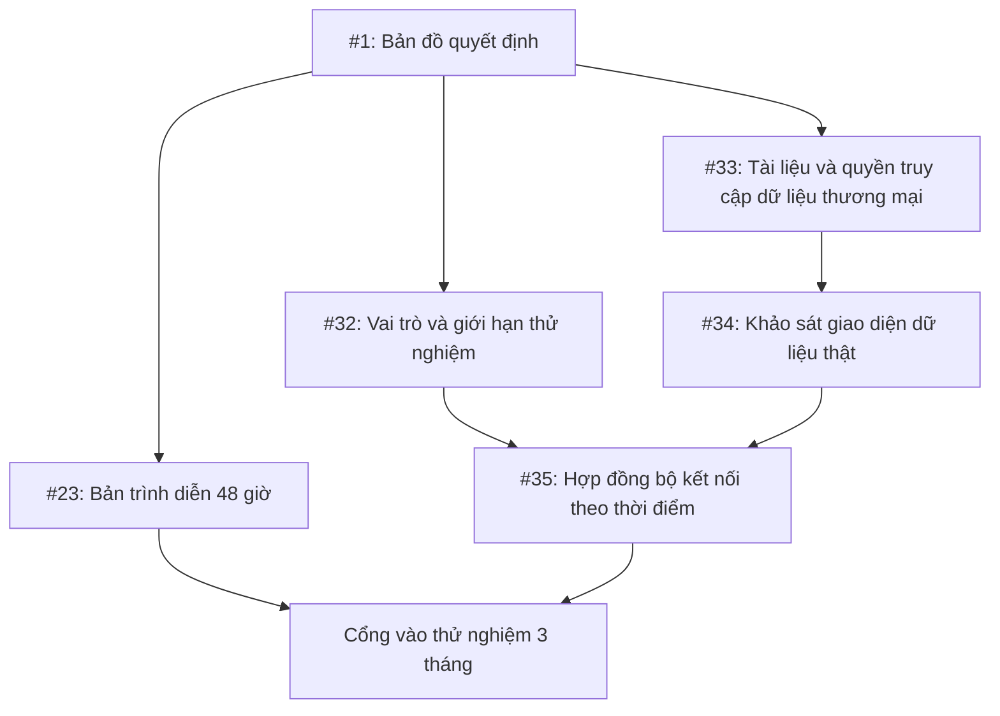
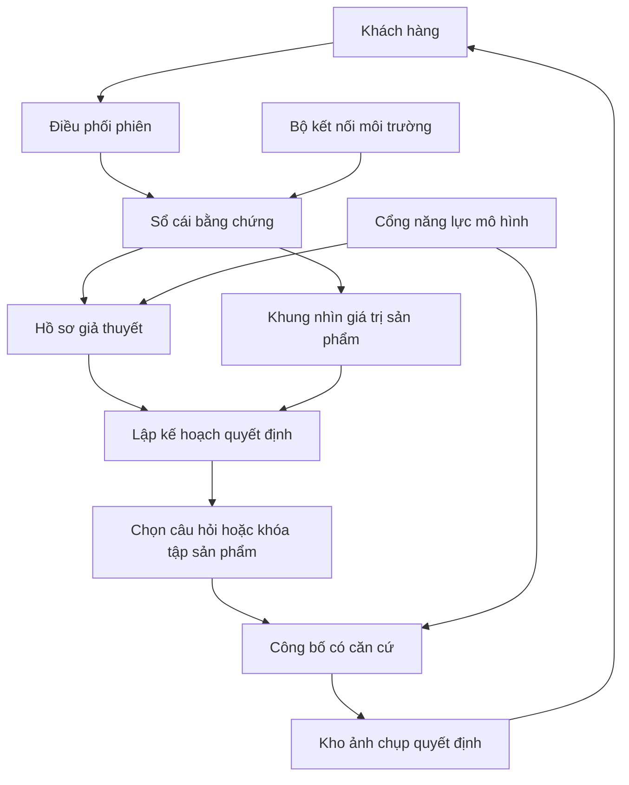
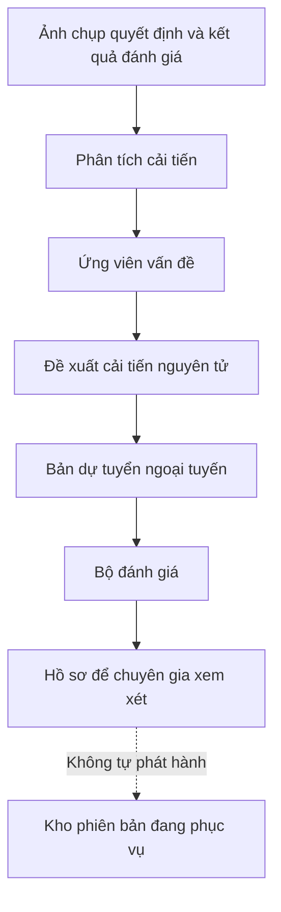
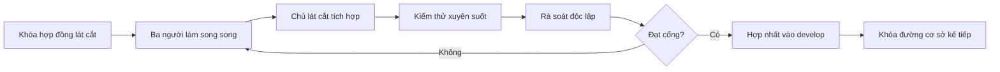

# Thiết kế lộ trình triển khai bản trình diễn tư vấn thích nghi 48 giờ

**Ngày:** 18 tháng 7 năm 2026

**Trạng thái:** Đã duyệt phương án qua đối thoại, đang chờ duyệt tài liệu hoàn chỉnh

## 1. Quyết định

Triển khai bản trình diễn theo các quyết định sau:

1. Giữ lại bộ khung từ phiếu [#24](https://github.com/hoangvantuan/vaic_thancotong/issues/24) sau khi vượt một cổng rà soát độc lập.
2. Không tiếp tục tổ chức phần còn lại theo sáu luồng thành phần nằm ngang.
3. Thay phần còn lại bằng các lát cắt dọc xuyên suốt (tracer bullet), mỗi lát cắt tạo thêm một hành vi có thể chạy từ giao diện tới lưu trữ.
4. Mỗi lát cắt có một người chịu trách nhiệm xuyên suốt và hai người có thể đóng góp song song qua hợp đồng đã khóa.
5. Hợp nhất các lát cắt theo thứ tự để nhánh `develop` luôn chạy và trình diễn được.
6. Giữ [#23](https://github.com/hoangvantuan/vaic_thancotong/issues/23) làm phiếu cha của bản trình diễn.
7. Không dùng các phiếu [#32](https://github.com/hoangvantuan/vaic_thancotong/issues/32) đến [#35](https://github.com/hoangvantuan/vaic_thancotong/issues/35) để chặn bản trình diễn 48 giờ.

Đây là tư duy lại từ nền trắng (zero-base) về mục tiêu và trình tự triển khai. Nó không có nghĩa xóa mã đang có. Mọi phần hiện hữu chỉ được giữ khi trực tiếp giúp chứng minh mục tiêu của bản trình diễn.

## 2. Mục tiêu thật của bản trình diễn

Bản trình diễn không nhằm chứng minh rằng hệ thống có thể tạo một giao diện trò chuyện hoặc trả ba sản phẩm. Nó phải chứng minh một đường đi nhỏ nhưng thật qua kiến trúc trong [Thiết kế khung tư vấn sản phẩm thích nghi](./2026-07-18-khung-tu-van-san-pham-thich-nghi-design.md):

1. Tách quan sát khỏi suy luận.
2. Xây và kiểm chứng hồ sơ giả thuyết về nhu cầu.
3. Chuyển dữ liệu máy lạnh thành chuỗi giá trị sản phẩm có điều kiện và bằng chứng.
4. Ghép hai khung để chọn câu hỏi, lọc, xếp hạng và giải thích.
5. Kiểm tra từng nhận định trước khi công bố.
6. Ghi ảnh chụp quyết định trước khi hiển thị.
7. Phát hiện một lỗi mô phỏng và tạo đề xuất cải tiến không ảnh hưởng đường phục vụ.

Một bản trình diễn chỉ có giao diện đẹp, danh mục thật và mô hình thật nhưng không biểu diễn được hai khung trung tâm vẫn bị coi là chưa đạt.

## 3. Quan hệ giữa các nhóm công việc

### 3.1. Quan hệ khái niệm



- **#23** tạo bằng chứng kỹ thuật rằng lõi có thể chạy.
- **#32** chuẩn bị người chịu trách nhiệm, quyền hạn, ngân sách và giới hạn vận hành thật.
- **#33 đến #35** chuẩn bị đường đọc giá, khuyến mãi và tồn kho theo thời điểm.
- Bản trình diễn chỉ dùng giá đã quan sát trong ảnh chụp dữ liệu, nên không phụ thuộc dữ liệu thương mại trực tiếp.
- Khi chuyển sang thử nghiệm 3 tháng, bằng chứng từ #23 và các điều kiện từ #32 đến #35 mới hội tụ.

### 3.2. Quan hệ hiện có trên GitHub

- #23 đang có tám phiếu con từ #24 đến #31.
- #23 hiện không được ghi là phiếu con của #1.
- #32 đến #35 thuộc bản đồ quyết định và chưa có quan hệ chặn với #23.
- Quan hệ hội tụ trước thử nghiệm 3 tháng mới là thiết kế đề xuất, chưa được ghi thành phụ thuộc GitHub.

## 4. Bằng chứng hiện trạng

Cam kết `457a30a` của #24 đã tạo nền kỹ thuật đáng giữ:

- Một ứng dụng Next.js duy nhất.
- Hợp đồng TypeScript cho ba loại kết quả lượt.
- Kiểu mang nhãn cưỡng chế thứ tự lọc, xếp hạng, kiểm tra, lưu và hiển thị.
- Hợp đồng nguồn chứng minh.
- Điểm thay thế cho dữ liệu, mô hình và lưu trữ.
- Mã truy cập, bí mật phiên và quyền xóa.
- Bộ kiểm thử cho các bất biến nền.

Tuy nhiên, nền hiện tại chưa phải bản trình diễn của thiết kế:

| Phần | Hiện trạng | Quyết định |
|---|---|---|
| Giao diện chính | Gọi `/api/chat` cũ | Khóa đường cũ, chuyển sang `/api/turn` |
| Đường lõi | Dùng `EMPTY_RULES` | Thay bằng gói máy lạnh có phiên bản |
| Nguồn sản phẩm | Bản giả | Thay bằng ảnh chụp danh mục có nguồn |
| Mô hình | Bản giả trên đường lõi | Thay bằng cổng năng lực gọi mô hình thật |
| Lưu trữ | Bộ nhớ tiến trình | Thay bằng bộ lưu tệp bền vững cho một tiến trình |
| Hồ sơ giả thuyết | Chưa có mô-đun miền | Bổ sung mô-đun sâu |
| Đồ thị giá trị sản phẩm | Chưa có | Bổ sung gói khai báo máy lạnh |
| Kế hoạch quyết định | Mới có báo cáo lọc và xếp hạng tối thiểu | Mở rộng thành điểm ghép duy nhất của hai khung |
| Ảnh chụp quyết định | Có vỏ nền | Bổ sung quan sát, giả thuyết, quan hệ, kế hoạch và dấu vết mô hình |
| Cải tiến | Chưa có đường riêng | Bổ sung đường ngoại tuyến và kho đề xuất |

Cam kết #24 báo đã vượt kiểm tra kiểu, kiểm tra mã, **47/47** kiểm thử và dựng ứng dụng. Bản làm việc mới chưa có thư mục `node_modules`, nên kết quả này phải được xác minh độc lập tại cổng đầu tiên trước khi dùng làm đường cơ sở.

## 5. Các phương án đã cân nhắc

| Phương án | Lợi ích | Mặt trái | Kết luận |
|---|---|---|---|
| Tiếp tục #25 đến #31 | Ít thay đổi tổ chức, nhiều người bắt đầu ngay | Hai khung chỉ gặp nhau muộn, tích hợp dồn vào #31 | Không chọn |
| Viết lại toàn bộ | Có thể đặt lại kiến trúc từ đầu | Bỏ phí nền #24, tăng rủi ro trễ 48 giờ | Không chọn |
| Giữ #24 và chuyển sang lát cắt dọc | Tái dùng phần tốt, chứng minh hành vi sớm, lỗi lộ nhanh | Giảm mức song song không kiểm soát | Chọn |

Phương án được chọn chấp nhận giảm mức song song tối đa để đổi lấy khả năng quan sát tiến độ thật và giảm rủi ro ghép dồn cuối kỳ.

## 6. Nguyên tắc triển khai

### 6.1. Mỗi lát cắt phải có giá trị quan sát được

Một lát cắt chỉ hoàn thành khi hành vi tương ứng chạy qua:

```text
Giao diện
  -> Xử lý lượt
  -> Mô-đun miền liên quan
  -> Cổng công bố
  -> Lưu ảnh chụp quyết định
  -> Phản hồi hoặc dấu vết có thể xem
```

Một bộ nạp dữ liệu, màn hình, bộ lưu trữ hoặc cổng mô hình đứng riêng chưa được coi là lát cắt hoàn thành.

### 6.2. Giữ một giao diện phục vụ

- `Xử lý lượt` là bề mặt phục vụ duy nhất.
- `runTurn` có thể tiếp tục là điểm vào kỹ thuật nếu hợp đồng được làm sâu hơn.
- `/api/chat` cũ bị đóng băng và không nhận thêm hành vi.
- Giao diện khách hàng chuyển sang `/api/turn` ngay trong lát cắt đầu tiên.

### 6.3. Kiểm thử tăng cùng sản phẩm

- Mỗi lát cắt bổ sung họ tình huống của chính hành vi nó tạo ra.
- Không đợi tới cuối mới viết 36 ca.
- Mỗi họ gồm ca gốc, ca phải đổi và ca phải giữ.
- Một lát cắt không vượt cổng nếu các ca đã có trước đó suy giảm.

### 6.4. Chỉ một nơi được đổi hợp đồng lõi

- Tại một thời điểm, chỉ chủ lát cắt hiện tại được thay hợp đồng lõi.
- Người khác làm song song qua phiên bản hợp đồng đã khóa.
- Nếu phát hiện hợp đồng thiếu, công việc phụ dừng và gửi thay đổi về chủ lát cắt.
- Không tạo đường vòng hoặc hợp đồng riêng để tránh chờ.

## 7. Kiến trúc đích của lát cắt

### 7.1. Đường phục vụ



### 7.2. Đường cải tiến



### 7.3. Các mô-đun sâu

| Mô-đun | Giao diện chính | Che giấu | Không được làm |
|---|---|---|---|
| Sổ cái bằng chứng | Ghi quan sát, đọc gói bằng chứng | Nguồn, thời điểm, quyền, sửa nối tiếp | Suy luận hoặc chọn sản phẩm |
| Hồ sơ giả thuyết | Cập nhật hồ sơ | Giả thuyết, mâu thuẫn, độ tin cậy, quyền ảnh hưởng | Đọc danh mục trực tiếp |
| Khung nhìn giá trị sản phẩm | Lập khung nhìn | Chuẩn hóa, quan hệ có kiểu, điều kiện, mức B0 đến B3 | Gán nhu cầu cho khách |
| Lập kế hoạch quyết định | Lập kế hoạch | Ghép hai khung, giá trị thông tin, lọc, xếp hạng, độ nhạy | Viết câu trả lời |
| Công bố có căn cứ | Công bố | Nhận định nguyên tử, diễn đạt, kiểm tra, dự phòng | Đổi sản phẩm hoặc thứ hạng |
| Phân tích cải tiến | Tạo đề xuất | Mẫu lỗi, nguyên nhân giả thuyết, phép thử, bản dự tuyển | Ghi vào bản đang phục vụ |

Điều phối chỉ giữ thứ tự, khóa chống lặp và ranh giới giao dịch. Nghiệp vụ nằm trong các mô-đun sâu.

## 8. Đường chứng minh trung tâm

Hành trình chuẩn dùng tình huống:

> Khách cần máy lạnh cho phòng ngủ 20 mét vuông, có trẻ nhỏ, ưu tiên êm nhưng chưa nói ngân sách.

Hệ thống phải cho thấy:

1. Câu nói gốc được lưu như quan sát.
2. Diện tích, phòng ngủ, trẻ nhỏ và ưu tiên êm được tách thành các nhận định nguyên tử.
3. Không tự suy ra thu nhập, mức chịu chi hoặc tính cách.
4. Hồ sơ giả thuyết ghi ngân sách là khoảng trống có thể đổi tập hợp lệ.
5. Bộ điều phối chọn đúng một câu hỏi về ngân sách.
6. Sau câu trả lời, gói máy lạnh tạo các đường từ thuộc tính tới kết quả sử dụng và lợi ích có điều kiện.
7. Bộ lọc loại sản phẩm vi phạm ràng buộc.
8. Bộ xếp hạng chỉ nhận sản phẩm đủ điều kiện.
9. Hệ thống trả từ một đến ba lựa chọn theo cấu trúc Dòng căn cứ.
10. Mỗi lý do, điểm đánh đổi và phần chưa xác minh truy được về nguồn.
11. Ảnh chụp quyết định được ghi trước khi phản hồi xuất hiện.
12. Màn hình chuyên gia cho phép xem quan sát, giả thuyết, quan hệ, lý do hỏi, lý do loại và kiểm tra công bố.

## 9. Lộ trình 48 giờ

Đồng hồ của lộ trình mới bắt đầu khi:

1. Tài liệu này được duyệt hoàn chỉnh.
2. Kế hoạch triển khai và cấu trúc vé mới được duyệt.
3. Các vé lát cắt đã được phát hành.
4. Chủ lát cắt đầu tiên công bố thời điểm bắt đầu và thời điểm kết thúc dự kiến theo múi giờ Việt Nam.

### 9.1. Cổng nền, giờ 0 đến 2

Mục tiêu: chứng minh #24 là nền có thể tin cậy.

Việc bắt buộc:

- Cài phụ thuộc bằng khóa phiên bản.
- Chạy kiểm tra kiểu, kiểm tra mã, toàn bộ kiểm thử và dựng ứng dụng.
- Rà soát độc lập hợp đồng, quyền phiên, khóa chống lặp và thứ tự lưu trước khi hiển thị.
- Ghi lại mọi sai lệch giữa tài liệu bàn giao với kết quả chạy lại.
- Khóa `/api/chat` cũ và xác nhận không mở rộng đường này.
- Khóa phiên bản hợp đồng dùng cho lát cắt đầu tiên.

Cổng đạt:

- `npm run check` và `npm run build` đạt.
- Không có lỗi bắt buộc chưa xử lý.
- Có người khác người viết #24 xác nhận bằng chứng.

### 9.2. Lát cắt 1, từ chối an toàn, giờ 2 đến 8

Hành vi:

- Người có mã truy cập tạo được phiên.
- Giao diện gửi lượt qua `/api/turn`.
- Yêu cầu chưa có đủ căn cứ tạo lời từ chối có phạm vi.
- Ảnh chụp quyết định được lưu bền trước khi hiển thị.
- Khởi động lại ứng dụng vẫn đọc được phiên.
- Người dùng xóa được phiên của mình, còn quản trị viên xóa được một phiên bất kỳ hoặc toàn bộ dữ liệu trình diễn.

Phạm vi kỹ thuật:

- Chuyển giao diện khỏi đường cũ.
- Thay bộ lưu trong bộ nhớ bằng bộ lưu tệp có hàng đợi ghi và thay tệp nguyên tử.
- Giữ nội dung phiên tới khi xóa thủ công.
- Xóa nội dung nhưng giữ biên nhận xóa không chứa nội dung.
- Triển khai một môi trường kín tối thiểu.

Đánh giá:

- Thêm **2 họ**, tổng **6 ca**.
- Bao phủ thiếu mã, sai mã, từ chối có căn cứ, lưu thất bại, thử lại cùng lượt và khởi động lại.

Cổng đạt:

- Không phản hồi nào hiển thị trước khi lưu thành công.
- Gửi lại cùng mã lượt không tạo quyết định thứ hai.
- Sau khởi động lại, quyết định vẫn phát lại được.

### 9.3. Lát cắt 2, hỏi đúng một câu, giờ 8 đến 16

Hành vi:

- Câu tự do được tách thành quan sát có nguồn.
- Hồ sơ giả thuyết giữ điều đã biết, điều suy luận, mâu thuẫn và khoảng trống.
- Hệ thống hỏi đúng một câu có khả năng đổi quyết định nhiều nhất.
- Khách sửa lời thì lịch sử sửa được giữ, không ghi đè quan sát cũ.
- Màn hình chuyên gia cho thấy lý do câu hỏi được chọn.

Phạm vi kỹ thuật:

- Bổ sung sổ cái bằng chứng tối thiểu.
- Bổ sung vỏ hồ sơ giả thuyết ổn định.
- Bổ sung quyền ảnh hưởng theo mức.
- Bổ sung chính sách chọn câu hỏi bằng giá trị thông tin.
- Mô hình chỉ tạo ứng viên trích xuất hoặc cách diễn đạt, không cấp quyền ảnh hưởng.

Đánh giá:

- Thêm **3 họ**, tổng cộng **15 ca**.
- Bao phủ câu nói lại, mâu thuẫn, từ chối trả lời, sửa nhu cầu và thay cách diễn đạt.

Cổng đạt:

- Giả thuyết yếu chỉ ảnh hưởng câu hỏi.
- Không hỏi lại dữ kiện đã được khách xác nhận.
- Mỗi lượt chỉ có một câu hỏi.

### 9.4. Lát cắt 3, khuyến nghị thật đầu tiên, giờ 16 đến 23

Hành vi:

- Đường phục vụ đọc một tập máy lạnh nhỏ từ kho thật và chỉ giữ sản phẩm vượt cổng bằng chứng.
- Hồ sơ khách hàng được ghép với khung nhìn giá trị máy lạnh.
- Hệ thống lọc cứng, xếp hạng mềm và trả được ít nhất một khuyến nghị thật.
- Khuyến nghị trình bày nhu cầu, dữ kiện, kết quả có điều kiện, đánh đổi, phần chưa xác minh, nguồn và bước tiếp theo.
- Màn hình chuyên gia cho thấy cả hồ sơ giả thuyết, đường giá trị sản phẩm và đối tượng ghép quyết định.

Phạm vi kỹ thuật:

- Thay nguồn sản phẩm giả bằng một bộ chuyển tiếp đọc dữ liệu thật qua hợp đồng `ProductSource`.
- Tạo gói khai báo máy lạnh nhỏ nhất đủ chứng minh chuỗi giá trị.
- Biểu diễn quan hệ có kiểu và mức bằng chứng B0 đến B3.
- Bổ sung đối tượng ghép quyết định.
- Trình bày lựa chọn theo cấu trúc Dòng căn cứ.
- Không viết cứng sản phẩm hoặc kết quả khuyến nghị trong giao diện.

Đánh giá:

- Thêm **2 họ**, tổng cộng **21 ca**.
- Bao phủ một sản phẩm gần phù hợp nhưng vi phạm ràng buộc và một thay đổi nhu cầu làm đổi lựa chọn.

Cổng đạt:

- **0** sản phẩm vi phạm ràng buộc cứng được khuyến nghị.
- **0** quan hệ B0 hoặc B1 được dùng làm sự thật hoặc lý do.
- Mỗi nhận định ảnh hưởng quyết định truy được nguồn, thời điểm và phiên bản.
- Ảnh chụp quyết định phát lại được mà không đọc lại nguồn hoặc gọi lại mô hình.

### 9.5. Lát cắt 4, mở rộng toàn kho và ba lựa chọn, giờ 23 đến 29

Hành vi:

- Đường tiếp nhận đọc toàn bộ kho và báo từng bản ghi thành công, cách ly hoặc lỗi.
- Đường phục vụ chỉ dùng máy lạnh vượt cổng bằng chứng.
- Hệ thống trả từ một đến ba lựa chọn và không thêm sản phẩm yếu để đủ ba.
- Mỗi lựa chọn giữ cùng cấu trúc Dòng căn cứ của lát cắt trước.
- Giá chỉ được trình bày là giá đã quan sát, kèm thời điểm và yêu cầu xác minh lại; tồn kho vẫn là chưa xác minh.

Phạm vi kỹ thuật:

- Mở rộng bộ chuyển tiếp dữ liệu để kiểm kê toàn bộ nguồn.
- Giữ đúng một trạng thái thành công, cách ly hoặc lỗi cho mỗi bản ghi phát hiện.
- Phát hiện bản ghi trùng theo quy tắc có phiên bản.
- Mở rộng gói máy lạnh cho các đặc điểm cần trong năm nhóm nghiệp vụ.
- Chỉ dùng B2 hoặc B3 làm lý do tư vấn.
- Bổ sung phân tích độ nhạy và xử lý trường hợp gần tương đương.
- Không dùng một điểm tổng để hồi sinh sản phẩm bị loại.

Đánh giá:

- Thêm **2 họ**, tổng cộng **27 ca**.
- Cùng các họ đã tạo trước đó, bao phủ đủ năm nhóm nghiệp vụ: phòng ngủ ban đêm, tải nhiệt biến động, ngân sách chặt, thay máy cũ và không gian kinh doanh.

Cổng đạt:

- **100%** bản ghi nguồn được tính trong báo cáo nạp.
- **0** sản phẩm vi phạm ràng buộc cứng được khuyến nghị.
- **0** quan hệ B0 hoặc B1 được dùng làm sự thật hoặc lý do.
- Mọi nhận định ảnh hưởng quyết định truy được nguồn, thời điểm và phiên bản.
- Không có giá hoặc tồn kho chưa xác minh nào được trình bày như dữ liệu hiện hành.

### 9.6. Lát cắt 5, mô hình thật và công bố, giờ 29 đến 38

Hành vi:

- Hành trình mặc định gọi dịch vụ mô hình thật.
- Mô hình hỗ trợ trích xuất và diễn đạt qua năng lực có kiểu.
- Cổng công bố đối chiếu từng nhận định nguyên tử với kế hoạch quyết định.
- Lỗi mô hình hoặc nội dung sai không làm đổi danh sách sản phẩm.
- Hệ thống sửa đúng một lần hoặc dùng phương án dự phòng an toàn.

Phạm vi kỹ thuật:

- Cấu hình nhà cung cấp, mô hình, thời gian chờ và số lần thử lại ngoài mã.
- Ghi dấu vết tên mô hình, phiên bản chỉ dẫn, mã băm đầu vào và đầu ra, độ trễ và lỗi.
- Dựng lại mã sản phẩm, giá, thông số và liên kết từ nguồn chụp, không tin chuỗi do mô hình tạo.
- Không ghi khóa, mã truy cập hoặc toàn bộ hội thoại vào nhật ký.

Đánh giá:

- Thêm **2 họ**, tổng cộng **33 ca**.
- Bao phủ mô hình hết thời gian, sai định dạng, thêm sản phẩm, tạo số liệu và lỗi lưu sau công bố.

Cổng đạt:

- Mô hình không thể thêm sản phẩm hoặc thay thứ hạng.
- Không nhận định sản phẩm nào thiếu nguồn được hiển thị.
- Lỗi mô hình luôn có đường dự phòng hoặc từ chối có phạm vi.

### 9.7. Lát cắt 6, cải tiến có kiểm soát, giờ 38 đến 44

Hành vi:

- Một lỗi nhỏ được gieo vào bản dự tuyển ngoại tuyến.
- Bộ đánh giá tạo tín hiệu lỗi.
- Tín hiệu được gộp thành ứng viên vấn đề có thể tái hiện.
- Hệ thống tạo đề xuất cải tiến nguyên tử.
- Bản dự tuyển được đánh giá lại mà không sửa bản đang phục vụ.

Phạm vi kỹ thuật:

- Tách kho đề xuất khỏi kho phiên bản phục vụ.
- Lưu đường dẫn từ tín hiệu, vấn đề, đề xuất, thay đổi tới kết quả đánh giá.
- Ghi cả bằng chứng ủng hộ và phản bác.
- Không tạo chức năng tự duyệt hoặc tự phát hành.

Đánh giá:

- Thêm **1 họ**, đạt tổng **12 họ, 36 ca**.
- Chạy lại toàn bộ ca trước đó trên bản đường cơ sở và bản dự tuyển.

Cổng đạt:

- Lỗi gieo được phát hiện đúng.
- Bản dự tuyển sửa lỗi mục tiêu mà không làm suy giảm cổng bắt buộc.
- Mã phiên bản đang phục vụ trước và sau đánh giá không đổi.

### 9.8. Cổng phát hành, giờ 44 đến 48

Không bổ sung tính năng mới.

Việc bắt buộc:

- Chạy ba hành trình hỏi thêm, khuyến nghị và từ chối an toàn.
- Chạy đủ **36/36 ca**.
- Diễn tập lỗi mô hình, lỗi nguồn và lỗi ghi ảnh chụp.
- Khởi động lại ứng dụng và phát lại quyết định.
- Thử xóa phiên hiện tại, xóa trái quyền và xóa bằng quyền quản trị.
- Rà soát bí mật và nhật ký.
- Hoàn thiện hướng dẫn cài đặt, triển khai, trình diễn, kiểm tra và xóa dữ liệu.

Cổng đạt:

- Mọi cổng bắt buộc của #23 đạt.
- Một người không tham gia viết mã chạy được ba hành trình theo tài liệu.
- Không còn lỗi chặn hoặc khoảng trống chưa được công bố.

## 10. Tổ chức ba người làm song song

### 10.1. Nguyên tắc

- Mỗi lát cắt có một chủ sở hữu chịu trách nhiệm kết quả từ đầu đến cuối.
- Hai người còn lại có thể làm song song trên vùng tệp và hợp đồng đã khóa.
- Chủ lát cắt quyết định thời điểm hợp nhất các đóng góp.
- Người không viết phần chính thực hiện rà soát độc lập trước khi đóng lát cắt.

### 10.2. Phân công đề xuất

| Thời gian | Chủ lát cắt | Đóng góp song song thứ nhất | Đóng góp song song thứ hai |
|---|---|---|---|
| Giờ 0 đến 2 | Cả nhóm khóa hợp đồng | Rà soát #24 | Khóa ca chấp nhận |
| Giờ 2 đến 8 | Nguyễn Hiệp | AnhDD nối giao diện | Hoàng Văn Tuấn tạo 6 ca |
| Giờ 8 đến 16 | Hoàng Văn Tuấn | Nguyễn Hiệp chuẩn bị bộ nạp | AnhDD chuẩn bị dấu vết |
| Giờ 16 đến 23 | Hoàng Văn Tuấn | Nguyễn Hiệp nối dữ liệu thật | AnhDD trình bày Dòng căn cứ |
| Giờ 23 đến 29 | Nguyễn Hiệp | Hoàng Văn Tuấn mở rộng đồ thị và luật | AnhDD mở rộng từ một đến ba lựa chọn |
| Giờ 29 đến 38 | AnhDD | Nguyễn Hiệp thử lỗi lưu trữ | Hoàng Văn Tuấn kiểm tra nhận định |
| Giờ 38 đến 44 | Hoàng Văn Tuấn | Nguyễn Hiệp dựng bản dự tuyển | AnhDD trình bày dấu vết cải tiến |
| Giờ 44 đến 48 | Nguyễn Hiệp điều phối phát hành | AnhDD kiểm tra hành trình | Hoàng Văn Tuấn xác nhận 36 ca |

Phân công này bám quyết định sở hữu đã chốt:

- Hoàng Văn Tuấn giữ trách nhiệm sản phẩm, lõi và phương pháp đánh giá.
- Nguyễn Hiệp giữ vận hành, dữ liệu và tích hợp phát hành.
- AnhDD giữ cổng mô hình, công bố và trải nghiệm.

### 10.3. Dòng hợp nhất



Không chạy ba lát cắt phụ thuộc nhau trên ba hợp đồng lõi khác nhau. Song song nằm trong cùng một lát cắt hoặc trong việc chuẩn bị không đổi hợp đồng cho lát cắt kế tiếp.

## 11. Chuyển đổi hệ thống vé

Chỉ thực hiện sau khi tài liệu này, kế hoạch triển khai và cấu trúc vé mới đều được duyệt.

### 11.1. Giữ

- Giữ #23 làm phiếu cha.
- Giữ lịch sử và cam kết của #24.
- Giữ #32 đến #35 cho đường thử nghiệm 3 tháng.

### 11.2. Thay thế

- Rà soát và đóng #24 nếu vượt cổng nền.
- Không sửa lại lịch sử của #25 đến #30 để biến chúng thành việc khác.
- Ghi bình luận chỉ rõ phiếu thay thế rồi đóng #25 đến #30 với trạng thái được thay thế.
- Ghi bình luận chỉ rõ phiếu thay thế rồi đóng #31; tạo một phiếu cổng phát hành mới và không dùng nó làm điểm tích hợp đầu tiên.
- Tạo một phiếu cho mỗi trong sáu lát cắt dọc và gắn làm phiếu con của #23.
- Bộ công việc đích gồm #24, sáu lát cắt mới và một cổng phát hành, đúng **8 phiếu con đang có hiệu lực**.
- Các phiếu cũ được thay thế vẫn giữ liên kết hai chiều để kiểm toán nhưng không được tính vào tám phiếu đích.
- Ghi phụ thuộc theo đúng thứ tự cổng.

### 11.3. Quy tắc phát hành vé

- Trước khi tạo vé, trình toàn bộ cấu trúc, mô tả và phụ thuộc để người dùng duyệt.
- Mỗi vé phải có mục tiêu, phạm vi, việc cần làm, tiêu chí chấp nhận và bằng chứng bàn giao.
- Mỗi vé phải tạo hành vi có thể trình diễn, không chỉ bàn giao một tầng kỹ thuật.
- Không sửa hoặc đóng phiếu cha #23 trong quá trình chuyển đổi.

## 12. Phạm vi giữ lại

- Một ứng dụng Next.js.
- Một ngành hàng máy lạnh trên đường phục vụ.
- Một mã truy cập chung và một mã quản trị riêng.
- Phiên cùng ảnh chụp quyết định tồn tại qua khởi động lại.
- Toàn bộ kho được tiếp nhận và báo trạng thái.
- Chỉ tập con máy lạnh đủ bằng chứng được phục vụ.
- Mô hình thật trên hành trình mặc định.
- Ba hành trình bắt buộc.
- **12 họ, 36 ca**.
- Một vòng đề xuất cải tiến ngoại tuyến.

## 13. Ngoài phạm vi

- Mở hệ thống công khai.
- Tài khoản cá nhân.
- Giá, khuyến mãi hoặc tồn kho trực tiếp.
- Nhiều ngành hàng trên đường phục vụ.
- Giỏ hàng, thanh toán hoặc đặt mua.
- Học trực tuyến.
- Tự duyệt hoặc tự phát hành thay đổi.
- Hạ tầng nhiều máy, sao lưu tự động hoặc cam kết độ sẵn sàng sản xuất.
- Hoàn tất các điều kiện tổ chức và dữ liệu của thử nghiệm 3 tháng.

## 14. Kiểu thất bại và cách chặn

| Kiểu thất bại | Nguyên nhân | Cơ chế chặn |
|---|---|---|
| Ba người tạo ba cách hiểu hợp đồng | Hợp đồng thay đổi đồng thời | Chỉ chủ lát cắt được đổi hợp đồng lõi |
| Có nhiều mã nhưng chưa có hành trình thật | Đóng việc theo tầng | Chỉ đóng khi kiểm thử từ giao diện tới lưu trữ đạt |
| Đường cũ tiếp tục phát triển | Muốn tận dụng giao diện sẵn có | Khóa `/api/chat` và chuyển giao diện ở lát cắt 1 |
| Hai khung bị giản lược thành điểm số | Dồn mọi việc vào lọc và xếp hạng | Bắt buộc có hồ sơ giả thuyết, quan hệ có kiểu và đối tượng ghép |
| Đọc toàn kho làm trễ đường phục vụ | Cố làm sạch mọi bản ghi | Tiếp nhận toàn bộ nhưng chỉ phục vụ tập vượt cổng |
| Mô hình thay quyết định | Giao diện mô hình quá rộng | Gọi theo năng lực có kiểu và kiểm tra từng nhận định |
| Kiểm thử bị dồn cuối | Tách đánh giá thành phiếu riêng | Tăng 6, 15, 21, 27, 33 rồi 36 ca theo lát cắt |
| Cải tiến ảnh hưởng bản phục vụ | Dùng chung quyền ghi | Tách kho đề xuất và bản dự tuyển |
| Tích hợp dồn cuối | Các thành phần chỉ gặp nhau ở #31 | Hợp nhất và trình diễn sau từng lát cắt |
| Không đủ thời gian | Phạm vi lan sang sản xuất | Giữ đúng bậc cắt giảm và không thêm tính năng ở cổng cuối |

## 15. Đánh đổi được chấp nhận

- Mức song song tối đa thấp hơn chia theo tầng, đổi lại mọi người nhìn thấy sản phẩm chạy sau từng cổng.
- Bộ lưu tệp chỉ phù hợp một tiến trình, đổi lại không cần dịch vụ mạng hoặc phụ thuộc nhị phân trong 48 giờ.
- Tập sản phẩm phục vụ nhỏ hơn toàn bộ kho, đổi lại mỗi sản phẩm và nhận định có bằng chứng.
- Giao diện chuyên gia chỉ đủ xem dấu vết bắt buộc, không phải bảng quản trị sản xuất.
- Vòng cải tiến dùng dữ liệu kiểm soát, nên chỉ chứng minh cơ chế chứ không chứng minh hiệu quả kinh doanh.
- Đồng hồ 48 giờ chỉ bắt đầu sau khi hợp đồng và vé được duyệt, đổi lại thời gian được đo trên một lộ trình có thể thực thi.

## 16. Tiêu chí chấp nhận tài liệu

Tài liệu sẵn sàng chuyển sang kế hoạch triển khai khi:

- Quan hệ giữa #23 và #32 đến #35 được hiểu thống nhất.
- Quyết định giữ #24 và thay lộ trình còn lại đã được duyệt.
- Đường chứng minh hai khung được coi là mục tiêu trung tâm.
- Sáu lát cắt và cổng phát hành có phạm vi rõ.
- Cách ba người làm song song và quyền đổi hợp đồng rõ.
- Cách chuyển đổi các vé cũ không làm mất lịch sử.
- Điểm bắt đầu đồng hồ 48 giờ được chấp nhận.
- Không còn chỗ giữ chỗ, mâu thuẫn phạm vi hoặc quyết định quan trọng chưa có chủ sở hữu.

Sau khi tài liệu được duyệt, bước tiếp theo là viết kế hoạch triển khai chi tiết. Sau khi kế hoạch được duyệt, cấu trúc vé mới sẽ được trình duyệt trước khi được phát hành trên GitHub.
